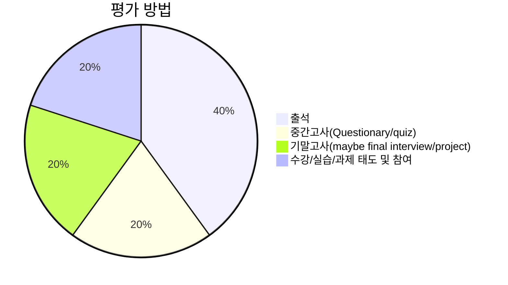
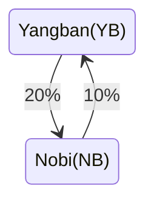

# Orientation

## 수업 소개

- 정영웅, [국립창원대학교](https://changwon.ac.kr) 재료금속공학과, :kr:

In the order of preference:



**52호관 212호**


**yjeong@changwon.ac.kr**


**055-213-3694**



- 분석 및 해석 기술의 발달로 다량의 데이터들이 생성되고 있다. 재료공학에서 데이터 해석 및 분석 능력의 중요성이 날로 높아지고 있다. 본 수업을 통해 학생들은 기초적인 데이터 분석/해석 및 시각화(그래프)를 위해 필요한 다양한 툴들을 익히고, 재료공학적 문제에 활용하는 경험을 하게된다.

- 관련 분야에서 가장 널리 활용되는 [Python](https://python.org) 언어를 활용하고, [JuPyter](https://jupyter.org) 환경을 활용하겠다.

- 재료공학 전공자에게 필요한 데이터 분석, IO, 해석 및 시각화 (그래프) 등 기초 컴퓨터활용 능력을 길러주기 위한 강의로 설계되었다. 본 교과목은 국립창원대학교 재료금속과 **전공 선택**교과이나, 이후 개설될 **수치해석**, **이동현상**, **기초 전산역학** 등의 교과과정의 이해를 위해서 선수강하길 권한다.

- 교수자는 Apple사의 MacOS 컴퓨터를 활용해 MS사의 [VScode](https://code.visualstudio.com)내의 [JuPyter](https://jupyter.org) 활용할 계획이며, 강의자료는 본 웹페이지를 활용할 계획이다. 수업시간에 보여질 시연/실습 환경과 무관하게, Windows, MacOS, Linux 등 다양한 컴퓨터 환경에서 실습 가능하다. 다만, 실습이 가능한 환경으로 개별 학생들의 환경을 세팅하는 것은 각자의 몫이다. 필요하다면 수업 전후에 도움을 줄 수 있다.

- [구글](https://google.com) 계정을 활용해서 [Google Colab](https://colab.google)와 [Google Drive](https://drive.google.com/)를 함께 활용해서 실습 가능하다. 인터넷 연결된 웹브라우저를 활용해서 실습 가능하나 추천하는 환경은 아니다. 이 경우 환경 세팅이 비교적 수월하겠으나, 인터넷 접속이 유지되어야 하고 계산 속도가 다소 느릴 수 있다.

- (optional) 스스로 프로그램을 작성하고, 더욱 세밀하게 관리하고 싶다면 [git](<https://ko.wikipedia.org/wiki/깃_(소프트웨어)>)을 배우고, 나아가 [GitHub](https://github.com) 계정을 만들고 결합하길 권한다.

## 세부 수업 목표

- 수강자의 기초 파이썬 활용 능력 향상
- 최신 데이터 해석/분석 툴의 기초적 활용법을 익힘
  - [Python](https://python.org)
  - [JuPyter](https://jupyter.org)
  - [NumPy](https://numpy.org)
  - [matplotlib](https://matplotlib.org)
- 이를 활용해 재료공학 기초 문제 해결을 위해 활용 경험
- 기초적 이해를 바탕으로, 재료공학 실전 문제 해결에 응용 경험
- 나아가 더욱 어려운 문제를 **스스로** 해결하기 위해 필요한 배경 지식 습득

<br/><br/>
<br/><br/>
<br/><br/>
<br/><br/>

---

# Week1
- 수업 소개, 규칙, 평가 방법, 실습 환경 소개

## 수업 01-1

### 강의 자료 및 수업 진행 방식

1. 강의 자료는 [markdown](https://ko.wikipedia.org/wiki/마크다운) 파일로 작성되어, [홈페이지에](https://youngung.github.io)내의 `lectures` 메뉴 게시물을 활용한다. 게시물은 상시로 업데이트가 될 수 있다. 홈페이지 환경에서 'theme'을 바꿔 화이트/블랙 모드로 바꿀 수 있다.
2. 반드시 인터넷 연결 환경을 활용하거나, 미리 수업 자료를 출력해와야 한다. (수업 태도/참여 점수 반영)
3. 수업 시간에 필요한 개념에 대해 설명하고, 교수자가 필요한 시연을 보인다. 이후 수강생들과 함께 차근차근 실습하거나, 혹은 학생들이 **스스로** 그리고 **혼자서** 실습해보길 바란다. :pray:
4. 강의 자료에 실습 가능한 **Python** 코드 snippet은 아래와 같은 박스로 표기된다.

```python
print('Hello, world')
```

5. 때에 따라서, 기존에 입력한 코드가 이미 실행되어 있어야만 제대로 작동하는 경우가 있으니, 긴장을 늦추지 않고 수업의 진행을 잘 따라오길 바란다.
6. 수업 시간에 배운 내용을 반드시 스스로 '반복'해서 실습해봐야 한다. 그리고 수업 시간내 내어준 예제를 혼자서 해보는 경험이 필요하다.


#### 실습 / 코딩

- 궁극적으로 적절한 '툴' 활용을 익히는 것이 목표이기 때문에, **코딩**이 필요하다.
- 코딩은 :bike:, :ski:, :snowboarder:,:tennis:, :surfer:, :guitar:, :soccer:등과 비슷하다. 모두 **몸**으로 익혀야 한다. 남(교수자)이 하는 걸 백번 보는 것 보다 직접 해보는 것이 낫다.
- 어려운 개념은 반복해서 예습을 풀어보며 **머리** 뿐만 아니라 **몸**(muscle memory:muscle:)으로 익히기!
- 개인이 계속해서 쓸 컴퓨터:computer:가 없이 코딩을 배우는 건 매우 어렵다.
- 실습을 할때마다 본인의 실습환경에 맞게 컴퓨터 환경을 다시 세팅하거나, 필요한 패키지를 설치하는 건 여간 귀찮고 어려운 일이 아니다.
- 실습에 맞는 개인용 컴퓨터를 **필수**적으로 보유하고 있길 권한다.
- 각종 cloud service나, 학교 전산실습실 이용을 추천하지 않는 건 실습 환경을 직접 세팅해볼 수가 없기 때문이다.
- 다시 한번 얘기하지만 반드시 스스로 실습해봐야 한다.
  - 예제를 일일이 다 쳐보기
  - 결과를 스스로 살펴봐야 합니다.
  - 예제를 바꿔서 적용하고 그 변화를 살펴보기.
  - 예시로 주어진 프로그램을 '한줄씩', 한 명령어씩 다 뜯어서 살펴보기 (hacking)
  - 반드시 개인용 컴퓨터 필요 - 실습
  - 친구/가족에게 빌리세요. 없다면 학교에서 대여도 합니다 - [링크](https://chains.changwon.ac.kr/nonstop/lend/sub.php?group_code=e0000010&subgroup_code=es000043)
  - 그외 기타 사정으로 수업을 듣고 싶으나 노트북 준비가 어렵다면 교수에게 상담 요청하시오
  - :raising_hand: :grey_question:
- 영문 키보드 반드시 숙지 필요

  - 영타가 느리면 그만큼 학습이 느려진다.
  - 예시로 주어지는 코드를 모두 직접 입력해봐야 한다.
  - 키보드 익히기: 유용한 링크[1](https://typing.io), [2](https://www.typelit.io), [3](https://typing.works) ...
  - 1분에 300타 정도의 속도는 나와야 하지 않겠어요?

- 각종 기호들 위치 익히기! 평소에 쓰지 않은 다양한 부호가 컴퓨터에 있습니다.
  위치와 생김새, 이름을 익혀야 하겠습니다.
  - `: accent
  - ': single quotation mark
  - ": double quotation mark
  - !: exclamation mark
  - @: 'at'
  - #: number sign (sharp)
  - $: dollar sign
  - %: percent
  - ^: caret
  - &: ampersand
  - \*: asterisk
  - (: left parenthesis
  - ): right parenthesis
  - -: dash
  - =: equal sign
  - ,: comma
  - \_: underscore
  - +: plus
  - [: left square bracket
  - ]: right square bracket
  - /: slash
  - \\: blackslash
  - <: left bracket
  - \>: right bracket
- 수업 시간 예제 반드시 스스로 해보기
  - 스스로 공부할 때, 혹은 예제를 풀 때 [ChatGPT](https://chatgpt.com)에 도움을 받는 건
    좋으나 시험에서는 활용 불가!
  - 왜 ChatGPT를 시험에 못 쓰게 하냐면, ChatGPT가 실수하는 것을 알아내고 고칠 수 있는 능력
    을 갖추지 못하면...
- 교수자가 사용하는 도구들: MacOS, MS VScode, 기본 terminal, JuPyter notebook, Google Colab ...
  - 하지만, 실습은 Windows, MacOS, Linux .. 등 어디서든 가능합니다.
  - [Google colab](https://colab.google)에서는 인터넷 연결만 되어 있다면 JuPyter notebook 실습 가능합니다.
  - 수업 중간에 인터넷을 통해 몇몇 Python 패키지를 설치해야 할 수도 있으므로, 교내 와이파이 접속 가능해야 함.
  - VS code에 대해 상세히 알고 싶다면 [여기](https://code.visualstudio.com/docs)를 통해 알아보자. 영어로 된 문서가 부담스럽거나 어렵다면, 최신 웹브라우저들은 대부분 번역 기능을 제공하니 적극적으로 활용해보길 바란다.

### 01-1-4 평가 방법

- 출석과 결석 (출석 부를 때 없으면 결석, 수업 시작 30 분 이내 도착하면 이후 **지각**처리)

- 중간/기말 평가
  - 중요한 원리 이해 필요.
  - 수업시간 다룬 예제들 중심으로 이해 필요.
  - 고득점을 원한다면 변형된 예제들까지 이해하고 적용/응용 가능해야함.
  - 평가 항목



- 오늘의 과제

  - 파이썬 설치 및 환경 설정 완성 (Python 3.12, [JuPyter](https://jupyter.org), [VS code](https://code.visualstudio.com), pip)
    * 설치 설명 참고 [링크](https://blog.naver.com/dlgusen123/223943489124)
  - [YouTube](https://youtube.com)에서 간단한 Python tutorial 영상 찾아서 보고 따라해보기.
  - 영문타자 익히기 - [여기1](https://www.typelit.io), [여기2](https://www.typing.com/student/lesson/328/common-english-words), [여기3](https://www.speedcoder.net)서 연습해보기.
  - 키보드 기호들의 위치 숙지 필요.
  - 교내 인터넷 접속 사전에 해보기.
  - [Google colab](https://colab.google)에서 Notebook 만들어 실습해보기.
  - [Google colab](https://colab.google)활용한다면 아이패드나 갤럭시 탭, 심지어는 핸드폰(?)으로도 실습 가능하다. 하지만 여러 이유로 컴퓨터가 아닌 기기는 추천하지 않는다.

## 수업 01-2

### 01-2-1 목표

- 파이썬 설치 및 환경 설정 완성 (Python 3.12, [JuPyter](https://jupyter.org), [VS code](https://code.visualstudio.com), pip)
- VS code에서 JuPyter 셋업 & 구동할 수 있다.
   * 몇몇 유용한 extension을 설치하면 더욱 도움이 된다.
- Hello, world
- 실습 예시를 모두 이해하고 풀 수 있다.
- 'Traceback'이해하고 대처할 수 있다: 실습간에 예상했던 대로 결과가 나오지 않고, 'Traceback' 이 포함된 메시지를 본다면 알려주세요.

### 01-2-2 내용

- JuPyter notebook 간단한 키조작 가능
- 셀(cell) 만들기, 지우기, 입력, 이동(navigation)
  - 코드 셀
  - markdown 셀
- 주석(comment)과 명령문(statement) 구분하기
- 변수 선언과 자료형 (`int`, `float`, `str`, `bool`) 이해하기
- 연산자 이해하기

  - 산술 연산자 (더하기, 빼기, 곱하기, 나누기, 지수, 나머지, 몫 ... )
  - 비교 연산자 (==, !=, <, >, >=, <=, is, is not, in, not in)
  - 논리 연산자 (and or)

    ```python
    # 1. 값 비교
    print(5 == 5)       # True (값이 같음)
    print(5 != 3)       # True (값이 다름)
    print(7 > 2)        # True (7이 2보다 큼)
    print(3 < 7)        # True (3이 7보다 작음)
    print(5 >= 5)       # True (5가 5보다 크거나 같음)
    print(4 <= 6)       # True (4가 6보다 작거나 같음)

    # 2. 객체 동일성 비교
    a = [1, 2, 3]
    b = [1, 2, 3]
    c = a

    print(a == b)       # True  (값이 같음)
    print(a is b)       # False (메모리 주소 다름)
    print(a is c)       # True  (같은 객체)
    print(a is not b)   # True  (다른 객체)

    # 3. 포함 여부
    text = "Fe2O3"
    print("F" in text)      # True  ('F'가 문자열에 포함됨)
    print("O" not in text)  # True  ('O'가 문자열에 없음)

    numbers = [1, 2, 3]
    print(2 in numbers)     # True  (리스트에 2가 포함됨)
    print(5 not in numbers) # True  (리스트에 5가 없음)
    ```

### 01-2-3 실습 예시 1

- [pip](https://pypi.org/project/pip/) 활용하여 아래 패키지 설치
  - [NumPy](https://numpy.org)
  - [SciPy](https://scipy.org)
  - [matplotlib](https://matplotlib.org)
  - [JuPyter](https://jupyter.org)
- 위 package가 설치된 directory 찾아 보기
- (Windows) 환경변수 살펴보기
- (Linux/macOS), zsh, bash 등 dotfile 살펴보기

### 01-2-5 실습 예시 2

- 인치(inch_leng) 길이를 센치미터(cmeter_leng)로 바꿔서 계산. 센치 미터를 인치로
  계산해보기.

  - 25 cm는 몇 inch인가?

  $$25 \text{ cm} \times \frac{0.393 \text{ inch}}{1 \text{ cm}}=25 \text{ cm} \times \frac{0.393 \bcancel{\text{ inch}}}{1 \bcancel{\text{cm}}}$$

  $$=25 \text{ cm} \times 0.393= 9.825 \text{ cm}.$$

  - 170 cm는 몇 inch인가?

  - 15 inch에다가 50 cm를 더하면 총 길이가 얼마인가?

  - 한쪽이 30 cm 다른 한변이 40 inch라면 총 면적은 어떻게 되나?

### 01-2-6 실습 예시 3

- 각도 degree 를 radian으로 바꾸기





```python
deg2rad=3.141592/180.
angle_in_degree = 30 ##
angle_in_radian = angle_in_degree * deg2rad
```





```python
rad2deg=180/3.141592
angle_in_radian = 0.5 ##
angle_in_angle = angle_in_radian * rad2deg2
```




```python
## 예시
c = float(input("섭씨 온도: "))
f = c * 9/5 + 32
print(f"{c:.2f}C= {f:.2f}F")
```

- 섭씨 25도는 화씨로 몇도인가?

- 화씨 35도는 섭씨 몇도인가?

- 화씨 20도에 섭씨 -5도를 더하면 화씨와 섭씨로 각각 몇도인가?

### 01-2-7 실습 예시 4

- 세륨의 평균 원자량 계산 (Fundamentals of Materials Science and Engineering, Calister 예제 2.1)

  ```python
  #세륨의 동위원소는 4가지 존재한다:
  # 각 동위원소의 분율은 아래와 같다.
  Ce136_f =  0.185  #[%]
  Ce138_f =  0.251  #[%]
  Ce140_f = 88.450  #[%]
  Ce142_f = 11.114  #[%]
  # 각 동위원소의 원자량은 아래와 같다.
  Ce136_w = 135.907 #[amu.]
  Ce138_w = 137.906 #[amu.]
  Ce140_w = 139.905 #[amu.]
  Ce142_w = 141.909 #[amu.]

  # 세륨의 평균 원자량은 얼마인가?

  ```

  가상의 원소 M의 평균 원자량 구하는 방법

  $$
  \bar{A}_M=\sum_if_{i_M}A_{i_M}
  $$

  단순 평균이라면...

  $$\frac{w^{^{136}Ce}+w^{^{138}Ce}+w^{^{140}Ce}+w^{^{142}Ce}}{4}$$

  로 구했겠지만, 서로 다른량이 존재하므로 주어진 분율을 활용해야겠다. 즉

  $$\frac{w^{^{136}Ce}f^{^{136}Ce}+w^{^{138}Ce}f^{^{138}Ce}+w^{^{140}Ce}f^{^{140}Ce}+w^{^{142}Ce}f^{^{142}Ce}}{f^{^{136}Ce}+f^{^{138}Ce}+f^{^{140}Ce}+f^{^{142}Ce}}$$

<br/><br/>
<br/><br/>
<br/><br/>
<br/><br/>

---

# Week2
- 자료구조, 제어, 반복
- 목표
  - List, Tuple, Dictionary, set
  - 조건문과 (conditions), 반복문 (loop) 이해

## 수업 02-1

### 02-1-1. list, tuple, dictionary 생성/수정/조회

#### 02-1-2. List

- 특징:

  - 수정 가능(mutable): 추가, 삭제, 변경 가능
  - 중복 허용
  - 순서 있음 (ordered)
  - 여러 자료형 혼합해서 저장 가능

- 리스트 생성 - 대괄호 사용 `[]`

  ```python
  elements = ["H", "He", "Li", "Be"]
  ```

- 요소 접근 (인덱싱; indexing); 0에서 부터 시작

  ```python
  print(elements[0])   # H
  ```

- 요소 변경

  ```python
  elements[1] = "Helium"
  print(elements)     #elements = ["H", "Helium", "Li", "Be"]
  ```

- 요소 추가 / 삭제

  ```python
  elements.append("B")   #elements = ["H", "Helium", "Li", "Be", "B"]
  elements.remove("Li")  #elements = ["H", "Helium", "Be", "B"]
  ```

- 중복 허용

  ```python
  elements = ['H','He','H']
  print(elements)
  ```

- 여러 자료형 혼합

  ```python
  myList=['H',203,2.3,['H','He']]
  myMatrix=[[1,2,3],[4,5,6],[7,8,9]] ##중첩된 리스트
  ```

- 언패킹 (unpacking)

  ```python
  a,b,c,d=[1,3,4,5]
  ```

#### 02-1-3. tuple

- 특징

  - 수정 불가능 (immutable); 한번 만들어지면 이후 변경 불가능
  - 중복 허용
  - 순서 있음
  - 여러 자료형 혼합해서 저장 가능

- 튜플 생성 - 소괄호 `()` 사용

  ```python
  colors = ("red", "green", "blue")
  # 요소 접근
  print(colors[1])   # green

  # 변경 불가 → 아래 코드는 오류 발생
  # colors[1] = "yellow"

  # 튜플 언패킹
  r, g, b = colors
  print(r, g, b)     # red green blue
  ```

#### 02-1-4. set

- 특징

  - 중복제거: 같은 값이 입력되어도 하나만 남게 됨
  - 순서없음
  - 인덱싱 불가: list나 tuple과 다름
  - 수정 가능 (mutable)
  - 원소의 타입에 제한 **있음**:

- 실습

  - 실습1: 생성

  ```python
  # 중괄호 {} 사용
  s1 = {1, 2, 3}
  print(s1)  # {1, 2, 3}

  # set() 함수 사용
  s2 = set([1, 2, 2, 3])
  print(s2)  # {1, 2, 3} (중복 제거)

  # 빈 set 생성 시는 set()만 가능
  empty_set = set()
  print(empty_set)  # set()
  ```

  - 실습2: 변경

  ```python
  s = {1, 2, 3}

  # 추가
  s.add(4)           # {1, 2, 3, 4}
  s.update([5, 6])   # {1, 2, 3, 4, 5, 6} (여러 개 추가)

  # 삭제
  s.remove(3)        # {1, 2, 4, 5, 6} (없는 값 제거 시 오류 발생)
  s.discard(10)      # 없는 값 제거해도 오류 없음
  s.pop()            # 임의의 값 제거 후 반환 (순서 없으니 랜덤)
  ```

#### 02-1-5. Dictionary

- 특징

  - 키(key)와 값(value)을 짝지어(패어) 저장하는 자료구조.
  - 순서 있음
  - 값 중복 가능
  - 키는 변경 불가능(immutable)

- 실습

  - 실습1: 생성

  ```python
  # - 딕셔너리 생성
  Fe = {
  	"name": "iron",
  	"structure": 'fcc',
  	"density": "7.874",
  	"density_unit": 'g/cm^3'
  }
  ```

  - 실습2: 값 접근(access)

  ```python
  print(Fe) # 전체 키/값 짝 출력
  print(Fe.keys()) # 키들만 출력
  print(Fe['name']) # 'name'키의 값
  print(Fe.get('name')) # 'name'키에 해당하는 값
  ```

  - 실습3: 값 변경

  ```python
  Fe.update(CTE=12e-6)
  ```

<!-- * 정리

	| 특징          | List (리스트)                         | Tuple (튜플)              | Dictionary (딕셔너리)              |
	|--------------|--------------------------------------|-------------------------|-----------------------------------|
	| 선언 방식      | `my_list = [1, 2, 3]`                | `my_tuple = (1, 2, 3)`  | `my_dict = {"a": 1, "b": 2}`      |
	| 변경 가능성     | ✅ 변경 가능 (mutable)                 | ❌ 변경 불가 (immutable)  | ✅ 값(value) 변경 가능 (muable)       |
	| 인덱싱/슬라이싱  | ✅ 지원                               | ✅ 지원                  | ❌ key를 통한 접근만 가능               |
	| 데이터 순서     | ✅ 순서 유지 (Python 3.7+ 보장)         | ✅ 순서 유지              | ✅ 순서 유지 (Python 3.7+ 보장)        |
	| 중복 허용      | ✅ 허용                               | ✅ 허용                  | ❌ key는 중복 불가 (value는 가능)       |
	| 사용 목적      | 여러 데이터를 순차적으로 저장/관리            | 고정된 데이터를 안전하게 저장 | key-value 구조로 빠른 탐색 및 매핑       |
	| 대표 메서드     | `append`, `extend`, `remove`, `sort` | 없음 (불변이므로)          | `keys`, `values`, `items`, `update`|
 -->

#### 02-1-6. Misc.

- `len` built-in function중 하나

  ```python
  a=[3,4,5,'a','b']
  len(a) # 정수 5
  ```

- List slicing
  ```python
  a=[0,1,2,3,4,5]
  # format
  # a[begin:end:step]; end-begin = len(a)
  a[::] # == a[0:6:1] ## default
  a[1::2] # == a[1:6:2]
  ```

#### 02-1-7 실습.

- 1족 원소 기호를 순서대로 포함한 리스트 만들기 (수소, 리튬, 나트륨, 칼륨, 루비듐, 세슘, 프랑슘)
- Calister 예제 2.1)

```python
#세륨의 동위원소는 4가지 존재한다:
# 각 동위원소의 분율은 아래와 같다.
Ce_f= [0.185, 0.251, 88.450, 11.114]  #[%]
# 각 동위원소의 원자량은 아래와 같다.
Ce_w = [135.907, 137.906, 139.905, 141.909]
# 세륨의 평균 원자량은 얼마인가?
avg=(Ce_f[0]*Ce_w[0]+ Ce_f[1]*Ce_w[1]+ Ce_f[2]*Ce_w[2]+ Ce_f[3]*Ce_w[3])/(Ce_f[0]+Ce_f[1]+Ce_f[2]+Ce_f[3])
## average
print(avg)
```

---

## 수업 02-2

### 02-2-1. `if`, `elif`, `else` 조건문 이해

- 기본 구조 / 형식

  ```python
  if 조건식1:
  	<명령문a>
  	<명령문b>
  elif 조건식2:
  	<명령문c>
  	<명령문d>
  else:
  	<명령문e>
  	<명령문f>
  <명령문g>
  <명령문h>
  <.....>
  ```

  ```mermaid
  flowchart LR
  	A[시작] --> B{조건식 1?}
  	B -- True --> B1[명령문 a] --> B2[명령문 b]
  	B -- False --> D{조건식 2?}

  	D -- True --> D1[명령문 c] --> D2[명령문 d]
  	D -- False --> E1[명령문 e] --> E2[명령문 f]


  	B2 --> F[명령문 g]
  	D2 --> F
  	E2 --> F

  	F --> G[명령문 h]
  ```

- 주의

  - indent, dedent 에 주의!!
  - 콜론 기호 ':' 빼먹지 말 것!

- 예시

  ```python
  # 예: 순수 알루미늄의 녹는점
  melting_point = 660  #Celcius degree
  temperature = 700    #Celcius degree

  if temperature < melting_point:
  	print("Solid state")
  elif temperature == melting_point:
  	print("Solid and liquid co-exist")
  else:
  	print("Liquid state")
  ```

### 02-2-2. `for` 반복문

- 기초 설명

  - 파이썬의 for 반복문은 **순서가 있는 데이터(시퀀스)**나
    **반복 가능한 객체(iterable)**를 순차적으로 꺼내면서 코드를 실행하는 구문.

- 기본 구조

  ```python
  for <변수> in <반복가능객체>:
  	<실행할 명령문1>
  	<실행할 명령문2>
  	<...>
  ```

  ```mermaid
  flowchart TD
  	A[시작] --> B[반복가능 객체, iterable ]
  	B --> C[반복가능객체 속의 다음번 element]
  	C --> D{아직 남은 element가 있나?}
  	D -- True --> E[명령문 1] --> E2[명령문 2]
  	E2 --> C
  	D -- False --> F[Exit loop]
  	F --> G[Continue program]
  ```

- 대표적으로 **순서가 있는 데이터 시쿼스**로는 List, Tuple, Dictionary 타입의 변수가 있다.

  - 예1

  ```python
  a=[3,4,5] #list type
  for e in a:
  	print(e)
  ```

  - 예1

  ```python
  a=[0,1,2,3,4,5,6] #list type
  for e in a[::2]: ## 0, 2, 4, 6
  	print(e)
  ```

  - 예2

  ```python
  a=('3',[34343],5) # tuple type
  for e in a:
  	print(e)
  ```

  - 예3

  ```python
  a=dict(a='b',b='1',d=3,z=[]) # (Python 3.7>)
  for e in a:
  	print(e)
  ```

- 주의

  - indent, dedent 에 주의!!

  - 콜론 기호 ':' 빼먹지 말 것!

### 02-2-3. Built-in function인 `range`, `len`, `enumerate`를 `for`와 함께 조합!

- 개념
  - `len()` -> 시퀀스 (List, 문자열, 튜플 등)의 **길이(요소 개수)**를 반환
  - `range()` → 지정한 범위의 숫자 시퀀스를 생성 (반복문에서 자주 사용)
  - `range` 와 `len` 함께 활용하여, 인덱스 기반 반복
  - `enumerate()`로 인덱스와 요소 함께 활용 용이

- 예시1

```python
fruits = ["apple", "banana", "cherry"]

for i in range(len(fruits)):  # 0 ~ len(fruits)-1
   print(f"Index {i}: {fruits[i]}")
```

- 예시 2

```python
specimen_lengths = [10.0, 12.3, 9.8, 11.5]  # cm

for i in range(len(specimen_lengths)):
length = specimen_lengths[i]
   print(f"Specimen {i+1}: {length} cm")
```

- 예시 3

```python
word = "steel"

for i in range(len(word)):
   print(f"Index {i} → {word[i]}")
```

- 예시 4

```python
fruits = ["apple", "banana", "cherry"]

for i, fruit in enumerate(fruits):
   print(i, fruit)
```

### 02-2-4. 실습 예시

- 예제1: 구구단 출력하기 (x단 입력하면 ... )

  ```python
  ## algorithm
  # 1. x단 입력 필요
  # 2. 1곱하기부터 9 곱하기까지 '반복'; 예를 들어, y를 1부터 9까지 바꾸며 반복
  #    2-1 각 '반복' 마다, x 곱하기 9 출력
  ```

- 예제2: 1부터 100사이의 정수합 구하기 (loop)

- 예제3: x! 팩토리얼 구하기

- 예제4: 주어진 List에서 최대값과 최소값 찾기 (조건문과 loop 활용)

- 예제5: 2의 제곱근 구하기.

  - Algorithm (점화식)

  $$x_{n+1}=x_n-\frac{(x_n)^2-2}{2x_n}$$

  - 파이썬으로 바꾸면

  ```python
  x=11. ## initial guess
  x=x-(x**2-2)/(2*x)
  print(x)
  x=x-(x**2-2)/(2*x)
  print(x)
  x=x-(x**2-2)/(2*x)
  print(x)
  x=x-(x**2-2)/(2*x)
  print(x)
  ```

  - `for` loop를 활용하면 더 근사하게 표현 가능하겠다.

  ```python
  x=11. ## initial guess
  for i in range(5):
  	x=x-(x**2-2)/(2*x)
  	print(x)
  ```

- 예제6: (예제5 응용) 3의 제곱근 구하기

  ```python
  x=1. ## initial guess (0이어서는 안된다. 이유는?)
  for i in range(7):
  	x=x-(x**2-3)/(2*x)
  	print(x)
  ```

- 예제 7: 4의 제곱근 구하기

  ```python
  x=1. ## initial guess (0이어서는 안된다. 이유는?)
  for i in range(7):
  	x=x-(x**2-4)/(2*x)
  	print(x)
  ```

- 예제 8(제곱근 구하기 일반화): a의 제곱근 구하기

  - Algorithm (점화식)

  $$ x\_{n+1}=x_n-\frac{(x_n)^2-a}{2x_n} $$

  ```python
  a=30 # a에 다른 숫자를 넣어서 반복해보자.
  x=1. ## initial guess (0이어서는 안된다. 이유는?)
  for i in range(7):
  	x=x-(x**2-a)/(2*x)
  	print(x,x**2-a)
  ```

  - initial guess를 -1로 사용해서 되풀이 해보자.

- 주양자수 $$n$$에 의해 결정되는 부 양자수 $$l,m_l$$ 출력하기.

  ```python
  # Calister 책의 표 2.1
  n=3 ## 주양자수,
  print('n:',n)
  no_electrons=0
  for l_value in range(0, n): # 0, 1, .., (n-1) 까지
    print('\tl:',l_value) #주의 '\t' string은 키보드의 탭기호를 뜻한다.
    low=-l_value
    up=+l_value
    print('\t\tml:',)
    for i in range(low,up+1): # -l, -l+1, ... 1, 0, 1, ... l-1, l
  	  print('\t\t\t',i)
  	  no_electrons=no_electrons+2 # 각 state마다 up/down spin 전자, 따라서 2개씩.
  print('total number of electrons:',no_electrons)
  ```

- 예시, 10진법 수를 이진법으로 바꾸는 파이썬 script를 작성해보자.

<br/><br/>
<br/><br/>
<br/><br/>
<br/><br/>

# Week3
- 함수, class, module, **import**
- 목표
  - 함수와 클래스, 그리고 모듈의 이해
  - 함수를 만들어, 모듈화 시키고 CLI에서 실행할 수 있다.

## 수업 03-1 (함수와 클래스 익히기)

### 03-1-1 함수란

- 특정한 작업(task)를 수행하는 묶음.

- basics:
  `def`로 정의하며, **재사용** 가능하고(reuseable),
  입력(arguments), 출력(return)값을 가질 수 있습니다.
  입력과 출력이 없는 함수도 있어요.

- 예시1

```python

def add(a, b): #함수의 이름이 'add', 입력은 a와 b
   return a + b # 출력은 a+b
```

- 예시2

```python
def sayhi(): # 함수의 이름이 'sayhi', 입력과 출력 없음
   print('Hi')
```

- 예시3

```python
def func(a=3,b=5): # 함수의 이름이 'func', 입력 a와 b의 default가 있음.
  """
  a and b are arguments and this function returs a+b
  """
  return a+b

print(func.__doc__) ## docstring 출력
print(help(func))
print(help(help))
```

- 예시 4: 아래 함수를 정의하면 에러가 발생한다. 에러를 읽어보고 이해해보자.

```python
def f(a=3,b=5,c,d):
   print(a+b)
   print(c+d)
   return a*b*c*d
```

### 03-1-2 built-in functions

- 특징
  - built-in 함수는 파이썬이 기본적으로 제공하는 함수
  - 별도의 **import** 없이 언제든 바로 사용 가능; 예 (print, help, ...)
  - 약 70여 개의 built-in 함수: A full list of built-in functions: [here](https://docs.python.org/3/library/functions.html)

### 03-1-3 class

- 개념

  - 클래스(class)는 객체(object)를 만드는 틀(설계도)
  - 클래스를 활용해 데이터와 기능을 한꺼번에 통합
  - 객체지향 프로그래밍(OOP, Object-Oriented Programming)의 핵심 개념
  - 클래스 안에는 속성(변수, attribute)과 메서드(함수, method)
  - Creating a new class creates a new type of object, allowing new instances of that type to be made.

- 예시

```python
	class Atom:
		def __init__(self,name):
			self.name = name
		def add_density(self,density):
			self.density=density
		def add_structure(self,structure):
			self.structure=structure

	## usage examples
	myFe=Atom() # Atom 클래스를 활용
	myFe.add_density(7.87) #7.87g/cm^3
	myFe.add_structure('BCC')

	myAl=Atom()
	myAl.add_density(2.70)
	myAl.add_structure('FCC')
```

- `getattr` built-in 함수

  - 기본문법

  ```python
  getattr(object, name[, default])
  ```

  - object : 속성을 가져올 대상 객체
  - name : 속성 이름 (문자열로 지정)
  - default (선택적) : 해당 속성이 없을 경우 반환할 기본값 (없으면 AttributeError 발생)

### 03-1-4 클래스 예제

- 합금(Alloy) 클래스 만들기

  - 설계: 공통 속성 나열해보기
    - 합금은 모두 '이름' 가지고 있음
    - '인장강도'
    - '연성'
    - '밀도'

```python
class Alloy:
	def __init__(self, name, tensile_strength, ductility, density):
		self.name = name
		self.tensile_strength = tensile_strength  # MPa
		self.ductility = ductility                # %
		self.density = density                    # g/cm^3

# 합금 데이터
a1 = Alloy("Ni-Cu", 450, 35, 8.9)
a2 = Alloy("Al-Mg", 320, 25, 2.7)
a3 = Alloy("Ti-6Al-4V", 900, 14, 4.4)

alloys = [a1, a2, a3]

# 특정 물성(property) 가져오기
property_to_check = "tensile_strength"  # 여기만 바꾸면 됨

for alloy in alloys:
	  value = getattr(alloy, property_to_check, "N/A")
	  print(f"{alloy.name}: {property_to_check} = {value}")
```

- List type은 클래스다.

  ```python
  numbers = [1, 2, 3]   # new instance of 'List' object (internal data)

  numbers.append(4) # append is one of the methods in List class.
  				  # It changes the internal data
  ```

- 새로운 리스트와 비슷한 타입을 데이터/클래스를 다음과 같이 작성할 수도 있다!

  ```python
  class MyList:
  	def __init__(self, items=None):
  		if items is None:
  			self.items = []
  		else:
  			self.items = items

  	def append(self, value):
  		self.items += [value]

  	def __len__(self):
  		return len(self.items)

  	def __getitem__(self, index):
  		return self.items[index]

  	def __str__(self):
  		return str(self.items)
  ```

  그리고 아래에 괕이 실습해보자.

  ```python
  mylist = MyList([1, 2, 3]) ## 앞서 선언된 MyList 클래스.
  print(mylist)          # [1, 2, 3]

  mylist.append(4)
  print(mylist)          # [1, 2, 3, 4]

  print(len(mylist))     # 4
  print(mylist[2])       # 3
  ```

### 03-1-5 여러 함수 만들어 보기

- Hooke's law

  $$
  \sigma = E \varepsilon
  $$

  ```python
  def hooke(modulus,epsilon):
  return modulus * epsilon
  ```

- 개념:

수식을 Python함수로 만들려면, 각 물리량을 뜻하는 기호에 적당한 이름을 붙여 변수로 지정해야 겠다. 나는 앞의 예제에서, 우선 첫번째로, 함수의 이름을 `hooke`이라 지었다. 그리고 변형률을 저장할 변수를 그에 해당하는 기호 $\varepsilon$ (epsilon)을 말 그대로 `epsilon`이라 지었고, 탄성계수(elastic modulus)에서 `modulus`를 사용했다. 같은 함수를 아래와 같이 작성할 수 있고, 정확히 같은 기능을 수행한다. 하지만, 전혀 추천되지 않는 이름들을 사용했다. 프로그램이 작고 간단할 때는 큰 문제가 되지 않을 수 있으나, 점점 프로그램이 커지고 복잡해지면 이와 같은 너무 간단한 이름은 선언될 때 본디 뜻하던 변수를 기억하기 쉽지 않고, 실수를 범하게 쉽게 만든다.

```python
def a(b,c):
return a*b
```

- Engineering strain & true strain

  $$
  \epsilon=\frac{\Delta l}{l_0}
  $$

  ```python
  def calc_engi_strain(l0,l1):
  delta_l=l1-l0
  return delta_l/l0
  ```

- True strain

  $$
  \varepsilon=\ln(\epsilon+1)
  $$

  ```python
  def calc_true_strain(engi_eps):
  import math
  true_eps=math.log(1+engi_eps) ## log function with base of e.
  return true_eps
  ```

- 예시: 길이 변화를 주면 true strain을 계산하는 함수를 작성하시오.

- Schmid law

  $$
  \tau=\sigma \cos\phi \cos\lambda
  $$

  ```python
  def schmid(sigma,phi,lamb):
  """
  Arguments
  ---------
  sigma: float
    uniaxial stress
  phi: float (in radian)
    angle between the slip plane normal and the loading direction
  lamb: float (in radian)
    angle between the slip direction and the loading direction

  Returns
  -------
  Schmid factor
  """
  import math
  return sigma*math.cos(phi)*math.cos(lamb)
  ```

- 위치 인자 (\*args); tuple

  ```python
  def poly(x,*args):
    """
    polynomial function

    y = a x^n + b x^(n-1) + c x^(n-2) ... z x^0

    Arguments
    ---------
    x,*args

    Returns
    -------
    y
    """
    n=len(args)-1 # highest order
    y=0.
    print('n,i,arg')
    for i, arg in enumerate(args):
  	  # print(n,i,arg)
  	  y+=arg*(x**n) #
  	  n-=1          # in descending order
    return y
  ```

- 키워드 인자 (keyword arguments; \*\*kwargs); dictionary 활용

  ```python
  def get_sum(*args):
    sum=0.
    for arg in args:
  	  sum=sum+arg
    return sum
  get_sum(1,2,3,4,5,6,7) #? what's going to be the correct answer?
  def introduce(**kwargs):
    for key, value in kwargs.items():
  	  print(f"{key}: {value}")
  introduce(name="Alice", age=25, country="Korea")
  ```

## 수업 03-2 (모듈 만들기)

### 03-2-1 개념

- CLI (command-line interface)
- 모듈화 (modularization)
  - 프로그램을 기능별로 나뉘어 파일(모듈)로 분리
  - 코드 재사용성(reuseability) 향상, 유지보수 용이, 협업시 효율성 증가
  - 모듈(module)은 `.py` 파일을 가르킨다.
  - 패키지는 여러 모듈의 모임이다.
  - 라이브러리(library)는 모듈과 패키지의 모임.

### 03-2-2 실습

#### 03-2-3. ex 01: 간단한 모듈 만들기 (더하기 곱하기)

1. 모듈 작성

```python
# 아래 모듈을 작성 후 mymodule.py로 저장하자.
def add(valuea, valueb):
	  return valuea + valueb

def multiply(valuea, valueb):
	  return valuea * valueb

def power(valuea, valueb):
	  return valuea ** valueb
```

2. 그 다음 아래를 활용해 mymodule을 불러와 보자.

```python
import mymodel
mymodule.add(3,4)
mymodule.multiply(3,4)
mymodule.power(3,4)
```

3. etc

- 작성된 모듈이 저장된 위치가 중요하다!
- 개개인이 활용하는 시스템:computer:의 환경변수 (windows의 경우)에 의해 행동이 달라질 수 있다.
- Linux/macOS의 경우에는 활용하는 shell의 닷 파일 (.sh, .bash, .zsh 등등)에서 지정된 $PATH 등의 변수에 의해 달라질 수 있다.

#### 03-2-4. ex 02: CLI에서 arguments 받기

- 1. 기초 모듈 작성

  ```python
  # file: ex02.py
  import sys
  if __name__ == "__main__":
    print("Arguments:", sys.argv)
  ```

- 2. Arguments의 역할을 이해하기 위해서 아래 실행

  - 2-1. Windows 환경

  ```sh
  c:\users\user\repo\mse> python ex02.py a b c 1 23
  ```

  - 2-2. MacOS/Linux 환경

  ```sh
  ~/repo/mse $ python ex02.py a b c 1 2 3
  ```

- 3. 실행 후 출력 결과 살펴보기

- 4. 더 상세한 argument parsing

  - 4-1. Argument parse 읽을 거리

  * [Argparse](https://docs.python.org/ko/3.7/library/argparse.html) 활용
  * [Argparse 자습서](https://docs.python.org/ko/3.7/howto/argparse.html#id1)

  - 4-2. 단계별로 작성해보기.

  * 4-2-1. 간단한 작동

    아래를 myprogram.py 파일(모듈)로 작성하여 저장하자.

    ```python
    import argparse
    if __name__=='__main__':
    parser = argparse.ArgumentParser()
    parser.parse_args()
    ```

    그 다음 CLI에서 아래와 같이 명령문을 쳐보자.

    ```batch
    c:/users/user> python myprogram.py --help
    usage: main.py [-h]

    options:
    -h, --help  show this help message and exit
    ```

  * 4-2-2. positional argument

    다음으로 myprogram.py을 열어서 다음과 같이 수정해봅시다.
    `x` argument를 추가하였고, $x^2$을 출력합니다.

    ```python
    import argparse
    if __name__=='__main__':
    parser = argparse.ArgumentParser()
    parser.add_argument("x", type=int, help="the base")
    args=parser.parse_args()

    print(args.x**2)
    ```

  * 4-2-3. `--help` 기능

    아래와 같이 명령문을 입력하면 ...

    ```dos
    c:\users\user> python myprogram.py --help
    ```

    다음과 같이 출력되었나? 출력된 결과물을 살펴보자.

    ```dos
    usage: main.py [-h] x

    positional arguments:
    x           the base

    options:
    -h, --help  show this help message and exit

    ```

  * 4-2-4. 변경된 영향 확인

    명령어를 바꿔 다음과 같이 입력해보자.

    ```sh
    c:\users\user> python myprogram.py 3
    given x: 3
    x^2: 9
    ```

  * 4-2-5. Additional options

    a. 다음으로 myprogram.py을 열어서 다음과 같이 수정해봅시다.

    ```python
    import argparse

    def add(x,y):
      return x+y

    if __name__=='__main__':
      parser=argparse.ArgumentParser()
      parser.add_argument('x',type=int,help='the 1st base')
      parser.add_argument('y',type=int,help='the 2nd base')
      parser.add_argument('--myname',type=str,help='My Name')
      args=parser.parse_args()

      print('Myname:',args.myname)
      print('given x:', args.x)
      print('given y:', args.y)
      multiplied=add(args.x,args.y)
      print('x times y:', multiplie)
    ```

    b. CLI에서 아래를 실행하면

    ```dos
    c:\users\user> python main.py --help
    ```

    다음과 같이 `positional arguments`와 `options`이 출력된다.

    ```dos
    usage: main.py [-h] [--myname MYNAME] x y

    positional arguments:
    x                the 1st base
    y                the 2nd base

    options:
    -h, --help       show this help message and exit
    --myname MYNAME  My Name
    ```

    `--myname`옵션의 경우 `MYNAME`이라는 입력이 필요함을 알 수 있다.

    c. 실행해보자.

    ```dos
    c:\users\user> python main.py 3 4 --myname mike
    Myname: mike
    given x: 3
    given y: 4
    x times y: 7
    ```

#### 예제

- 주어진 정수에 대한 구구단을 출력하는 CLI용 프로그램 만들어 보자.


<br/><br/>
<br/><br/>
<br/><br/>
<br/><br/>

---

# Week4
- file IO / NumPy 01 - 기초 배열(array) 이해
- 목표
  - 파일을 활용해 데이터 input/output의 활용 가능하다.
  - NumPy 기초를 이해한다.

<br/><br/>
<br/><br/>

## 수업 04-1 기초 (file/IO)

### 04-1-1. 개념

Python에서 파일을 통한 I/O는 `open()` 함수 활용한다 (자세한 설명은 [여기](https://docs.python.org/3/library/functions.html#open)를 참고바람). ```open```함수를 통해 파일 오브젝트를 생성하고, 이를 통해 파일로 data를 입력하거나, 파일로부터 data를 불러올 수 있다. open의 경우 파일을 여는 여러가지 모드가 있다. ```open```함수에 arguments로 filename을 입력하고, 모드를 지정한다.


myFile = open(file='filenamehere', mode='r')


myFile = open(file='filenamehere', mode='w')


myFile = open(file='filenamehere', mode='a')


myFile = open(file='filenamehere', mode='binary')




#### 04-1-2. 예시

- 예시1. (텍스트 파일 **쓰기**)

  ```python
  # 파일 쓰기
  with open("example.txt", "w" encoding="utf-8") as f:
  f.write("Hi people in Changwon National University!\n")
  f.write("This is an example text file!\n")
  ```

- 예시2. (텍스트 파일 **읽기**)

  ```python
  # 파일 읽기
  with open("example.txt", "r", encoding="utf-8") as f:
  lines = f.readlines()  # 모든 줄을 리스트로 읽기
  for line in lines:
  print(line.strip())  # strip() → 줄바꿈 제거
  ```

- 예시3. (성적 처리)
  다음 [파일](/assets/dat_files/lectures/1_2_data_mse/score_record_2017_MF_final_analysis.txt)
  을 읽고 평균, 표준 편차, 그리고 최고점과 최저점을 받은 학생 번호를 찾는
  파이썬 프로그램을 만들어 보자.

  ```txt
  ID Score
  --------------
  xxxx5093  14.0
  xxxx5298  53.0
  xxxx3374  28.0
  xxxx3374  41.0
  xxxx5116  15.0
  xxxx5122  16.0
  xxxx5102  10.0
  xxxx6114   6.0
  xxxx5108  26.0
  xxxx6135  22.0
  xxxx4246  12.0
  xxxx1513  11.0
  xxxx5115  42.0
  xxxx5140  41.0
  xxxx5105  44.0
  xxxx4254  67.0
  xxxx3341  47.0
  xxxx5100  48.0
  xxxx4264  55.0
  xxxx5127  53.0
  xxxx4235  44.0
  xxxx4249  67.0
  xxxx4257  41.0
  xxxx5146  53.0
  xxxx4273  62.0
  xxxx4275  64.0
  xxxx4258  62.0
  xxxx4282  58.0
  xxxx4236  77.0
  xxxx4269  38.0
  xxxx4445  50.0
  xxxx5142  53.0
  ```

- 예시4.
  예시 3과 같은 파일이 여럿 주어진다면, 각 파일마다 예시3의 작업을 반복 수행하는 CLI에서
  활용 가능한 Pythonn module을 만들자.

- 예시5. (모든 파일의 이름 바꾸기)
  다음 [압축파일](/assets/dat_files/lectures/1_2_data_mse/tensile_test_results.zip)을 풀어서 살펴보자.
  여기서 파일 이름에서 'WZ'를 모두 'EX'로 바꾸고 싶다. 어떻게 해야할까?

  ```dos
  c:\users\user> ren 00_DD_WZ_01.csv 00_DD_EX_01.csv
  c:\users\user> ren 00_DD_WZ_02.csv 00_DD_EX_02.csv
  ...
  ```

  혹은 복사?

  ```dos
  c:\users\user> cp 00_DD_WZ_01.csv 00_DD_EX_01.csv
  c:\users\user> cp 00_DD_WZ_02.csv 00_DD_EX_02.csv
  ...
  ```

  혹은 마우스로 일일이 눌러서 바꿀 수도 있겠다. Python으로 가능할까?

  ```python
  # os.copy
  # glob
  # os.getcwd()
  # os.listdir(os.getcwd())
  # `str`의 split을 찾거나, 혹은 index를 활용해 바꿀 수도 있겠다.
  ```

### 문자열 포매팅
#### 퍼센트 (%) 방식

문자열에 ```%s```, ```%d```, ```%i```, ```%f```기호를 삽입하여 문자나 값을 대체하여 넣을 수 있다. 아래 예문을 보면, ```name```과 ```density```를 ```print```가 되는 문자열 속에 특정 위치에 삽입 후 출력하는 것을 확인할 수 있다.

```python
name='Iron'
density=7.87
print('The density of %s is %d g/cm^3'%(name,density))
```



%s


%d


%i


%f



문자열 속의 실수(float)의 경우 소수점자리를 수정하여 표현할 수 있다. 아래 예제를 살펴보면, 첫번째 ```print```문은 소수점 첫째자리까지, 그리고 두번째 ```print```는 소수점 다섯째자리까지 출력하는 것을 확인할 수 있다.

```python
print('9 / 6 = %.1f'%(9/6))
print('9 / 6 = %.5f'%(9/6))
```

#### ~~str.format()~~는 다루지 않겠다.

#### f-string
%를 활용한 방법만큼 널리 쓰이는 포매팅 기법은 f-string 기법이다. 아래와 같이, 문자열이 시작되는 따옴표에 앞서 ```f```로 f-string형식을 활용함을 밝히고, 문자열내에 ```{``` 및 ```}```쌍 내부에 변수의 이름을 직접 적는 방식이다. %기법은 대체되는 변수가 문자열 바깥에 기입되는 반면, f-string은 문자열 내부에 기입되어 있어 코드를 읽기가 더욱 수월하다는 장점이 있다.

```python
print(f'9/6 = {9/6:.1f}')
print(f'9/6 = {9/6:.5f}')
val=9/6
print(f'9/6 = {val:.1f}')
print(f'9/6 = {val:.5f}')
```


#### 파일 쓰기 연습
1에서부터 100까지 모든 정수가 한줄에 하나씩 쓰여진 파일을 만들어보자. 반복되는 작업이 예상되므로 ```for```구문이 필요하겠다. 아래와 같은 코드를 `화면`에 출력하게 되겠다.
```python
for i in range(1,101):
   print(i)
```
화면에 출력하지 않고, 파일 `one2hund.txt`를 만들어 같은 방식의 출력을 다음과 같은 예시를 통해 수행할 수 있다.
```python
myfile = open('one2hund.txt','w') # file 열기
for i in range(1,101):
  myfile.write(f'{i}') # myfile instance의 write method 활용
myfile.close() # file 닫기
```
이후 파일을 열어보면, 가로로 모든 숫자가 붙은채로 아래와 유사하게 출력되는 것을 확인할 수 있다.
```txt
123456789101112131415161718...
```
각각의 정수를 개개의 줄로 출력이 되게끔 줄바꿈기호 '\n'를 활용하여 파일에 출력해보자.
```python
myfile = open('one2hund.txt','w') # file 열기
for i in range(1,101):
  myfile.write(f'{i}\n') # myfile instance의 write method 활용
myfile.close() # file 닫기
```

파일을 열기(open)하고 닫지 않는다면 예상하지 못한 일이 발생할 수 있다. 따라서 파일 오브젝트를 ```open```으로 생성한 뒤, 쓰임이 다하면 ```close```메소드로 닫아야 한다. 따라서, ```open```과 ```close```는 짝으로 쓰일때가 많다. ```open``` 활용 이후 ```close```구문을 깜빡하지 않게 강제시켜주는 좋은 습관은 ```with```구문을 함께 활용하는 것이다. 아래 에제를 보자.

```python
with open('one2hund.txt','w') as myFile # file 열기
   for i in range(1,101):
      myfile.write(f'{i}\n') # write method 활용
```
with와 indented된 구역으로 나누어 구성되어, 더욱 세련되게 코드 작성을 도와주고 읽기 쉽게 만들어준다.

#### 파일 읽기 연습
위 쓰기에 이어서, 생성된 파일을 읽어보자.
```python
myfile= open('one2hund.txt','w') # file 열기
for i in range(1,101):
  myfile.write(f'{i}\n') # myfile instance의 write method 활용
myfile.close() # file 닫기

myfile = open('one2hund.txt','r') # file 열기
cnt=myfile.read()
print(cnt)
```


<br/><br/><br/><br/>

## 수업 04-2 (NumPy 기초)

### 기초 개념
- [NumPy](https://numpy.org)는 파이썬 환경에서, 고성능 수치 계산을 위한 library이다. 사실 빠른 연산을 위해 최적화된 [C](https://www.c-language.org)나 [FORTRAN](https://fortran-lang.org) library를 활용한다.
- 공식 사이트에서 더욱 상세히 배울 수 있다: [링크](https://numpy.org/devdocs/user/quickstart.html).

불행하게도, 많은 인터넷 자료가 그렇듯이, 문서가 영어로 작성되어 있다. 다행히도 최신 브라우저들은 번역 기능이 탑재되어 있으니 활용하면 좋겠다.

앞서 List를 활용하여, math package를 함께 사용하면, 스칼라, 벡터, 행렬 등을 대상으로 다양한 수학적 연산을 수행할 수 있다. 하지만 Python의 built-in 기능으로는 빠른 수학적 연산처리가 어렵다. 이를 보완하고자 연산속도가 빠르면서도 다양한 수학적 기능을 도와주는 [NumPy](https://numpy.org)패키지가 개발되었다. NumPy설치를 위해서는 ```pip```를 활용할 수 있다. 인터넷이 연결된 컴퓨터의 CLI환경에서 다음과 같이 명령어를 입력하면 설치가 가능하다. 인터넷으로 연결된 시스템의 터미널에서 아래와 같이 입력하면 설치된다.
```sh
c:/users/user/myrepo> pip install numpy
```
이후 파이썬 환경에서 NumPy패키지를 import해 사용하면 되겠다. 많은 경우, 아래와 같이 ```np```라는 이름으로 불러오는 경우가 많다.
```python
import numpy as np
```
다른 많은 Python 패키지들과 마찬가지로, open source 프로젝트로 개발되었으며, 현재로 활발히 업데이트가 되고 있다. 따라서 새로운 기능이 추가되거나, 종전의 기능이 없어지는 경우가 있으므로, 어떠한 버전을 활용하고 있는지 확인이 필요할 때가 있다. 그리고 한 시스템내에서 다양한 위치에 서로다른 패키지가 설치될 때가 있으므로, 사용되는 NumPy패키지의 위치를 확인할 필요가 있다. 아래의 두 경우를 살펴보자.
```python
import numpy as np
print(np.__version__)
print(np.__file__)
```

List로 생성된 값의 모임을 간단히 NumPy배열 형식 ```numpy.ndarray```로 간편히 바꿀 수 있다. 아래 예시들을 살펴보자.
```python
# 1차원 배열
arr1 = np.array([1, 2, 3])  # np.array 클래스 생성.
print(arr1)

# 2차원 배열
arr2 = np.array([[1, 2, 3], [4, 5, 6]])
print(arr2)

# 0으로 채운 배열
zeros_arr = np.zeros((2, 3))  # zeros method활용하여 2x3배열
print(zeros_arr)

# 1로 채운 배열
ones_arr = np.ones((3, 3)) # 3x3배열
print(ones_arr)

# 특정 값으로 채운 배열
full_arr = np.full((2, 2), 7)
print(full_arr)

# 연속된 수
range_arr = np.arange(0, 10, 2)  # 0부터 10 전까지 2씩 증가
print(range_arr)

# 랜덤 배열
rand_arr = np.random.rand(2, 3)  # 0~1 사이 난수
print(rand_arr)
```

```numpy.ndarray```형식은 NumPy의 array클래스의 instance로써, 다양한 속성(attributes)와 매서드(method) 갖고 있다. 아래의 attributes와 매서드가 자주 쓰인다. 그 쓰임을 익힐 필요가 있다.

```python
arr = np.array([[1, 2, 3], [4, 5, 6]])
print(arr.shape)   # (2, 3) → 2행 3열
print(arr.ndim)    # 차원 수 → 2
print(arr.size)    # 전체 원소 개수 → 6
print(arr.dtype)   # 데이터 타입 → int64 (환경에 따라 다름)
print(arr.ravel()) ## memory-efficient
print(arr.flatten()) ## independent copy
print(arr.ravel().sum())
print(arr.flatten().sum())
```

NumPy의 배열간의 연산은 벡터화되어 속도가 빠르다. 많은 경우, `for`, `range` 등의 일반적인 반복문 필요없어, 간단한 형태로 표기되어, list를 활용한 것보다 수식 표현과 연산속도에 유리하다.

```python
a = np.array([1, 2, 3])
b = np.array([4, 5, 6])

print(a + b)   # [5 7 9]
print(a - b)   # [-3 -3 -3]
print(a * b)   # [ 4 10 18]  (요소별 곱)
print(a / b)   # [0.25 0.4 0.5]
print(a ** 2)  # [1 4 9]    (제곱)


## 각각의 경우 List를 활용했을 때 훨씬 많은 코딩 필요함.
c=[] # +
for i in range(a):
  c.append(a[i]+b[i])

c=[] # -
for i in range(a):
  c.append(a[i]-b[i])

c=[] # *
for i in range(a):
  c.append(a[i]*b[i])

c=[] # /
for i in range(a):
  c.append(a[i]/b[i])

c=[] # **
for i in range(a):
  c.append(a[i]**2)

##?
print((a**2).sum())
```

List를 활용한 방식과 NumPy의 속도 비교를 위해 아래 예제를 활용해보자. 우선 0에서부터 100까지 정수가 담겨있는 ```List```와 ```numpy.ndarray``` 형식의 자료를 만들자.
```python
mylist=list(range(101))
mylist ## The list type object
myarray=np.array(mylist)
myarray ## The numpy type object
```
아래와 같이 각각의 연산을 JuPyter의 매직 키워드 ```%%timeit```를 활용해 7번 반복 연산해 평균 연산 속도를 측정해보자.
```python
%%timeit
s=0.
for i in range(100):
    s=s+mylist[i]
```
그리고 ```sum``` 매소드를 활용한 결과를 비교해보자.

```python
%%timeit
s=myarray.sum()
```

나의 경우에는 전자는
$$1.85 \mu s = 1.85 \times 10^{-6} s$$
그리고 후자는
$$539 ns = 538\times 10^{-9} s = 0.538 10^{-6} s$$
결과가 나왔다. 후자는 전자에 비해 약 1/3 정도의 시간만 필요하였다.

#### 차원과 축: NumPy 배열을 바라보는 두가지 관점
NumPy배열의 '차원'(dimension, 혹은 rank)는 배열이 몇 겹으로 중첩되어 있는지를 의미한다. 쉽게 말해, 데이터가 몇 단계의 리스트로 레이어로 감싸져 있는지에 따라 차원이 달라진다. 아래를 살펴보자.

```python
import numpy as np

a = np.array(5)                  # 스칼라 (0차원)
b = np.array([1, 2, 3])          # 벡터 (1차원)
c = np.array([[1, 2, 3],
              [4, 5, 6]])        # 행렬 (2차원)
d = np.array([[[1], [2], [3]],
              [[4], [5], [6]]])  # 행렬 (3차원) ... 혹은 ML/AI 관련 문헌에서 '텐서'라 불림 - 수학/물리 문헌의 '텐서'와 다름.
print(a.ndim)
print(b.ndim)
print(c.ndim)
print(d.ndim)
```

차원과 다르게 '축'(axis)의 관점에서 배열을 바라보는 관점도 있다. 이때 '축'은 배열의 index방향을 의미한다. 즉, 다차원 배열에서 데이터를 접근하거나 연산할 때 어느 방향을 기준으로 하느냐에 따라 축이 달라진다. 다음 배열은 차원의 관점에서는 2차원임을 알 수 있다.
```python
c = np.array([[1, 2, 3],
              [4, 5, 6],
              [7, 8, 9]])
```
이 경우 축이 2개인 것으로 이해할 수 있다. 첫번째 축 ```0```은 행을 따라 내려가는 방향 (세로, column-wise)이 되며, 축 ```1```은 열을 따라 가로로 가는 방향 (가로, row-wise)로 이해된다. 아래 각 열, 그리고 행 '축'을 따라 덧셈을 하는 경우를 살펴보자.

```python
c = np.array([[1, 2, 3],
              [4, 5, 6],
              [7, 8, 9]])
print(c.sum(axis=0))  # 열별 합 → [12 15 18]
print(c.sum(axis=1))  # 행별 합 → [ 6 15 24]
```

3D 배열에서 축 번호는 '바깥'부터 '안쪽' 순으로 0, 1, 2, ... 순으로 이어진다.

```python
d = np.array([[[1, 2], [3, 4]],
              [[5, 6], [7, 8]]])
```
```d.shape```은 ```(2,2,2)```이고, ```d.ndim```은 3이다. 즉 3차원이고, 총 세 축으로 이루어진다. 각 축을 따라 2개씩 element가 있는 구조로 이해할 수 있다. 이때
- ```axis=0``` 은 가장 바깥 차원
- ```axis=1``` 은 중간 차원 (row)
- ```axis=2``` 는 가장 안쪽 차원 (column)
로 이해된다.

아래 경우를 더 살펴보자.
```python
a = np.arange(15)
```
위 결과로 1D 배열에 0에서부터 14까지 15개의 element 숫자가 자료가 ```a```에 저장된다. 이를 (3x5) 형태의 2D 배열로 형태를 바꿀 수 있다. ```reshape``` method를 활용한다.
```python
b=a.reshape(3,5)
```
이때 두 축이 활용된 것으로 볼 수 있고, 첫번째 축 ```axis=0```은 3 요소를, 두번째 축 ```axis=1```은 5 요소를 가진 것으로 이해할 수 있다. 그 결과를 ```b```로 저장했고 그 결과를 출력해보자
```python
print(b)
```
다음과 같이 출력이 될것이다.
```
array([[ 0,  1,  2,  3,  4],
       [ 5,  6,  7,  8,  9],
       [10, 11, 12, 13, 14]])
```
첫번째 축(```axis=0```)의 첫 요소는 [0,1,2,3,4], 그 다음은 [5,6,7,8,9], 마지막 세번째는 [10,11,12,13,14]가 된다. 이를 인덱싱 해보면
```python
print(b[0,:])
print(b[1,:])
print(b[2,:])
```

이번에는 두번째 축 (```axis==1```)을 따라 살펴보자.
첫 요소는 [0,5,10], 그 다음은 [1,6,11], [2,7,12], [3,8,13], 마지막 5번째 요소는 [4,9,14]가 될 것이다.
```python
print(b[:,0])
print(b[:,1])
print(b[:,2])
```

#### Indexing & slicing
List 타입의 자료에서도 indexing과 slicing이 사용된다. [시작,끝,스텝]형태의 인덱싱이 NumPy 배열에도 동일하게 적용된다.
```python
mylist=List((3,3,4,3,3,4,5,6))
#mylist[시작:끝:스텝] 형태로 index가 적용되는 것 처럼 ..
```


```python
myarray=np.array((3,3,4,3,3,4,5,6))
myarray[2:6:2] #3번째부터 6번째까지, 2칸씩 띄어 넘으며 ..
#mylist[시작:끝:스텝] 형태로 index가 적용되는 것 처럼 ..
```
위 결과는 아래와 같을 것이다.
```python
array([ 5, 10])
```

NumPy 배열에 경우에는 이러한 indexing이 각 '축'에 깔끔히 적용될 수 있다. 아래 2차원 배열 (혹은 2축으로 구성된 배열)을 살펴보자.
```python
arr = np.array([[1, 2, 3], [4, 5, 6]])
```

위의 경우, 첫번째 축(axis=0)은 2개의 요소 그 다음 축(axis=1)은 3개의 요소로 이루어진 것을 알 수 있다. 즉

```python
# nested 배열의 각 축을 '행'(가로)과 '열'(세로)이라 하면
# arr = [  1  2  3 ] # 첫번째 가로
#.         4  5  6   # 두번째 가로

print(arr[0, 0])  # 1행 1열 → 1
print(arr[1, :])  # 2행 전체 → [4 5 6]
print(arr[:, 1])  # 모든 행의 2열 → [2 5]
```

각 축마다 begin, end, step이 적용되므로, 복잡한 slicing을 할 수 있다. 아래를 보자.
```python
## 각 '축'에서 List indexing 적용가능. 예를 들어
print(arr[1::,1::])
print(arr[::2,::2])

#
print(arr[::-1,::])  #행만 거꾸로
print(arr[::,::-1])  #열만 거꾸로
print(arr[::-1,::-1]) #행과 열을 모두 거꾸로
```

아래 경우를 하나씩 입력 후 차근차근 살펴보며 실습해보자.
```python
a=np.arange(100)
a=a.reshape(10,10)
a[:,::2]  # 각 10자리에서 짝수로만 이루어진 2차원 배열
a[0::2,::] # 10자리수가 짝수로 이루어진 2차원 배열
a[1::2,::] # 10자리수가 홀수로 이루어진 2차원 배열
a[::,1::2] # 1의 자리수가 홀수로 이루어진 2차원 배열
a[::,0::3] # 1의 자리수가 0, 3, 6, 9로 끝나는 수로 이루어진 2차원 배열
a[0::3,::] # 10의 자리수가 0, 3, 6, 9로 끝나는 수로 이루어진 2차원 배열
```

다음 3차원의 경우도 살펴보자.

```python
a=np.arange(1000)
a=a.reshape(10,10,10) #
a[::5,::,::] #?
```


- 예제: 데이터 파일
  Use data in here [matrix_01.txt](/assets/dat_files/lectures/1_2_data_mse/matrix_01.txt)

  ```python
  import numpy as np

  # 공백 구분 텍스트 불러오기
  matrix = np.loadtxt("matrix.txt")

  print("불러온 행렬:")
  print(matrix)

  print("shape:", matrix.shape)   # (3, 3)
  print("dtype:", matrix.dtype)   # ?
  ```

- 예제: csv file
  Use data in here [matrix_01.csv](/assets/dat_files/lectures/1_2_data_mse/matrix_01.csv)

  ```python
  import numpy as np

  # 공백 구분 텍스트 불러오기
  matrix = np.loadtxt("matrix.txt")

  print("불러온 행렬:")
  print(matrix)

  print("shape:", matrix.shape)   # (3, 3)
  print("dtype:", matrix.dtype)   # ?
  ```


- 예제: 저장하기
<aside><p>%d 와 %f로 정수는 각각 정수와 실수 형식 저장에 쓰인다.</p></aside>

```python
# 행렬 저장하기 (공백 구분)
matrix = np.array([[1, 2, 3], [4, 5, 6], [7, 8, 9]])
np.savetxt("save_matrix.txt", matrix, fmt="%.2f")

# CSV로 저장
np.savetxt("save_matrix.csv", matrix, delimiter=",", fmt="%d")
```

<br/><br/>
<br/><br/>
<br/><br/>
<br/><br/>


# Week5
- NumPy 02 - 배열 연산(산술, 내적, 외적), 브로드캐스팅, 그 외 기타 함수
- 목표
  - 다양한 벡터/행렬 연산을 NumPy 라이브러리 활용해 수행할 수 있다.
  - 브로드캐스팅을 이해한다.
  - Determinant, Eigenvalue 등을 계산할 수 있다.

## 수업 05-1 (List활용한 기초 행렬 연산)

### 05-1-1. 기본 예제 (벡터의 크기, 내적, )

3차원 벡터는, 가령 아래와 같이 세 성분으로 이루어져 있으며,

$$
\boldsymbol a=(a_1,a_2,a_3)
$$

그 크기는 다음과 같이 정의된다.

$$
|\boldsymbol a|=\sqrt{a_1^2+a_2^2+a_3^2}=\sqrt{\sum_i^3a_i^2}.
$$

주어진 벡터 `v`의 크기를 구하는 함수 `get_mag`를 아래의 예와같이 작성될 수 있겠다.

```python
def get_mag(v):
   import math
   return math.sqrt(v[0]**2+v[1]**2+v[2]**2)
```

주어진 벡터를 3차원에서 벗어나 n차원 공간으로 일반화 한다면 ([Frobenius norm](https://en.wikipedia.org/wiki/Matrix_norm#Frobenius_norm))정의를 활용해 다음과 같이 표현할 수 있다.

$$
|\boldsymbol a|=\sqrt{\sum_i^na_i^2}
$$

이를 다시 다음과 같은 파이썬 코드 예시로 작성할 수 있겠다.

```python
def frob(vector):
   import math
   s=0. # sum
   for i, e in enumerate(vector):
      s=s+e**2
   return math.sqrt(s)
```

두 벡터 $\boldsymbol a$와 $\boldsymbol b$의 내적은 다음과 같이 정의된다.

$$
\boldsymbol a \cdot \boldsymbol b=a_1b_1+a_2b_2+a_3b_3=\sum_i^3a_ib_i
$$

혹은 아래와 같이 두 벡터 사이의 끼인 각 $\theta$를 활용해 표현할 수 있다.

$$
\boldsymbol a \cdot \boldsymbol b=|\boldsymbol a||\boldsymbol b|\cos\theta
$$

두 벡터 사이의 내적을 `list`, `len`, `range`, `enumerate` 등을 활용하여 아래와 같이 표현 가능하다.

```python
a=[1,2,3]
b=[4,5,6]
dotprod=0.
for i in range(3):
   dotprod=dotprod+a[i]*b[i]
   ## 위를 `dotprod+=a[i]*b[i]`로 줄여서 표현 가능
```

NumPy의 배열을 활용한다면 위를 더욱 축약 시킬 수 있다.

```python
a=np.array([1,2,3])
b=np.array([4,5,6])
dotprod=0.
for i in range(len(a)):
   dotprod+=a[i]*b[i]
print(dotprod)
```

혹은 위를 더 축약 시켜

```python
a=np.array([1,2,3])
b=np.array([4,5,6])
dotprod=0.
print((a[i]*b[i]).sum())
```

혹은 @을 활용하여 다음과 같이 더욱 축약하여 작성할 수 있다.

```python
a=np.array([1,2,3])
b=np.array([4,5,6])
print(a@b)
```

두 3D 벡터가 주어졌을 때 사이 끼인 각을 구하려면, 앞서 활용된 서로다른 두 벡터의 정의를 함께 활용할 수 있다. 즉

$$
\boldsymbol a \cdot \boldsymbol b=a_1b_1+a_2b_2+a_3b_3=\sum_i^3a_ib_i=|\boldsymbol a||\boldsymbol b|\cos\theta
$$

위 식을 정리하여 활용하면 아래와 같다.

$$
\frac{a_1b_1+a_2b_2+a_3b_3}{|\boldsymbol a||\boldsymbol b|}=\cos\theta
$$

따라서

$$
\theta=\cos^{-1}\bigg(\frac{a_1b_1+a_2b_2+a_3b_3}{|\boldsymbol a||\boldsymbol b|}\bigg)
$$

위를 `math`모듈과 그 모듈내의 `sqrt`, `acos`을 활용하여 아래와 같은 간단한 코드를 작성할 수 있다.
<aside><p>sqrt는 square root, 즉 제곱근에서 따왔고 acos 함수는 arccosine, 즉 코사인 함수의 역함수, $\cos^{-1}$ 에서 따왔다. </p></aside>

```python
def get_mag(v):
   import math
   return math.sqrt(v[0]**2+v[1]**2+v[2]**2)

def get_ang(a,b):
   import math
   dotprod=0.
   for i in range(len(a)):
      dotprod+=a[i]*b[i]
   costh=dotprod/(get_mag(a)*get_mag(b))
   print(f'costh:{costh}')
   th=math.acos(costh)
   return th

a=[1,0,0]
b=[0,1,0]
angle=get_ang(a,b)
print('ang in radian:', angle)
## angle to degree?
print('ang in degree:', angle*180/3.141592)
```

### 05-1-2. 2x2 행렬간의 dot product 이해하기

[두 행렬의 곱](https://ko.wikipedia.org/wiki/행렬_곱셈)을 이해해보자. 행과 열이 각각 (l,m)인 행렬

$$\boldsymbol{A}_{l\times m}$$

와 (m,n)인

$$\boldsymbol{B}_{m\times n}$$

의 곱은 새로운 행렬이 된다. 새로운 행렬을 $$\boldsymbol{C}$$라 하면, 그 행렬의 행과 열은 (l,n)이 되며 다음과 같이 표기되곤 한다.

$$\boldsymbol{C}=\boldsymbol{A}\cdot\boldsymbol{B}$$

이때, 앞선 행렬의 한 행의 요소와, 뒷따르는 행렬의 열 요소들이 각기 순서대로 곱해져서 새로운 행렬 $\boldsymbol{C}$를 이루게 되며, 그 방식이 아래 그림에 표기되어 있다.

<p align="center">
  
</p>

예를 아래 두 벡터의 곱의 예를 함께 살펴보자,

$$
\begin{bmatrix}
1 & 2 \\
3 & 4
\end{bmatrix}
\cdot
\begin{bmatrix}
2 & 0 \\
1 & 3
\end{bmatrix}
= ?
$$

두 2x2 행렬 $$\boldsymbol A$$와 $$\boldsymbol B$$를 곱하여 행렬 $$\boldsymbol C$$가 된다면, 아래와 같이 표현한다.

$$
\boldsymbol C = \boldsymbol A \cdot \boldsymbol B
$$

이 때

$$
\begin{array}{c}
C_{11}=A_{11}B_{11}+A_{12}B_{21} \\
C_{12}=A_{11}B_{12}+A_{12}B_{22} \\
C_{21}=A_{21}B_{11}+A_{22}B_{21} \\
C_{22}=A_{21}B_{12}+A_{22}B_{22} \\
\end{array}
$$

가 된다. 이를 그대로 Python으로 옮기면

```python
A = [[1, 2], [3, 4]]
B = [[2, 0], [1, 3]]

C=[[0,0],[0,0]]
C[0][0]=A[0][0]*B[0][0]+A[0][1]*B[1][0]
C[0][1]=A[0][0]*B[0][1]+A[0][1]*B[1][1]
C[1][0]=A[1][0]*B[0][0]+A[1][1]*B[1][0]
C[1][1]=A[1][0]*B[0][1]+A[1][1]*B[1][1]
print('1:',C)
```

위 행렬곱 식에서 $$\boldsymbol{C}$$행렬 요소 위치에 따라 달라지는
$$\boldsymbol{A}$$와 $$\boldsymbol{B}$$행렬의 위치가 있다.
이를 살펴보면

$$
C_{ij}=A_{i1}B_{1j}+A_{i2}B_{2j}
$$

로 표현됨을 알 수 있다. 이를 반영하여 모든 $$(i,j)$$ 짝에 적용하면...

```python
A = [[1, 2], [3, 4]]
B = [[2, 0], [1, 3]]

C=[[0,0],[0,0]]
i=0;j=0
C[i][j]=A[i][0]*B[0][j]+A[i][1]*B[1][j]
i=0;j=1
C[i][j]=A[i][0]*B[0][j]+A[i][1]*B[1][j]
i=1;j=0
C[i][j]=A[i][0]*B[0][j]+A[i][1]*B[1][j]
i=1;j=1
C[i][1]=A[i][0]*B[0][j]+A[i][1]*B[j][1]
print('2:',C)
```

그런데, 코드를 살펴보면, 아래의 동일한 statements가 4번 반복되는 것을 알 수 있다.

```python
C[i][j]=A[i,0]*B[0,j]+A[i,1]*B[j,1]
```

$$(i,j)$$가 각각 `for`구문을 통해 0,1을 반복하므로, 아래와 같이 축약할 수 있겠다.

```python
A = [[1, 2], [3, 4]]
B = [[2, 0], [1, 3]]

C=[[0,0],[0,0]]
for i in range(2):
    for j in range(2):
        C[i][j]=A[i][0]*B[0][j]+A[i][1]*B[1][j] ## 네 statements가 동일함에 주목!
print('3:',C)
```

그런데, 반복되던 statement의 우변에서도 0과 1이 반복된다.

```python
C[i][j]=A[i][0]*B[0][j]+A[i][1]*B[j][1]
```

따라서

```python
for k in range(2):
   C[i][j]=C[i][j]+A[i][k]*B[k][j]
```

라 줄일 수 있겠다.
이렇게 모두 줄일 수 있는 만큼 줄여서 축약된 형태로 표현하면 ..

```python
#더 줄이면?
C=[[0,0],[0,0]]
for i in range(2):
	for j in range(2):
		for k in range(2):
			C[i][j]=C[i][j]+A[i][k]*B[k][j]
			#C[i][j]+=A[i,k]*B[k,j]      += 기호 사용
print('4:',C)
```

두 2x2행렬 곱은, 아래 더 상세히 배우게 될 `NumPy`패키지를 활용하면 더욱 축약된 형태로 작성가능하다.

```python
import numpy as np
A = np.array([[1, 2], [3, 4]])
B = np.array([[2, 0], [1, 3]])
print('6:',A @ B)          # 행렬 곱
print('7:',np.dot(A, B))   # 동일
```

### 05-1-3. 두 3x3 행렬 곱? 일반화하여, nxn 행렬사이의 곱은?

$$\boldsymbol A$$ 와 $$\boldsymbol B$$ 의 곱 결과가 또 다른 3x3행렬 $$\boldsymbol C$$ 이라면

$$
\boldsymbol A\cdot\boldsymbol B = \boldsymbol C
$$

와 같이 표현할 수 있다. 이를 **index**를 활용한 방식으로 아래와 같이 표기 가능하다.

$$
\sum_k^3A_{ik}B_{kj}=C_{ij}, \text{ for } i=1,2,3 \text{ and } \   j=1,2,3
$$

- 05-1-3-1. 예제

```python
# for loop 3개를 활용해서 표현할 수 있겠는가?
```

- 05-1-3-2. 예제

```python
# 두 nxn 행렬 사이의 곱을 구하는 python 함수를 작성해 보세요.
```

- 05-1-3-3. 예제
  세 행렬 사이의 곱이 다음과 같다.

$$
\boldsymbol D=\boldsymbol A \cdot \boldsymbol B \cdot \boldsymbol C
$$

이를 인덱스 notation으로 표현하면

$$
D_{ij}=A_{ik}B_{kl}C_{lj}=\sum_k\sum_l A_{ik}B_{kl}C_{lj} \text{ for } (i,j) = (1,1), (1,2), ..., (3,3)
$$

```python
# 세 nxn 행렬 사이의 곱을 구하는 python 함수를 작성해 보세요.
```

### 05-1-3. 외적

- 설명

  두 벡터 $$\boldsymbol a, \boldsymbol b$$의 외적이 다음과 같이 표현된다.

  $$
  \boldsymbol c = \boldsymbol a \times \boldsymbol b
  $$

  $$
  c_i=\epsilon_{ijk}a_jb_k
  $$

  어떻게 파이썬으로 구현할 수 있나?

  ```python
  import numpy as np

  a = np.array([1, 2, 3])
  b = np.array([4, 5, 6])

  c = np.cross(a, b)
  print(c)  # [-3  6 -3]
  ```

- 예시 ~~tetrahedral site & octaheral site 크기 구하기~~

### 05-1-4. [Broadcasting](https://numpy.org/devdocs/user/basics.broadcasting.html#basics-broadcasting)

- 브로드캐스팅은 서로 다른 shape의 배열끼리 연산할 때 NumPy가 자동으로 차원을 맞춰주는 기능

- 예시 (1차원+0차원(스칼라))

  ```python
  arr = np.array([1, 2, 3, 4, 5, 6, 7, 8, 9])
  print(arr + 10)  # [11 12 13 ... 19] ## stretched ..
  ```

- 예시 (2차원 + 1차원)

  ```python
  mat = np.array([[1, 2, 3],
  			  [4, 5, 6]])
  vec = np.array([10, 20, 30])

  print(mat + vec)
  # [[11 22 33]
  #  [14 25 36]]
  ```

- 주의!

  뒤에서부터 비교하며 차원이 같거나 1이면 확장 가능
  하나라도 불가능하면 에러 발생

### 05-1-5. Other various features

```python
arr = np.array([1, 4, 9, 16])

print(np.sqrt(arr))   # 제곱근 → [1. 2. 3. 4.]
print(np.exp(arr))    # e^x
print(np.log(arr))    # 자연로그
print(np.sin(arr))    # 사인 함수
print(np.mean(arr))   # 평균
print(np.sum(arr))    # 합
print(np.min(arr))    # 최소값
print(np.max(arr))    # 최대값
print(np.std(arr))    # 표준편차

arr = np.array([3, 1, 2])

print(np.sort(arr))        # 정렬된 배열
print(np.argsort(arr))     # 정렬 인덱스
print(np.argmax(arr))      # 최대값 인덱스
print(np.argmin(arr))      # 최소값 인덱스

ind=np.argsort(arr)
arr[ind] ## sorting 이 된 배열

# 추가 예제
names=['Michael','Jim','Pam','Dwight','Kevin','Creed']
scores=[5, 30, 20, 40, 10, 25]

inds=np.argsort(scores)
print(names[inds]) ## score에 따라 정렬된 배열
```

## 수업 05-2 [아인슈타인 표기법](https://ko.wikipedia.org/wiki/아인슈타인_표기법)과 [np.einsum](https://numpy.org/doc/stable/reference/generated/numpy.einsum.html) 함수

Reference: [https://rockt.ai/2018/04/30/einsum](https://rockt.ai/2018/04/30/einsum)

아인슈타인 표기법은, 벡터, 행렬, 텐서가 사용된 수학 수식에서, 중복된 기호와 합기호 $\sum$가 함께 나타나는 연산을 표기할 때, 합기호를 생략하는데 착안하여 복잡한 수식을 좀 더 간략하게 표기하는 방식이다.
아래 수식에서 한 기호가 하나의 값을 표현할 때는 굵지 않은 글씨체로 ($a$), 만약 벡터와 같이 하나의 기호가 여러 값으로 이루어져 있을 때는 굵은 글씨체 ($\boldsymbol a$)로 표기하겠다.

### 05-2-1 다양한 행렬 그리고 벡터 연산과 Einstein 표기법

#### 벡터 스케일링 (스칼라 곱)

주어진 벡터 $\boldsymbol a$에 스칼라 $c$를 곱하면 또 다른 벡터 $\boldsymbol b$이 된다. 이는 아래와 같이 수식으로 표현가능하다.

$$
c\boldsymbol a=\boldsymbol b
$$

이를 index 표기법으로 나타내면, 3차원 공간에서 각 벡터는 3성분을 지니므로, 아래 첨자 $_i$를 활용해 각 첨자를 구분할 수 있다. 즉 벡터 $\boldsymbol a$는 사실 $(a_1,a_2,a_3)$로 구분되는 세 성분으로 이루어져 있으며, 이는 벡터 $\boldsymbol b$도 마찬가지이다. 따라서 앞선 수식을 각 성분에 대해 나타낸다면, 각기 구분되는 세 수식 $b_1=ca_1$ 그리고 $b_2=ca_2$, 마지막으로 $b_3=ca_3$으로 대신할 수 있다. 그런데, 아무래도 이건 조금 번거로운 느낌이 든다. 아래와 같이 좀 더 간략하게 표기하는 게 좋겠다.

$$
b_i=ca_i \text{ with } i=1,2,3
$$

위를 Python의 List, 그리고 NumPy를 가지고 각기 표현할 수도 있겠다.




```python
## List로 구현
c=0.3
a=[1,2,3]
b=[] # empty list
for i in range(3): ## iteration
   b.append(c*a[i])
```




```python
## Range와 len의 조합을 활용해, 임의의 크기를 가진 list에 적용 가능
c=0.3
a=[1,2,3,4,5]
b=[] # empty list
for i in range(len(a)): ## iteration
   b.append(c*a[i])
```




```python
## NumPy로 구현
c=0.3
a=np.array([1,2,3])
b=c*a ## broadcasting (?!)
```





#### 벡터의 크기

벡터의 크기는 앞서 이미 다루었다. 한 벡터 $\boldsymbol a$의 크기는 $|\boldsymbol a|$라 표기하고, 이는 다음과 같이 정의된다.

$$|\boldsymbol a|=\sqrt{\sum_i^3a_i^2}$$

고전적인 아인슈타인 표기법은 위와 같이 하나의 물리량에 일반적으로 적용되진 않는다. 하지만 NumPy의 einsum 함수는 적용된다. 아래와 같이 먼저 벡터내의 요소의 거듭제곱으로 이루어진 벡터를 구할 수 있다. 벡터 $\boldsymbol a$가 가령 아래와 같다고 하자.
$$\boldsymbol a= (2,3,4)
$$

```python
import numpy as np
a=np.array([2,3,4])
```
만약 2+3+4를 구하는게 목적이라면, 즉 $\sum_i a_i$가 목적이라면, 아래와 같이 수행할 수 있다.

```python
np.einsum('i->',a)
```

그런데 우리는 $\sum_ia_i^2$을 먼저 구해야 하겠다. 따라서 아래와 같이 약간 변화를 줄 수 있다.
```python
np.einsum('i->',a**2)
```

다음으로 이렇게 얻어진 값의 제곱근을 구해야 하므로 아래가 최종적으로 적절한 형식이 되겠다.

```python
np.sqrt(np.einsum('i->',a**2))
```

<aside><p>
실은 NumPy의 선형대수(Linear Algebra) 함수 모듬을 활용하여 더욱 간략히 수행할 수 있다.

```np.linalg.norm(a)```
</p></aside>


#### 단위 벡터 (unit)

벡터 $\boldsymbol a$의 크기가 1 이라면 (즉 $|\boldsymbol a=1|$), 벡터 $\boldsymbol a$ 를 단위 벡터(unit vector)라 부른다. 즉 단위 벡터란, 크기가 1인 벡터를 뜻한다.
주어진 한 벡터 $\boldsymbol a$의 단위 벡터를 $\bar{\boldsymbol a}$라 할 때, $\boldsymbol a$와 $\bar{\boldsymbol a}$의 관계를 다음과 같이 표현할 수 있다:

$$
\bar{\boldsymbol a}=\frac{\boldsymbol a}{|\boldsymbol a|}
$$

앞서 스칼라곱에서 보았듯, 마찬가지로 개별 성분값들을 활용한 index표기법을 활용해 아래와 같이 표현할 수 있다.

$$
\bar{a}_i=\frac{a_i}{\sqrt{a_1^2+a_2^2+a_3^2}}
$$

위 수식도 사실은 $i$가 1, 혹은 2, 혹은 3인 세 경우에 각기 해당하는 수식을 의미한다. 즉 위는 아래 표기법과 같이

$$
\bar{a}_i=\frac{a_i}{\sqrt{a_1^2+a_2^2+a_3^2}}, \text{ with } i=1,2,3
$$

의 $i=1,2,3$ 부분이 생략된 것이라 볼 수 있다. 정리하자면 아래 탭에 세가지 각기 다른 방식으로 표현된 수식들은 사실 모두 동일한 수식을 표현하고 있는 것이다.




$$
\bar{\boldsymbol a}=\frac{\boldsymbol a}{|\boldsymbol a|}
$$




$$
\bar{a}_i=\frac{a_i}{\sqrt{a_1^2+a_2^2+a_3^2}}, \text{ with } i=1,2,3
$$




$$
\bar{a}_i=\frac{a_i}{\sqrt{a_1^2+a_2^2+a_3^2}}
$$




$$
\bar{a}_1=\frac{a_1}{\sqrt{a_1^2+a_2^2+a_3^2}},
\ \ \
\bar{a}_2=\frac{a_2}{\sqrt{a_1^2+a_2^2+a_3^2}},
\ \ \
\bar{a}_3=\frac{a_3}{\sqrt{a_1^2+a_2^2+a_3^2}}
$$



index를 활용하되 아무런 생략없이 표기된 경우(`생략없이`)와 비교했을 때, `WITH생략`의 경우 얼마나 많이 수식에 활용된 표현이 축약될 수 있는지 비교해보자. 그리고 생략 되어 표기된 경우만 주어지더라도, 생략되지 않은 경우를 의미하는 바를 잘 파악할 수 있어야 하겠다. 굵은 글씨체로 표기된 경우가 가장 많이 생략된 표기법이나, index가 사용되지 않아 수식의 명확성이 높지 않을 수 있다. 마지막에 완전히 생략된 표기법은 Einstein 표기법을 이해하기 위한 기초가 된다.

#### 예시:

주어진 벡터 $$\boldsymbol a$$와 방향은 같으나 크기가 1인 단위 벡터를 구하는 Python 예제를 살펴보자.




$$
\bar{a}_i=\frac{a_i}{\sqrt{a_1^2+a_2^2+a_3^2}}
$$




```python
a=[3,4,5]
magnitude=0. ## 벡터 크기
for i in range(len(a)):
	magnitude+=a[i]**2
magnitude=magnitude**0.5 ## sqrt(a)
for i in range(len(a)):
	a[i]=a[i]/mag
print(bar_a)
```




```python
import numpy as np
old_a=np.array([3,4,5])
new_a=old_a**2
mag=np.sqrt(new_a.sum())
bar_a=old_a/mag
print(bar_a)
```




```python
import nump as np
old_a=np.array([3,4,5])
bar_a=old_a/np.sqrt((old_a**2).sum())
print(bar_a)
```




#### 예시: 반대방향 벡터

한 벡터 $\boldsymbol a$와 크기가 같으나, 방향이 반대인 벡터를 $\boldsymbol b$라 한다면, 아래와 같은 결과를 얻는다.



$$
\boldsymbol a = - \boldsymbol b
$$




$$
a_1 = -b_1,
\ \ \
a_2 = -b_2,
\ \ \
a_3 = -b_3
$$




$$
a_i = -b_i, \text{ with } i=1,2,3
$$




$$
a_i = -b_i
$$




```python
a=[3,4,5]
b=[0,0,0]
for i in range(len(a)):
	b[i]=-a[i]
```




```python
a=np.array([3,4,5])
b=-a
```




#### 예시: 벡터의 합




$$
\boldsymbol c =  \boldsymbol a + \boldsymbol b
$$




$$
c_1 = a_1+b_1,
\ \ \
c_2 = a_2+b_2,
\ \ \
c_3 = a_3+b_3
$$




$$
c_i = a_i+b_i, \text{ with } i=1,2,3
$$




$$
c_i =a_i + b_i
$$




```python
a=[3,4,5]
b=[3,-5,-2]
c=[0,0,0]
for i in range(len(a)):
	c[i]=a[i]+b[i]
```




```python
a=np.array([3,4,5])
b=np.array([3,-5,-2])
c=a+b
```




#### 예시: 벡터의 차




$$
\boldsymbol c =  \boldsymbol a - \boldsymbol b
$$




$$
c_1 = a_1-b_1,
\ \ \
c_2 = a_2-b_2,
\ \ \
c_3 = a_3-b_3
$$




$$
c_i = a_i-b_i, \text{ with } i=1,2,3
$$




$$
c_i =a_i - b_i
$$




```python
a=[3,4,5]
b=[3,-5,-2]
c=[0,0,0]
for i in range(len(a)):
	c[i]=a[i]-b[i]
```




```python
a=np.array([3,4,5])
b=np.array([3,-5,-2])
c=a-b
```




#### 내적 (inner dot)

두 벡터간의 '내적'이라 일컫는 연산의 결과는 스칼라가 된다.

$$
\boldsymbol a \cdot \boldsymbol b = \sum_i^3 a_ib_i=c
$$

위를 [Einstein summation convention](https://ko.wikipedia.org/wiki/아인슈타인_표기법)으로 표기하면

$$
\boldsymbol a \cdot \boldsymbol b = a_ib_i=c
$$

Einstein 표기법에 따르면, 앞서 $\text{ with } i=1,2,3 $가 생략되었듯, summation 기호 $$\sum_i^3$$가 생략되어 표기된다. 정리하자면, 두 벡터간의 내적에서 '곱'이 나타난 경우, 곱셈의 대상이 되는 두 물리량의 인덱스가 동일하게 표기된다 (위 에서는 $i$). 중복된 인덱스 $i$가 나타나면 summation기호가 같이 표현되므로, 중복된 인덱스가 나타날 때, 필연적으로 summation이 수행됨을 예상할 수 있다. 이러한 생각이 summation기호를 생략하는데 이르게 된다.



```python
## Numpy없이 구현
a=[1,2,3]
b=[4,5,6]
c=0.
for i in range(3):
   c=c+a[i]*b[i]
print(c)
```




```python
## Numpy없이 구현
a=[1,2,3,5,2,1]
b=[4,5,6,3,4,1]
c=0.
for i in range(len(a)):
   c=c+a[i]*b[i]
print(c)
```




```python
import numpy as np
## Numpy로 구현
a=np.array([1,2,3])
b=np.array([4,5,6])
c=a*b  ## element-wise operation되는 것을 유념하라.
		## 즉 c=np.array([a[0]*b[0],a[1]*b[1],a[2]*b[2]])
c=c.sum()
print(c)

#혹은 마지막 두 줄을 줄여서 아래와 같은 한줄의 명령어로 바꿀 수 있겠다.
c=(a*b).sum()
print(c)
```




```python
import numpy as np
## Numpy로 구현
a=np.array([1,2,3])
b=np.array([4,5,6])
np.einsum('i,i->',a,b)
```




```python
import numpy as np
## Numpy로 구현
a=np.array([1,2,3])
b=np.array([4,5,6])
print(np.einsum('i,i->',a,b))
print(a@b)
print(np.dot(a,b))
print(np.inner(a,b))
print(np.sum(a*b))
```




#### (nxn)행렬과 (n)벡터 곱

행과 열이 각각 n인 행렬과 (즉 nxn행렬)과 n성분으로 구성된 벡터간의 곱

$$
\boldsymbol c = \boldsymbol A \cdot \boldsymbol v
$$

이 index를 활용해 다음과 같이 표기된다.

$$
c_i = \sum_j^nA_{ij}v_j \ \text{ for } i=1,2,...,n
$$

위 결과를 정리하자면 아래와 같다.




$$
c_i=A_{ij}v_j
$$





```python
A=[[2,1],[3,1]]
v=[3,1]
n=2 # 2x2 행렬과 (2)차원 벡터라 가정하자면
c=[0,0,0]
for i in range(n): # 각 c[i]성분의 초기값을 0으로.
   c[i]=0.
   for j in range(n): # 생략된 summation 기호에 해당하는 loop
      c[i]=c[i]+A[i][j]*v[j]
print(c)
```




```python
A=np.array([[2,1],[3,1]])
v=np.array([3,1])
n=2 # 2x2 행렬과 (2)차원 벡터라 가정하자면
c=np.array([0,0,0])
for i in range(n): # 각 c[i]성분의 초기값을 0으로.
   c[i]=0.
   for j in range(n): # 생략된 summation 기호에 해당하는 loop
      c[i]=c[i]+A[i,j]*v[j]
print(c)
```




```python
A=np.array([[2,1],[3,1]])
v=np.array([3,1])
c=A@v
print(c)
```




```python
A=np.array([[2,1],[3,1]])
v=np.array([3,1])
c=np.einsum('ij,j->i',A,v)
print(c)
```




#### 행렬 곱1 (single dot)

두 행렬 $\boldsymbol A$와 $\boldsymbol B$의 곱이 아래와 같이 정의된다고 하자.

$$
C_{ij} = \sum_k^3 A_{ik}B_{kj} \text{ for } (i,j) \text{ of } (1,1), (1,2), ... , (n,n-1), (n,n)
$$

아래 결과로 정리된다.




```python
A=[[1,2,3],[4,5,6],[7,8,9]]
B=[[3,2,1],[6,5,4],[9,8,7]]
C=[]
for i in range(3): # C행렬의 각 행을 초기화
C.append([])
for j in range(3): # C형렬 각 행에서의 j렬의 초기값에 0 대입
	C[i].append(0)
	for k in range(3): # sum_k^3에 해당하는 summation!
	C[i][j]+=A[i][k]*B[k][j]
```




```python
import numpy as np
A=np.array([[1,2,3],[4,5,6],[7,8,9]])
B=np.array([[3,2,1],[6,5,4],[9,8,7]])
C=np.zeros((3,3)) ## 처음부터 0으로만 가득찬 3x3행렬 초기화
for i in range(3):
	for j in range(3):
		for k in range(3):
			## Nested-list와 달리 ',' 콤마 기호로
			## 각 축의 index를 구분한다.
			C[i,j]+=A[i,k]*B[k,j]
print(C)
```




```python
import numpy as np
A=np.array([[1,2,3],[4,5,6],[7,8,9]])
B=np.array([[3,2,1],[6,5,4],[9,8,7]])
# 혹은 dot 활용하여
C=np.dot(A,B)
print(C)
```




```python
import numpy as np
A=np.array([[1,2,3],[4,5,6],[7,8,9]])
B=np.array([[3,2,1],[6,5,4],[9,8,7]])
# 혹은 더 줄여서 (python 3.5이상)
C=A@B # dtype 이 float로 바뀜
print(C)
```




```python
import numpy as np
A=np.array([[1,2,3],[4,5,6],[7,8,9]])
B=np.array([[3,2,1],[6,5,4],[9,8,7]])
np.einsum('ik,kj->ij',A,B)
```




#### 행렬 곱2 (double dot)

$$
c=\boldsymbol A : \boldsymbol B
$$

$$
\rightarrow c=\sum_i\sum_jA_{ij}B_{ij}=\sum_j\sum_iA_{ij}B_{ij}=\sum_j\sum_iB_{ij}A_{ij}=\sum_i\sum_jB_{ij}A_{ij}
$$

파이썬 코드로 바꾸면...

```python
A=[[1,2,3],[4,5,6],[7,8,9]]
B=[[3,2,1],[6,5,4],[9,8,7]]
## 1
c=0.
for i in range(3): # i is outer
  for j in range(3): # j is inner
	  c+=A[i][j]*B[i][j]
print(c)
## 2, 안/바깥 for-loop 바뀜.
c=0.
for j in range(3): # j is outer
  for i in range(3): # i is inner
    c+=A[i][j]*B[i][j]
print(c)
## 3. 안/바깥 for-loop 바뀜, 그리고 A와 B의 순서 바뀜
c=0.
for j in range(3): # j is outer
  for i in range(3): # i is inner
    c+=B[i][j]*A[i][j] # A[i][j] x B[i][j] 혹은 B[i][j] x A[i][j]
print(c)
## 4. A와 B의 순서 바뀜
c=0.
for i in range(3): # i is outer
  for j in range(3): # j is inner
    c+=B[i][j]*A[i][j] # A[i][j] x B[i][j] 혹은 B[i][j] x A[i][j]
print(c)
```

`NumPy`를 활용해서 표현해보자. 아래 두 경우중에 더욱 마음에 드는 스타일이 있는가? 교수자는 개인적으로 후자의 스타일이 더 간략하면서도 직관적이라 마음에 든다.

```python
A=np.array([[1,2,3],[4,5,6],[7,8,9]])
B=np.array([[3,2,1],[6,5,4],[9,8,7]])
##
c=0.
for i in range(3): # i is outer
  for j in range(3): # j is inner
    c+=A[i,j]*B[i,j]
```


```python
A=np.array([[1,2,3],[4,5,6],[7,8,9]])
B=np.array([[3,2,1],[6,5,4],[9,8,7]])
c=np.einsum('ij,ij->',A,B)
```


## 예시
- 10 x 3 x 12 행렬 $\boldsymbol A$와 12 x 3 x 8 행렬 $\boldsymbol B$의 곱의 결과가 10 x 8 행렬 $\boldsymbol C$고 아래와 같이 수행된다고 하자.
$$ C_{ij}=\sum_{k=1}^3\sum_{l=1}^{12}A_{ikl}B_{lkj}$$



Python으로 코드를 작성한 후, 예시로 제시된 정답과 비교해보자.


```python
C=np.zeros((10,8))
for i in range(10):
  for j in range(8):
    for k in range(3):
      for l in range(12):
        C[i,j]=C[i,j]+A[i,k,l]*B[l,k,j]
```


```python
C=np.einsum('ikl,lkj->ij',A,B)
```



행렬의 축이 늘어나면 늘어날 수록, 정답 예시1과 같은 형태의 코드 스타일은 선호되지 않을 것이다. 여러 인공지능 기술에서 매우 차원이 높은 다수의 행렬들간의 복잡한 연산이 요구된다. 그럴 경우, Einstein summation 기법을 익히고 간략히 표현할 수 있을수록 유리할 것이다.


<br/><br/>
<br/><br/>
<br/><br/>
<br/><br/>

---

# Week6
- NumPy 03, Eigenvalue, ANN

## 수업 06-1 (Eigenvalue)

### 06-1-1 개념

- 고유값(eigen value): 행렬(특히 선형변환)을 적용했을 때, 크기만 변하고 방향은 변하지 않는 벡터의 크기 변화 비율.

- 고유벡터(eigen vector): 그 “변하지 않는 방향”을 가지는 벡터.

- 수식:

  $$
  \boldsymbol A\cdot \boldsymbol v = \lambda \boldsymbol v
  $$

  를 만족시키는 스칼라 $$\lambda$$ 값을 고유값이라 한다.
  위 관계를 만족시키는 고유값 세개가 각각 $$\lambda_1,\lambda_2,\lambda_3$$라면
  $$\lambda_1\boldsymbol{v},\lambda_2\boldsymbol{v},\lambda_3\boldsymbol{v}$$
  를 고유 벡터라 한다.

### 06-1-2 선형 변환(linear transformation; linear map)

#### 06-1-2-1 선형변환 조건

- 행렬과 벡터의 곱을, 벡터 맵핑으로 해석할 수 있다.

<p align="center">
  
</p>


- 아래와 같은 두 조건을 만족시키는 행렬 $$\boldsymbol A$$를 선형변환 행렬이라 한다.

  $$
  \boldsymbol A\cdot (\boldsymbol a+\boldsymbol b)
  = \boldsymbol A\cdot \boldsymbol a+ \boldsymbol A\cdot \boldsymbol b
  $$

  $$
  \boldsymbol A\cdot (\lambda\boldsymbol a)=\lambda A\cdot\boldsymbol a
  $$

<p align="center">
  
</p>

<p align="center">
  
</p>

\*\* [Wikipedia 발췌 이미지](https://en.wikipedia.org/wiki/Linear_map)

#### 06-1-2-2 선형변환 특성

- 선형변환의 특성을 잘 반영하는 방향을 찾을 수 있다.
- 아래의 행렬은 선형변환을 하며, 그 특성을 대표하는 두 방향을 빨간색으로 나타내었다.

### 06-1-3
고유값의 기하학적 의미를 파악해보자. 다음과 같은 행렬의 경우를 살펴보자. 다음의 여러 행렬들에 의한 벡터(점)의 변환을 살펴보자. 그리고 빨간 선과 (표기되어 있다면) 파란 선 위의 점들이 다른 점들과 어떠한 차이가 있는지 눈여겨 살펴보자.


위 세 경우와 달리, 아래 경우는 조금 특별하다. 특성값이 복소수
$$\lambda_1=0.71+0.71i,$$
그리고
$$\lambda_2=0.71-0.71i$$
임을 눈여겨 보자.


### 06-1-4 Eigenvalue, Eigenvector 구하기.

- 2차원 예시01

  $$
  \begin{bmatrix}
  A_{11}&A_{12}\\
  A_{21}&A_{22}
  \end{bmatrix}
  \begin{bmatrix}
  v_1\\
  v_2
  \end{bmatrix}
  =
  \lambda
  \begin{bmatrix}
  v_1\\
  v_2
  \end{bmatrix}
  $$

  $$
  A_{11}v_1+A_{12}v_2=\lambda v_1\ \ \ \ (1)
  $$

  $$
  A_{21}v_1+A_{22}v_2=\lambda v_2\ \ \ \ (2)
  $$

  (1)식을 고치면,

  $$
  (A_{11}-\lambda)v_1=-A_{12}v_2
  $$

  따라서

  $$
  v_1=\frac{-A_{12}}{A_{11}-\lambda}v_2
  $$

  (2)에 대입하면

  $$
  \frac{-A_{21}A_{12}}{A_{11}-\lambda}v_2+A_{22}v_2=\lambda v_2\ \ \ \ (3)
  $$

  (3)의 $$v_2=0$$인 해는 trivial. 이걸 제외하면,

  $$
  \frac{-A_{21}A_{12}}{A_{11}-\lambda}+A_{22}=\lambda
  $$

  정리하면

  $$
  -A_{21}A_{12}+A_{22}(A_{11}-\lambda)=\lambda(A_{11}-\lambda)
  $$

  위는 $$\lambda$$에 대한 2차 방정식이며

  $$
  \lambda^2-(A_{11}-A_{22})\lambda-A_{21}A_{12}+A_{22}A_{11}=0
  $$

- 2차원 예시02

  $$
  \boldsymbol A\cdot \boldsymbol v = \lambda \boldsymbol v
  \ \ \
  \rightarrow
  \ \ \
  (\boldsymbol A-\lambda\boldsymbol I)\cdot v=0
  $$

  $$
  \boldsymbol A =
  \begin{bmatrix}
  A_{11}& A_{12}\\
  A_{21}& A_{22}
  \end{bmatrix}
  $$

  그리고

  $$
  \boldsymbol I =
  \begin{bmatrix}
  1& 0\\
  0& 1
  \end{bmatrix}
  $$

  고유값 $$\lambda$$는 아래와 같이 구해진다.

  $$
  \det(\boldsymbol A-\lambda\boldsymbol I)=0
  $$

  ```python
  import numpy as np
  def eig2x2(A):
    a=A[0,0]
    b=A[0,1]
    c=A[1,0]
    d=A[1,1]
    tr = a + d
    det = a*d - b*c
    disc = tr*tr - 4*det
    lam1 = (tr + np.sqrt(disc)) / 2
    lam2 = (tr - np.sqrt(disc)) / 2
    return lam1, lam2

  A = np.array([[3,2],[2,1]], dtype=float)
  lam1, lam2 = eig2x2(A)
  print("manual:", lam1, lam2)
  print("numpy :", np.linalg.eigvals(A))
  ```

- 예시
  주어진 [파일](/assets/dat_files/lectures/1_2_data_mse/matrix_03.txt)의 매트릭스의 값들을 활용해서 각 파일에서 고유값들을 구해서
  출력하시오.

  ```python
  import numpy as np
  def eig2x2(A):
    a=A[0,0]
    b=A[0,1]
    c=A[1,0]
    d=A[1,1]
    tr = a + d
    det = a*d - b*c
    disc = tr*tr - 4*det
    lam1 = (tr + np.sqrt(disc)) / 2
    lam2 = (tr - np.sqrt(disc)) / 2
    return lam1, lam2
  d=np.loadtxt('../data/matrix_03.txt',skiprows=1)
  for i, mat2x2 in enumerate(d):
    mat=mat2x2.reshape(2,2)
    print(eig2x2(mat)) ## nan 은 어던 경우인가?
  ```

- `np.ling.eigen`활용 소개

- 변형률

역학에서 변위구배텐서(displacement gradient tensor) $\boldsymbol u$라는 물리량을 활용해, 변형 전 후의 위치변화를 다음과 같이 위치를 나타내는 벡터 변환으로 나타낸다.

$$
\boldsymbol v^{new}=\boldsymbol u \cdot \boldsymbol v^{old}
$$

이때, 변위구배텐서의 eigen value를 활용해 변형의 `량`을 가늠해볼 수 있다. 2차원 변위구배텐서의 특성값을 각각 $\lambda_1, \lambda_2$라 한다면, 경우에 따라 (회전이 거의 없다면) $\lambda_1-1$과 $\lambda_2-1$은 꽤 괜찮은 변형의 정도를 나타내는 지표가 될 수 있다. 여기서 1을 빼는 이유는 무엇일까?

- 예시 Human vs. Zombie [ref](https://www.youtube.com/watch?v=i8FukKfMKCI)

신분제가 공고하던 조선 시대에서도 [양반](https://en.wikipedia.org/wiki/Yangban)과 [노비](https://en.wikipedia.org/wiki/Nobi) 계층간의 변화가 일어나곤 했다 ([참고](https://product.kyobobook.co.kr/detail/S000001197638)). 매우 불안정했던 가상의 조선시대에 매년 역적으로 몰린 양반의 20%가 노비가 되고, 노비 중 10%가 큰 부를 쌓아 양반으로 신분상승을 했다고 가정하자.


해가 거듭 될 수록 달라지는 양반(YB)과 노비(NB)의 상관 관계를 수식으로 표현하자면 아래와 같다.
$$
YB_{(n+1)} = 0.80 YB_{(n)} + 0.10 NB_{(n)}
$$
$$
NB_{(n+1)} = 0.20 YB_{(n)} + 0.90 NB_{(n)}
$$
여기서 첨자 $_{n}$과 $_{n+1}$은 각각 직전 해, 그리고 다음해에 해당하는 노비와 양반을 가리킨다. 위 연립 방정식을 아래와 같이 행렬식으로 나타낼 수 있겠다.
$$
\begin{bmatrix}
YB_{(n+1)} \\
NB_{(n+1)}
\end{bmatrix}
=
\begin{bmatrix}
  0.90& 0.01 \\
  0.02& 0.95
 \end{bmatrix}

\begin{bmatrix}
YB_{(n)} \\
NB_{(n)}
\end{bmatrix}
$$

예들 들어, 양반과 노비의 인구수가 첫해($n=0$)에 8명 vs 2명 이었다고 가정하자. 그 다음해에는
$$
\begin{bmatrix}
YB_{(1)} \\
NB_{(1)}
\end{bmatrix}
=
\begin{bmatrix}
  0.8& 0.1 \\
  0.2& 0.90
 \end{bmatrix}

\begin{bmatrix}
8 \\
2
\end{bmatrix}
=
\begin{bmatrix}
6.60 \\
3.40
\end{bmatrix}
$$
그리고 그 다음에는
$$
\begin{bmatrix}
YB_{(2)} \\
NB_{(2)}
\end{bmatrix}
=
\begin{bmatrix}
  0.8& 0.1 \\
  0.2& 0.90
 \end{bmatrix}

\begin{bmatrix}
6.60 \\
3.40
\end{bmatrix}
=
\begin{bmatrix}
5.62 \\
4.38
\end{bmatrix}
$$

이렇게 차례로 시간이 더욱 지나고 나면 3.34, 6.66으로 수렴된다. 하지만 초기 세팅이 8대2가 아니라 8대 4였다면 4대 8로 바뀌게 된다. 위 경우를 포함해 양반대 노비의 비율이 각기 다를경우에도 시간이 충분히 지나면, 규칙성 있게 바뀌게 된다.


다음 몇몇 선형변환 매트리스와 그에 해당하는 Eigenvector와 Eigenvalue가 보여주는 변화를 살펴보자


- 구글(Google)의 Page ranking system: [ref](https://pi.math.cornell.edu/~mec/Winter2009/RalucaRemus/Lecture3/lecture3.html)
<!--

```typograms
                                                        ----0.3--+
                                                        |        |
                                                        V        |
+-----------------+                    +---------------------+   |
| www.daum.net    | ------ 0.2 ---   | www.naver.com       |---+
|                 | <----- 0.3 -----   |                     |
+-----------------+                    +---------------------+
     ^     |        \                     ^           |
     |     |         \                    |           |
    0.2    0.3        \                   0.15        0.3
     |     |           \                  |           |
     |     v            0.2               |           v
+-----------------+       \           +-------------------+
|                 |        \          |                   |
| www.youtube.com |         +------ |    google.com     |
|                 |<-------0.7--------|                   |
|                 |--------0.05-----|                   |
+-----------------+                   +-------------------+
```

$$
\begin{bmatrix}
daum \\
naver \\
youtube \\
google  \\
\end{bmatrix}
=
\begin{bmatrix}
0 & 0.3  & 0.2 & 0 \\
0.2 & 0.3 & 0 & 0.15\\
0.3 & 0 & 0 & 0.7 \\
0.2 & 0.3 & 0 & 0.05
\end{bmatrix}
\begin{bmatrix}
daum \\
naver \\
youtube \\
google  \\
\end{bmatrix}
$$

-->

------------------------------
## 수업 06-2 (ANN, Activation)

- 인공 신경망 (Artificial Neural Network)

  - [인공 신경망](https://ko.wikipedia.org/wiki/신경망)
    ([neutral network](<https://en.wikipedia.org/wiki/Neural_network_(machine_learning)>))에 쓰이는
    일반적인 [인공뉴런](https://ko.wikipedia.org/wiki/인공_뉴런)
    ([artificial neuron](https://en.wikipedia.org/wiki/Artificial_neuron))은 다음 형태를 가지는 경우가 많다.
  - 신경망

- Basic structure of Artificial Neural Network

  - 행렬곱과 더하기 조합. 아래 수식은 실제로 Artifical Neutral Network(ANN)에서 널리 활용되는 형태의 연산이다.

    $$
    \boldsymbol y=\boldsymbol W\cdot \boldsymbol x + \boldsymbol b
    $$

    $$
    y_i=\bigg(\sum_j^mW_{ij}x_j\bigg)+b_i=W_{ij}x_j+b_i \text{ with } i=1,2, ..., n
    $$

    ```python
    W=np.array([[1,2,3,4],[5,6,7,8]]) ## 2x4 행렬 (with n and m beging 2 and 4, respectively)
    x=np.array([5.5,0.1,0.3,1.0])     ## 4 (nested 가 아님. 1차원 임에 유의)
    b=np.array([-0.5,+0.5])

    n=2
    m=4
    y=np.zeros(n) # 주의 정수 n은 2이다.

    for i in range(n): ## i=1,2,...,n
    for j in range(m):
      y[i]+=W[i,j]*x[j]+b[i]
    print(y)
    ## 위 표현은 틀렸다.
    ## 올바른 표현의 예는 아래와 같다. 무엇이 고쳐졌는가?
    n=2
    m=4
    y=np.zeros(n)
    for i in range(n): ## i=1,2,...,n
    y[i]+=b[i]
    for j in range(m):
      y[i]+=W[i,j]*x[j]
    ## summation_j^m가 어디까지의 term에 적용되는지 정확히 알아야 함.
    print(y)
    ```

  - 예시

  `W[n,m]`행렬과 `x[m]`벡터, 그리고 `b[n]`벡터로 구성된
  배열을 활용해 위 수식

  $$\boldsymbol v=\boldsymbol W\cdot \boldsymbol x + \boldsymbol b$$

  을 계산하여 리턴하는 함수를 만드시오.

  ```python
  def neuron(w,x,b):
  	  """
  	  Arguments
  	  ---------
  	  W: ndarray
  	   [m x n] matrix (weight)
  	  b: ndarray
  	   [n] vector (bias)

  	  Returns
  	  -------
  	  W.x + b
  	  """
  	  n,m=w.shape() # tuple
  	  y=np.zeros(n)
  	  for i in range(n):
  		y[i]+=b[i]
  		for j in range(m):
  		  y[i]+=w[i,j]*x[j]
  	  return y
  ```

- Activation

  - [인공 신경망](https://ko.wikipedia.org/wiki/신경망)
    ([neutral network](<https://en.wikipedia.org/wiki/Neural_network_(machine_learning)>))에 쓰이는
    일반적인 [인공뉴런](https://ko.wikipedia.org/wiki/인공_뉴런)
    ([artificial neuron](https://en.wikipedia.org/wiki/Artificial_neuron))은 다음 형태를 가지는 경우가 많다.

    $$
    y_k=\phi\bigg(\sum_{j}^mw_{kj}x_j+b_k\bigg)
    $$

    이 때 $$\phi$$는 activation function이라 불리며 다양한 형태가 사용되고 있다.
    우리는 이를 element-wise로 적용되는 함수라 보자.

  - Activation function

    - Binary step

    $$
    \phi(x_i)=0 \text{ if } x_i<0
    \newline
    \phi(x_i)=1 \text{ if } x_i\geq0
    $$

    ```python
    def act_func_binary(x):
      """
      Binary function as the activation function for neuron
      """
      flg=x>=0
      y=np.zeros(x.shape)
      y[flg]=1.
      return y
    ```

    - 예시 (Logistic function)

    $$
    \phi(x_i)=\frac{1}{1+e^{-x_i}}
    $$

    - 예시: Rectified linear unit (ReLU)

    $$
    \phi(x_i)=\frac{x+|x|}{2}
    $$

# Week7
- 중간고사

## 수업 07-1

- 목표
  - 복습, 출제 방향 설명

## 수업 07-2

# Week8
- Matplotlib 01

- 목표
  - axes, figure 를 만들 수 있다.
  - 선(line), 점(dot)으로 이루어진 그래프를 그릴 수 있다.
  - x축, y축의 label, tick, limits을 만들 수 있다.
  - linear scale, logscale을 만들고 이해할 수 있다.
  - 3차원 그래프를 그릴 수 있다.
  - 파일로부터 데이터를 불러오고, 이를 graph로 바꿀 수 있다.

## 수업 08-1

[Matplotlib](https://matplotlib.org): Python 환경에서 데이터를 시각화하는데 가장 널리 쓰이는 라이브러리 중에 하나이다. MATLAB과 유사한 환경을 제공해주는 pyplot 모듈을 활용한 인터페이스가 널리쓰인다. 아래 예시들을 함께 살펴보자.
```python
import matplotlib.pyplot as plt
import matplotlib.pyplot as plt

x = [0, 1, 2, 3, 4]
y = [0, 1, 4, 9, 16]

plt.plot(x, y)          # 선 그래프
plt.title("Basic Line Plot")
plt.xlabel("X-axis")
plt.ylabel("Y-axis")
```

- scatter plot

```python
x = [5, 7, 8, 7, 6, 9, 5, 4, 5, 6]
y = [99, 86, 87, 88, 100, 86, 103, 87, 94, 78]
plt.scatter(x, y, color='red')
plt.title("Scatter Plot")
```

각 데이터 세트 (선, 점 등)에 라벨을 부여하고, 이를 레전드(```legend```) 함수를 활용해 그래프를 꾸밀 수 있다.

```python
plt.plot([1,2,3],[1,4,9], label=r'$y = x^2$')
plt.plot([1,2,3],[1,2,3], label=r'$y = x$')
plt.legend() ## legend
```

```plt.subplot```을 활용해서 행렬 행태의 그래프 모임을 그릴 수 있다.

```python
plt.subplot(1, 2, 1)  # 1행 2열 중 첫 번째
plt.plot([1,2,3],[1,4,9])
plt.title("Left")

plt.subplot(1, 2, 2)  # 두 번째
plt.plot([1,2,3],[1,2,3])
plt.title("Right")
```

```plt```환경을 조금 더 상세히 살펴보면, 두개의 오브젝트 ```figure```와 ```axis```를 이해할 수 있다. ```figure```는 그림을 그리는 캔버스, ```axis```는 그래프가 시각화되는 좌표계라 볼 수 있다.

- Figure: 그래프 전체 "캔버스"
- Axes: 실제 데이터가 그려지는 "좌표 영역"

따라서 한 Figure 안에 여러 개의 axes가 삽입될 수 있다. 아래 예제를 살펴보자.

```python
import matplotlib.pyplot as plt

# Figure(도화지), Axes(좌표 영역) 생성
fig, ax = plt.subplots()

x = [0, 1, 2, 3, 4]
y = [0, 1, 4, 9, 16]

# ax 객체를 활용해 데이터 플롯
ax.plot(x, y, label="y = x^2", color="blue")

# 그래프 꾸미기
ax.set_title("Figure & Axes Example")
ax.set_xlabel("X-axis")
ax.set_ylabel("Y-axis")
ax.legend()
ax.grid(True)

plt.show()
```

NumPy의 ```linspace```, ```logspace```등과 결합하면 여러 1D 그래프를 손쉽게 그릴 수 있다. 예를 들어 $y=x^2$을 $x\in[-10,10]$을 그리자면

```python
import numpy as np
import matplotlib.pyplot as plt
x=np.linspace(-10,10) # [-10,10] 범위내의 50 포인트
y=x**2 ## NumPy의 element-wise operation을 기억하자.
plt.plot(x,y)
```
결과를 살펴보자.

위 예제를 응용하여 아래 실습을 수행해보자. 범위 내의 아래 삼각함수를 그려보자.

예1.

$$
y=\cos(\theta), \text{ with } \theta\in[-\pi,\pi]
$$

예2.

$$
y=\sin(\theta), \text{ with } \theta\in[-\pi,\pi]
$$

예3.
$$
y=\tan(\theta), \text{ with } \theta\in\big[-\frac{\pi}{2},\frac{\pi}{2}\big]
$$

- 반지름의 길이가 10인 원을 그려보자.

$$
x^2+y^2=10^2
$$

- 길이 변화에 따라서 나타나는 공칭 변형률과 진형병률 그래프 관계를 그리고 이를 비교해보자.

$$
\varepsilon=\ln(\epsilon+1)
$$

- Stress vs. strain curve 그리기
다음 [압축파일](/assets/dat_files/lectures/1_2_data_mse/tensile_test_results.zip)을 풀어서, 파일 하나를
살펴보자 - 예를 들어 `00_DD_WZ_01.csv`
위 데이터 파일을 활용해
1.  폭: 6.04 mm, 두께 2.99 mm 인걸 확인하고,
2.  힘과 변위 칼럼을 활용해서 응력과 변형률을 구하자.
3.  그 다음 응력과 변형률 곡선을 Figure로 그려보자.


- 임의의 3차원 벡터 생성과 stereographic projection.

cubic crystal structure내의 결정 방위 [h,k,l]에 해당하는 단위 벡터를 그려보자. Cubic crystal의 경우 Miller index $[uvw]$가 한 결정 방향이라면 그 방향에 해당하는 벡터 $\boldsymbol b$는 아래와 같이 구할 수 있다.
$$
\boldsymbol b = (b_1,b_2,b_3)=\bigg(\frac{h}{\sqrt{h^2+k^2+l^2}},\frac{h}{\sqrt{h^2+k^2+l^2}},\frac{h}{\sqrt{h^2+k^2+l^2}}\bigg)
$$
이를 계산하는 함수를 작성해보면
```python
def get_direct(uvw=np.array([1,1,0])):
  """
  Argument
  --------
  uvw: as in <ndarray> or <list>

  Return
  ------
  """
  ##
  if type(uvw).__name__=='list':
    uvw=np.array(uvw)

  deno=(uvw**2).sum() # demoniator: 분모, numerator: 분자
  deno=np.sqrt(deno)
  return uvw/deno

## 테스트 해보자.
get_direct([1,1,0])
get_direct([1,1,1])
```

꼭 List 타입으로 주는 방식이 싫다면 아래와 같은 형태도 괜찮은 대안이 될 수 있겠다.
```python
def get_direct(v1,v2,v3):
  """
  Argument
  --------
  v1,v2,v3

  Return
  ------
  """
  ##
  uvw=np.array([v1,v2,v3])
  deno=(uvw**2).sum() # demoniator: 분모, numerator: 분자
  deno=np.sqrt(deno)
  return uvw/deno
```

위 함수를 활용해 결정학적으로 같이 $[100],[010],[001],[\bar{1}00],[0\bar{1}0],[00\bar{1}]$을 3차원 그래프로 표현해보자. 3차원 점들을 표현하기 위해서는 3차원 axis가 필요하다. 이를 위해서 fig의 add_subplot 매소드에 'projection=3d' 파라미터를 입력하여 3차원 axis를 만들자. 그 다음, 앞서 생성한 점들을 'scatter'함수를 활용해 아래와 같이 표현해보자.
```python
%matplotlib widget
fig=plt.figure()
ax1=fig.add_subplot(111,projection='3d')
vs=[[1,0,0],[0,1,0],[0,0,1],[-1,0,0],[0,-1,0],[0,0,-1]]
for i, v in enumerate(vs):
    uvw=get_direct2(*v)
    ax1.scatter(*uvw,marker='o',color='k')
```

3차원 공간인지 사실 한눈에 살펴보기 어렵다. 따라서, 원점(0,0,0)에서부터 각 지점까지 화살표로 이어보는게 더 좋겠다. 화살표를 그리기 위해서 [```quiver```](https://matplotlib.org/stable/api/_as_gen/matplotlib.pyplot.quiver.html)매소드를 활용하였다.
```python
%matplotlib widget
import matplotlib.pyplot as plt
fig=plt.figure()
ax1=fig.add_subplot(111,projection='3d')
vs=[[1,0,0],[0,1,0],[0,0,1],[-1,0,0],[0,-1,0],[0,0,-1]]
orig=[0,0,0]
for i, v in enumerate(vs):
    uvw=get_direct2(*v)
    ax1.scatter(*uvw,marker='o',color='k')
    ax1.quiver(*orig,*uvw,arrow_length_ratio=0.2,color='r')
```

3차원 방향을 좀 더 명확히 살펴보기 위해, 반지름 1인 구(sphere)를 같이 그려보면 좋겠다. 이를 위해서는 [구면 좌표계(spherical coordinate system)](https://ko.wikipedia.org/wiki/구면좌표계)를 활용하면 더욱 쉽게 구를 그릴 수 있다. $(r,\theta,\phi)$의 좌표계에서 $r=1$로 고정하면, 반지름이 1인 구의 면에 해당한다. 아래 범위 내의 경우를 활용하면 되겠다.
- $\theta=[0,\pi]$
- $\phi=[0,2\pi]$

주어진 구 좌표계는 다음과 같이 직교 좌표계 $(x,y,z)$로 아래와 같이 변환된다.

- $x=r\times \sin\theta\cos\phi$
- $y=r\times \sin\theta\sin\phi$
- $z=r\cos\theta$

[```np.mgrid```](https://numpy.org/doc/stable/reference/generated/numpy.mgrid.html)기능을 활용하면 쉽게 그리드를 만들 수 있다. np.linspace와 유사하나, 다차원으로 확장가능하며, grid를 만들기에 적합하다.

```python
import numpy as np
theta,phi=np.mgrid[0:np.pi:10j,0:2*np.pi:10j]
```
위에 만들어진 theta와 phi를 직교좌표계로 바꾸면
```python
import numpy as np
theta,phi=np.mgrid[0:np.pi:10j,0:2*np.pi:10j]
r=1 # radius가 1이다.
## 직교 좌표계로 아래와 같이 변환할 수 있다.
x=r*np.sin(theta)*np.cos(phi)
y=r*np.sin(theta)*np.sin(phi)
z=r*np.cos(theta)
```

이제 grid된 x,y,z좌표와 matplotlib의 plot_wireframe을 활용해서 3D 구면을 그려보자.

```python
import numpy as np
theta,phi=np.mgrid[0:np.pi:10j,0:2*np.pi:10j]
r=1 # radius가 1이다.
## 직교 좌표계로 아래와 같이 변환할 수 있다.
x=r*np.sin(theta)*np.cos(phi)
y=r*np.sin(theta)*np.sin(phi)
z=r*np.cos(theta)

fig = plt.figure()
ax = fig.add_subplot(111, projection='3d')
ax.plot_wireframe(x,y,z,alpha=0.2,lw=0.9) ## alpha: 투명도, lw: linewidth
```

나아가, 그 위에 앞서 구한 결정방향들을 올려보자.

```python
import numpy as np
theta,phi=np.mgrid[0:np.pi:20j,0:2*np.pi:20j]
r=1 # radius가 1이다.
## 직교 좌표계로 아래와 같이 변환할 수 있다.
x=r*np.sin(theta)*np.cos(phi)
y=r*np.sin(theta)*np.sin(phi)
z=r*np.cos(theta)

fig = plt.figure()
ax = fig.add_subplot(111, projection='3d')
ax.plot_wireframe(x,y,z,alpha=0.2,lw=0.9)

##
vs=[[1,0,0],[0,1,0],[0,0,1],[-1,0,0],[0,-1,0],[0,0,-1]]
orig=[0,0,0]
for i, v in enumerate(vs):
    uvw=get_direct2(*v)
    ax.scatter(*uvw,marker='o',color='k')
    ax.quiver(*orig,*v,arrow_length_ratio=0.2,color='r')
```

그런데 사실, 3차원으로 그린 그래프 툴이 개발되기 전에도 많은 재료공학자들이 3차원 정보를 표현해야만 했다. 그들은 3차원 정보를 2차원면에 표현하기 위해 stereographic projection법을 활용하였다.

```python
%matplotlib widget
#%matplotlib inline
fig=plt.figure()
ax1=fig.add_subplot(111,projection='3d')
vs=[[1,0,0],[0,1,0],[0,0,1],[-1,0,0],[0,-1,0],[0,0,-1]]
orig=[0,0,0]
for i, v in enumerate(vs):
    uvw=get_direct2(*v)
    ## quiver 메소드를 활용하였다.
    ax1.quiver(*orig,*v,arrow_length_ratio=0.2,color='r')

d=1.2
ax1.set_xlim(-d,d)
ax1.set_ylim(-d,d)
ax1.set_zlim(-d,d)
```

## Crystal symmetry

## 수업 08-2 (~~np.meshgrid~~, np.mgrid, grid, contouring)

# Week9
- Force vs. Disp curve 분석, 최소 자승법
- 목표
  - force vs. displacement 파일로 불러올 수 있다.
  - 응력 변형률로 데이터를 분석하고 이를 진응력 진변형률로 바꿀 수 있다.
  - 최소 자승법을 이해하고 활용할 수 있다.

## 수업 09-1 (Force vs. displ 데이터 -> 응력 선도)

- 실습을 위해 필요한 다음 [calibration1](/assets/dat_files/lectures/1_2_data_mse/calibration1.txt),
  [calibration2](/assets/dat_files/lectures/1_2_data_mse/calibration2.txt)
  파일을 다운로드 받자.
- 첫번째 calibration file은 변위 측정 장치에서 측정된 voltage 변화를 mm 단위의 변위로 '변환'해준다.
- 두번째 calibration file은 로드셀 (load)장치에서 측정된 voltage 변화를 kN 단위의 힘으로 '변환'해준다.

  ```python
  import matplotlib.pyplot as plt
  c1=np.loadtxt('calibration1.txt')
  c2=np.loadtxt('calibration2.txt')

  fig=plt.figure()
  ax1=fig.add_subplot(121)
  ax2=fig.add_subplot(122)

  y=c1[:,0] # extension in [mm]
  x=c1[:,1] # voltage
  ## 뒤죽박죽 시행된 calibration sheet의 데이터를 X(voltage)기준으로 정렬하자.
  ind=np.argsort(x)
  y=y[ind]
  x=x[ind]
  # 정렬된 calibration sheet 데이터를 그리자.
  ax1.plot(x,y,'-o',mfc='None',label='Calibration')

  ## let's find out what y=ax+b fits this equation well.
  a1=0.1
  b1=0.1 ## a1 과  b1 을 바꿔가며 calibration 해보자.
  xs=np.linspace(-4,2)
  ys=xs*a1+b1
  ax1.plot(xs,ys,label='fit')
  ax1.legend()

  y=c2[:,0] # force in kN
  x=c2[:,1] # voltage
  # .... 이어 계속해서 프로그래밍 해보자.
  ```

  이렇게 얻어진 데이터를 가지고 폭과 두께, 그리고 gauge length를 안다면
  응력 vs. 변형률 데이터로 변환 가능하다.

- 다음으로, 위에서 구한 힘과 변위를 활용해 응력 vs. 변형률 데이터로 바꿔보자.

  - 폭이 12.695 mm, 두께가 1.193 mm, 게이즈가 20 mm라 가정하자.
  - 공칭 응력

  $$
  \sigma^{engi}=\frac{force}{Area}
  $$

  - 공칭 변형률

  $$
  \epsilon^{engi}=\frac{\Delta l}{l_0}
  $$

  - 진 변형

  $$
  \varepsilon=\ln(1+\epsilon)
  $$

  - 진 응력

  $$
  \sigma^{true}=\sigma^{engi}(1+\epsilon)
  $$

  ```python
  ## algorithm
  # 1. 파일로부터 Numpy를 활용해 데이터를 불러온다.
  # 2. 주어진 시편의 폭과 두께로부터 초기단면적을 구한다.
  # 3. 초기 단면적과 힘을 활용해 공칭 응력을 구한다.
  # 4. 초기 게이지 길이와 변위를 활용해 공칭 변형률을 구한다.
  # 5. 진 변형률을 구한다.
  # 7. 진 응력을 구한다.
  # 8. 진응력 vs. 진 변형률 곡선을 구한다.
  # 9. 최대 하중 이후의 데이터를 trimming 해본다.
  ```

- Hollomon Equation으로 바꿔본다.

$$
\sigma=k\varepsilon^n
$$

적절한 k값과 n값을 앞서 calibration sheet의 $ a$ 그리고 $ b $에 해당하는 값을 찾기 위해서는
$\log$ 함수의 활용이 유용하다.

$$
\log\sigma=\log k + n\log \varepsilon
$$

밑(base)이 자연수(2.713...)인 로그 함수를 활용한다면

$$
ln\sigma=\ln{k}+n\ln\varepsilon
$$

이를 활용해 적절한 $k$ 값 및 $n$ 값을 구해보자.

```python
# np.log 함수를 활용해 밑이 자연수인 로그 함수를 활용하자.
# np.log(sigma), np.log(epsilon)
# plt.plot 활용해 직선 그려보기
# a값 그리고 b값 찾기.
# log (a) 그리고 log (b)로부터 a, b값을 역산(거꾸로 계산) 해보자.
```

- 복잡한 형태의 데이터 파일의 경우를 생각해보자.
  이미 calibration된 이후 얻어진 [힘/변위 데이터](/assets/dat_files/lectures/1_2_data_mse/force_vs_displ.txt)를
  살펴보고, 분석해보자.

  ```python
  np.loadtxt('filename') # 이 명령어가 적용되지 않는 여러 이유가 있다. 그 이유를 파일을 직접 살펴보고 고민해보자.
  #with open(fn,'r') as fo:
  #    cnt=fo.read()
  #    blocks=cnt.split('Data Acquisition')
  #    blocks=blocks[1:]

  #for ib,block in enumerate(blocks):
  #    lines=block.split('\n')
  #    lines=lines[3:-2] ##??
  #    bl=''
  #    dmaster=np.zeros((len(lines),4),dtype='float')
  #    for i, line in enumerate(lines):
  #        dmaster[i,:]=np.array(line.split('\t'),dtype='float')

  #    plt.plot(dmaster[:,1],dmaster[:,2])
  ```

## 수업 09-2 (노이즈가 있는 데이터로부터 최소자승법을 활용한 선형회귀)

- 목표

  - 최소 자승법을 이해한다.
  - 09-1의 데이터의 활용헤서 '최소자승법'을 활용해본다.

- 개념

  - 주어진$$n$$ 쌍의의 데이터가 아래와 같이 표현될 수 있다.

  $$
  (x_i,y_i) \text{ with } i=1,2,...,n
  $$

  이때 위 $$n$$쌍의 데이터를 우리가 구하는 직선의 방정식이 매우 잘 대표해야 하겠다.

  $$
  y=ax+b
  $$

  그러한 직선의 방정식을 구하기 위해서는 데이터와 계산된 값 사이의 차이를 최소화시켜야겠다.

  - 예시.

    - 실제로는 2.5x + 5가 데이터인데, 가상의 노이즈를 부과해보자.

      ```python
      import numpy as np
      import matplotlib.pyplot as plt

      # example data with noise
      xs = np.linspace(0, 10, 20)
      # 실제로는 2.5x + 5가 데이터인데, 가상의 노이즈를 부과해보자.
      a=2.5
      b=5
      y_true = a * xs + b
      ## 정규 분포를 따르는 인위적 노이즈를 부과해보자.
      noise = np.random.normal(0, 3, size=xs.shape) ## 정규분포 mean:0, std: 3
      ys = y_true + noise
      ```

    - 그 다음, 정확한 $$a, b$$ 값을 모른다 가정하고, 각 추측된 값
      $$\tilde a,\tilde b$$ 값을 사용해보자. 그리고 추측된 값과, 노이즈가 있는 값
      들 사이에 차이를 아래와 같이 정의하여 살펴보자.

      $$
      \epsilon_i=y_i-(\tilde a x_i+\tilde b)
      $$

    - 각 쌍

      $$
      (x_i,y_i)
      $$

      에 따라 음의 차이 혹은 양의 차이가 있을 수 있으므로, 자승(square)값을 구하고
      그 자승 값의 총 합을 살펴보자. 즉

      $$
      \sum_i^n(\epsilon_i)^2
      $$

      값을 찾아 보자.

    - 여기까지의 과정은 아래와 같이 Python으로 구현될 수 있다.

      ```python
      plt.plot(xs,ys,'rx',label='Data with noise')
      #plt.plot(xs,y_true,'k-',label='True data')

      tilde_a=2.2
      tilde_b=5
      plt.plot(xs,tilde_a*xs+tilde_b,'m--',label='Guessed fit')
      epsilon=np.zeros(xs.shape)
      for i, x in enumerate(xs):
      	y=x*tilde_a+tilde_b
      	epsilon[i]=y-ys[i]
      	plt.plot([x,x],[ys[i],y],'-b')
      print(f'residual: {(epsilon**2).sum()}')
      leg=plt.legend()
      ```

    - 이제 자승값의 합을 최소화 시키는 $$\tilde a, \tilde b$$ 값을 어떻게
      구할 수 있을지 고민해보자.

    - 가장 적절한 $$\tilde a, \tilde b$$ 값을 구하기 위해 우선

      $$
      S=\sum_i^n(\epsilon_i)^2
      $$

      라 하고, 이를 풀어서 표현하면

      $$
      S=\sum_i^n(\epsilon_i)^2=\sum_i^n(y_i-(\tilde ax_i+\tilde b))^2
      $$

      가 된다. 위 표현은 위 코드 박스에서

      ```python
      (epsilon**2).sum()
      ```

      에 해당한다.

      제곱 항을 전개하면

      $$
      S=\sum_i^n(y_i-(\tilde ax_i+\tilde b))^2
      =\sum_i^n\bigg(y_i^2+(\tilde ax_i-2y_i(\tilde ax_i+\tilde b)+\tilde b)^2\bigg)
      $$

      가 된다. 이때

      $$
      \frac{\partial S}{\partial \tilde a}=0
      $$

      그리고

      $$
      \frac{\partial S}{\partial \tilde b}=0
      $$

      를 만족하는 $$\tilde a, \tilde b$$ 값이 최소자승법에 의해 구해진다.
      따라서 각 미분 값을 구해보면

      $$
      \frac{\partial S}{\partial \tilde a}
      =\sum_i^n\frac{\partial \bigg((y_i-(\tilde ax_i+\tilde b))^2\bigg) }{\partial \tilde a}
      =\sum_i^n{\bigg(2(y_i-(\tilde ax_i+\tilde b))(-x_i)\bigg)}
      $$

      위 미분값이 0이 되는 조건을 더욱 정리해보면

      $$
      \frac{\partial S}{\partial \tilde a}
      =-2\sum_i^n{\bigg((x_iy_i-\tilde ax_ix_i-\tilde bx_i)\bigg)}=0
      $$

      따라서

      $$
      \frac{\partial S}{\partial \tilde a}
      =-2\sum_i^n{\bigg((x_iy_i-\tilde ax_i^2-\tilde bx_i)\bigg)}=0
      \newline
      \rightarrow \bigg(\sum_i^nx_iy_i\bigg)-\tilde a\bigg(\sum_i^nx_i^2\bigg)-\tilde b\bigg(\sum_i^nx_i\bigg)=0
      $$

      마찬가지로

      $$
      \frac{\partial S}{\partial\tilde b}=\sum_i^n\bigg(2(y_i-\tilde a x_i-\tilde b)\bigg)
      $$

      가 되며, 최적 조건은

      $$
      \bigg(\sum_i^ny_i\bigg)-\tilde a\bigg(\sum_i^nx_i\bigg)-n\tilde b=0
      $$

      으로 표현된다. 두 최적 조건을 나타내는 식을 '연립 방정식'으로 표현할 수 있으며, 이는

      $$
      \begin{bmatrix}
      \sum_i^nx_i^2 & \sum_i^nx_i\\
      \sum_i^nx_i & n
      \end{bmatrix}
      \begin{bmatrix}
      \tilde a\\
      \tilde b
      \end{bmatrix}
      =
      \begin{bmatrix}
      \sum_i^nx_iy_i\\
      \sum_i^ny_i
      \end{bmatrix}
      $$

      따라서, 위 연립 방정식을 풀이하면 $$S$$를 최소화하는
      $$\tilde a, \tilde b$$ 쌍을 구할 수 있다.

      ```python
      import numpy as np
      import matplotlib.pyplot as plt

      # example data with noise
      xs = np.linspace(0, 10, 10)
      a=2.5
      b=5
      y_true = a * xs + b
      ## artificial noise added.
      noise = np.random.normal(0, 3, size=xs.shape) ## 정규분포 mean:0, std: 3
      ys = y_true + noise

      plt.plot(xs,ys,'ro',label='Data with noise')
      #plt.plot(xs,y_true,'k-',label='True data')

      tilde_a=2
      tilde_b=5

      epsilon=np.zeros(xs.shape)
      for i, x in enumerate(xs):
      	y=x*tilde_a+tilde_b
      	epsilon[i]=y-ys[i]
      	plt.plot([x,x],[ys[i],y],'-')
      plt.plot(xs,tilde_a*xs+tilde_b,'m--',label='manual fit')
      print(f'residual: {(epsilon**2).sum()}')
      plt.legend()

      ## least square
      # the 2x2 matrix
      matrix=np.zeros((2,2))
      matrix[0,0]=(xs**2).sum()
      matrix[0,1]=xs.sum()
      matrix[1,0]=xs.sum()
      matrix[1,1]=len(xs)
      # the 2d vector on the right-hand-side.
      c=np.zeros(2)
      c[0]=(xs*ys).sum()
      c[1]=ys.sum()
      # obtain inverse matrix and multiply it with c
      a_lsq,b_lsq=np.linalg.inv(matrix)@c ## m^{-1} . c
      ```

# Week10 (Matplotlib + Hall-petch equations, Creep data)

## 수업 10-1 (Creep data)

- SN curve 데이터 파일 [SN_curve.txt](/assets/dat_files/lectures/1_2_data_mse/SN_curve.txt)을 다운받아서
  아래 예측 모형에 걸맞는 값들을 구해보자.

  $$
  N=B/\sigma^m
  $$

  위에서 각 기호는 아래와 같이 설명된다.

  $$
  N: \text{ number of cycles at failure }
  \newline
  \sigma: \text{Stress amplitude}
  $$

  $$
  B, m : \text{material parameters}
  $$

- Creep 데이터 파일 [creep.txt](/assets/dat_files/lectures/1_2_data_mse/creep.txt)을 다운받아서
  아래 예측 모형에 걸맞는 값들을 구해보자.

  $$
  \dot\varepsilon=K\sigma^n
  $$

  $$
  \dot\varepsilon : \text{ creep rate}
  $$

  $$
  \sigma : \text{ 응력}
  $$

  $$
  K, n : \text{material parameters}
  $$

- [SciPy](https://scipy.org)의 curve_fit 함수 활용하기

  ```python
  import numpy as np
  import matplotlib.pyplot as plt
  from scipy.optimize import curve_fit

  def power(edot,K,n):
  	return (edot/K)**(1/n)

  dat=np.loadtxt('creep.txt',skiprows=1).T
  x_data,y_data=dat

  popt, pcov=curve_fit(power,x_data,y_data,p0=[1,1])
  args=popt
  power(x_data,*args)
  plt.plot(x_data,y_data,'x')
  plt.plot(x_data,power(x_data,*args))
  plt.xscale('log')
  plt.yscale('log')
  ```

- 실습: 데이터를 활용해
  $$
  \dot\varepsilon<10^{-2}
  $$
  영역과
  $$
  \dot\varepsilon\geq 10^{-2}
  $$
  에 따로 `curve_fit`을 적용시켜서
  $$
  K
  $$
  와
  $$
  n
  $$
  값을 구해보자.

## 수업 10-2 (Contouring)

- 등고선 (contour) plot
- 예시

  ```python
  %matplotlib widget
  import numpy as np
  import matplotlib.pyplot as plt
  ## number of grid lines
  xn=20 #along horizontal
  yn=20 #along vertical

  ## x,y range
  xlim=np.array([-2,2])
  ylim=np.array([-6,6])
  ## actual grids
  xs=np.linspace(*xlim,xn) ## 4
  ys=np.linspace(*ylim,yn) ## 11
  yy,xx=np.meshgrid(ys,xs) ##  11 x 4
  #xx,yy=np.meshgrid(xs,ys) ##  11 x 4

  ## canvas (two 2D axes, one 3D axis)
  fig=plt.figure(figsize=(13,3))
  ax1=fig.add_subplot(131)
  ax2=fig.add_subplot(132)
  ax3=fig.add_subplot(133,projection='3d')

  ## grid points
  ax1.scatter(xx,yy,c='k')
  mappable=ax2.contourf(xx,yy,z,cmap='jet')
  plt.colorbar(mappable,ax=ax2)
  if True:
  	#z=np.sqrt(xx**2+yy**2)
  	z=np.cos(xx)*yy+10
  	#z=np.log(np.abs(xx))*np.abs(yy)

  	## 3D surface
  	ax3.plot_surface(xx,yy,z,cmap='jet',alpha=0.5)
  	## colored 2D contour
  	ax3.contour(xx,yy,z,offset=0,cmap='jet')

  	for i in range(xn): ## x
  		for j in range(yn): ## y
  			ax1.text(xx[i,j],yy[i,j],f"z{i,j}={z[i,j]:.1f}",size=7,va='bottom',ha='center')

  fig.tight_layout()
  for i, ax in enumerate([ax1,ax2,ax3]):
  	ax.set_xlabel('X'); ax.set_ylabel('Y')
  	ax.set_xlim(xlim*1.3)
  	ax.set_ylim(ylim*1.3)
  ax3.set_zlabel('Z')
  ax3.set_zlim(0,)
  ```

- 예시: Schmid law

  $$
  \tau=\sigma\cos\phi\cos\lambda
  $$

  이 때

  $$
  \cos\phi\cos\lambda
  $$

  를 Schmid factor라 부른다.

  ```python
  %matplotlib inline
  import numpy as np
  import matplotlib.pyplot as plt
  nphi=200
  nlam=100
  phi=np.linspace(0,2*np.pi,nphi) ## x
  lamb=np.linspace(0,2*np.pi,nlam) ## y

  P,L=np.meshgrid(phi,lamb)
  print(L.shape)
  print(P.shape)

  fig=plt.figure(figsize=(8,2))
  ax1=fig.add_subplot(121)
  ax2=fig.add_subplot(122)
  sf=np.cos(L)*np.cos(P) # schmid factor calculation
  map=ax1.contourf(np.rad2deg(P),np.rad2deg(L),sf) ## radian -> degree로 바꿔서
  plt.colorbar(map,ax=ax1)
  ax1.set_xlabel(r'$\phi ^\circ{}$')
  ax1.set_ylabel(r'$\lambda ^\circ{}$')
  ```

- 예시, FCC 단결정의 슬립계 면방향 지수

  $$(h,k,l)$$

  그리고 슬립 방향

  $$[u,v,w]$$

  이 주어지고, 일축 인장 방향이 벡터

  $$
  (x_1,x_2,x_3)
  $$

  로 주어졌을 때,

  $$
  \phi,\lambda
  $$

  를 계산하고, 이를 활용해 인장 응력 방향에 따라서 달라지는 Schmid factor 값을 살펴보시오.

- 인장 응력 방향을 polar coordinate로 표현해서 살펴봅시다.

# Week11
- 무게비 원자비

## 수업 11-1 (무게비 원자비 변환)

- 무게비 (weight fraction)

  $$
  w_a=\frac{W_a}{W_a+W_b}\times 100 (wt.\%)
  $$

  $$
  W_a, W_b
  $$

  는 각각

  $$
  a
  $$

  원소와

  $$
  b
  $$

  원소의 질량 (혹은 무게).
  마찬가지로, 부피비는 다음과 같이 표현이 가능하겠다.

  $$
  f_a=\frac{V_a}{V_a+V_b}\times 100 (vol.\%)
  $$

  $$
  V_a, V_b
  $$

  는 각각

  $$a$$원소와 $$b$$ 원소의 부피

- 무게비 <-> 변환?

  - 원소 $$a$$의 무게는 밀도 $$\rho_a$$
    와 부피 $$V_a$$의 관계로 설명가능하다.

    $$
    \rho_a=\frac{W_a}{V_a}
    $$

    $$
    w_a=\frac{W_a}{W_a+W_b}\times 100 =\frac{\rho_aV_a}{\rho_aV_a+\rho_bV_b}\times 100
    $$

    $$
    \rightarrow w_a=\frac{1}{1+\frac{\rho_bV_b}{\rho_aV_a}}\times 100
    $$

    $$
    \rightarrow 1+\frac{\rho_bV_b}{\rho_aV_a}=\frac{100}{w_a}
    \rightarrow \frac{\rho_bV_b}{\rho_aV_a}=\frac{100}{w_a} -1
    $$

    $$
    \therefore
    \frac{V_b}{V_a}=(\frac{100}{w_a} -1)\frac{\rho_a}{\rho_b}
    $$

    마지막 관계식을 활용하여 부피비를 다시 표현하면

    $$
    f_a=\frac{V_a}{V_a+V_b}\times 100=\frac{1}{1+V_b/V_a}\times 100=\frac{1}{1+(\frac{100}{w_a} -1)\frac{\rho_a}{\rho_b}}\times 100
    $$

    따라서 각 원소의 밀도

    $$
    \rho_a,\rho_b
    $$

    그리고 무게비

    $$
    w_a [\%]
    $$

    를 알면 백분율 부피비를 구할 수 있다.

    $$
    a
    $$

    원소와

    $$
    b
    $$

    원소의 자리르 바꾸면

    $$
    f_b=\frac{1}{1+(\frac{100}{w_b} -1)\frac{\rho_b}{\rho_a}}\times 100
    $$

    ```python
    def convert_a(wa,rhoa,rhob): ## get f_a
    	return 1/(1+(100/w_a-1)*(rhoa/rhob))*100
    def convert_b(wb,rhoa,rhob): ## get f_a
    	return 1/(1+(100/w_b-1)*(rhob/rhoa))*100
    ```

- 유용한 패키지 [periodic table](https://pypi.org/project/periodictable/),
  [Github page](https://github.com/python-periodictable/periodictable)
  [Documentation](https://periodictable.readthedocs.io/en/latest/)

  ```bash
  c:\users\user> pip install periodictable
  ```

- 예제
  한 철강 제품의 무게비가 다음과 같았다.

  $$
  Fe:C = 0.99: 0.01
  $$

  철의 부피비,

  $$
  v_{Fe}
  $$

  는 얼마인가?

  ```python

  ```

## 수업 11-2

# Week12
- Matplotlib imaging, color-coding, EBSD 데이터 분석

- 목표
  - SEM 데이터를 소개하고, Ferrite와 Martensite로 분류

## 수업 12-1

- 색표현을 설명

  - Gray scale (0~255)
  - RGB R(0~255), G(0~255), B(0~255)
  - RGBA R(0~2550), G(0~255), B(0~255), alpha(0~1)
  - [참고](<https://www.w3schools.com/colors/colors_rgb.asp?color=rgb(102,%20255,%20255)>)

- [imshow](https://matplotlib.org/stable/api/_as_gen/matplotlib.pyplot.imshow.html) 함수

  ```python
  import matplotlib.pyplot as plt
  import numpy as np

  # 5x5 랜덤 배열
  data = np.random.rand(5, 5)

  plt.imshow(data, cmap='viridis', interpolation='nearest')
  plt.colorbar()  # 값과 색의 대응 막대 추가
  plt.show()
  ```

- Color map (`cmap`) 옵션

  ```python
  import matplotlib.pyplot as plt
  import numpy as np

  # 100x100 배열: 0~255 값 (가상의 화상)
  grain_map = np.random.randint(0, 255, (100, 100))

  fig=plt.figure(figsize=(8,2))
  # 1x3 axes 생성
  ax1=fig.add_subplot(131)
  ax2=fig.add_subplot(132)
  ax3=fig.add_subplot(133)
  #--
  # random하게 만들어진 0~255 사이의 값 확인
  ax1.hist(grain_map.flatten())# histogram
  ##
  cmaps=['jet','gray']
  for i, ax in enumerate([ax2,ax3]):
  	ax.imshow(grain_map, cmap=cmaps[i])
  	ax.set_title(f'color map: {cmaps[i]}')
  ```

- 실제 미세조직 사진 활용 실습

  - 아래 사진을 [여기](/assets/dat_files/lectures/1_2_data_mse/dualphase_sem.png) 눌러서 다운 받자

  

  ```python
  from PIL import Image
  import numpy as np
  import matplotlib.pyplot as plt

  fn='../data/dualphase_sem.png' ## file name을 경로를 포함하여 정확하게 기입해야 한다.
  img_rgba = Image.open(fn) ## PIL, RGBA
  img_gray=img_rgba.convert('L') ## convert image into gray scale
  img_gray=np.asarray(img_gray)
  plt.imshow(img_gray,cmap='gray')
  ```

  위 사진은 ferrite와 martensite가 같이 존재하는 dual-phase 철강 제품의
  주사 전자 현미경 사진이다. 이 사진에서 밝은 부분은 ferrite, 어두운 부분은 martensite
  상이다. 이를 구분하여 두 상의 '분율'을 구해보자.

  ```python
  from PIL import Image
  import numpy as np
  import matplotlib.pyplot as plt
  img=Image.open('../data/dualphase_sem.png')
  img=np.asarray(img)
  print(img.shape)

  ## Canvas와 사용할 축을 2x2 grid의 형태로 만들자.
  fig=plt.figure(figsize=(7,4))
  ax1=fig.add_subplot(221)
  ax2=fig.add_subplot(222)
  ax3=fig.add_subplot(223)
  ax4=fig.add_subplot(224)

  ## 첫번째 axis에는 각 화상(pixel)에서 0~255사이의
  # 값들이 어떻게 분포하는지 histogram으로 그리자.
  ax1.hist(img.flatten())
  # 그리고 그 옆에 불러온 SEM 이미지를 그려보자.
  ax2.imshow(img,cmap='gray')

  ## 아래는 ferrite상과 martensite 상을 구분하는 간단한 예시를 살펴보자.

  #newimg=img.copy()
  #flg=img>img.mean()
  #newimg[flg]=255
  #newimg[~flg]=0
  #h=ax3.hist(newimg.flatten())
  #ax4.imshow(newimg,cmap='gray')
  #for i, ax in enumerate([ax1,ax3]):
  #    ax.set_ylim(0,300000)

  #white,black=h[0][0],h[0][-1]
  #ferrite=white/(white+black)
  #martensite=black/(white+black)
  #print(ferrite,martensite)
  ```

- 아래 세 이미지는 한 dual-phase 시편 내의 각기 다른 3 위치에서 촬영한 SEM image이다.
  위에서 다뤘던 내용을 익혀 적용하고, 이를 바탕으로 이 시편에서의 ferrite와 martensite
  분율을 고르시오.

  
  
  

  - 위 SEM 사진을 다음 링크를 활용해 다운 받자:

  [imag1](/assets/dat_files/lectures/1_2_data_mse/centercenter.png)
  [imag2](/assets/dat_files/lectures/1_2_data_mse/edgecenter.png)
  [imag3](/assets/dat_files/lectures/1_2_data_mse/edgeedge.png)

## 수업 12-2

- 수업 12-1 내용을 Argparse를 활용해 CLI 프로그램으로 작성해보자.
- EBSD data 분석

# Week13
- 내삽과 외삽, 선형회귀

## 수업 13-1

## 수업 13-2

# Week14

## 수업 14-1

- 실습 예시
  - 금속 합금 조성 (Cu %) vs 전기 전도도

```python
import numpy as np
import matplotlib.pyplot as plt

# 예제: 금속 합금 조성(Cu %) vs 전기 전도도
x = np.array([0, 5, 10, 15, 20])
y = np.array([58, 55, 50, 45, 42])  # 전도도 W/mK

plt.scatter(x, y, color='b', label='Data')
plt.xlabel("Cu content [%]")
plt.ylabel("Electrical Conductivity [W/mK]")
plt.title("Conductivity vs Cu content")
plt.grid(True)
plt.legend()
plt.show()
```

## 수업 14-2

# Week15 (기말고사)

## 수업 15-1

## 수업 15-2
