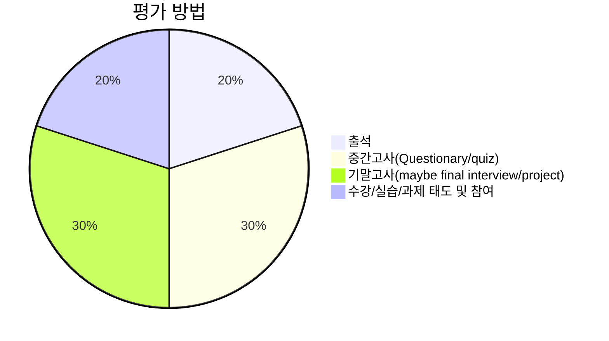

- [1 수업 소개](#1-수업-소개)
- [2. 세부 수업 목표](#2-세부-수업-목표)
- [3. 강의 자료 및 수업 진행 방식](#3-강의-자료-및-수업-진행-방식)
- [4. 실습 / 코딩](#4-실습--코딩)
- [5. 평가 방법](#5-평가-방법)
- [6. Take home](#6-take-home)

# 1 수업 소개

- 정영웅, [국립창원대학교](https://changwon.ac.kr) 재료금속공학과, :kr:



**52호관 212호**


**yjeong@changwon.ac.kr**


**055-213-3694**



- 분석 및 해석 기술의 발달로 다량의 데이터들이 생성되고 있다. 재료공학에서 데이터 해석 및 분석 능력의 중요성이 날로 높아지고 있다. 본 수업을 통해 학생들은 기초적인 데이터 분석/해석 및 시각화(그래프)를 위해 필요한 다양한 툴들을 익히고, 재료공학적 문제에 활용하는 경험을 하게된다.

- 관련 분야에서 가장 널리 활용되는 [Python](https://python.org) 언어를 활용하고, [JuPyter](https://jupyter.org) 환경을 활용하겠다.

- 재료공학 전공자에게 필요한 데이터 분석, IO, 해석 및 시각화 (그래프) 등 기초 컴퓨터활용 능력을 길러주기 위한 강의로 설계되었다. 본 교과목은 국립창원대학교 재료금속과 **전공 선택**교과이나, 이후 개설될 **수치해석**, **이동현상**, **기초 전산역학** 등의 교과과정의 이해를 위해서 선수강하길 권한다.

- 교수자는 Apple사의 MacOS 컴퓨터를 활용해 MS사의 [VScode](https://code.visualstudio.com)내의 [JuPyter](https://jupyter.org) 활용할 계획이며, 강의자료는 본 웹페이지를 활용할 계획이다. 수업시간에 보여질 시연/실습 환경과 무관하게, Windows, MacOS, Linux 등 다양한 컴퓨터 환경에서 실습 가능하다. 다만, 실습이 가능한 환경으로 개별 학생들의 환경을 세팅하는 것은 각자의 몫이다. 필요하다면 수업 전후에 도움을 줄 수 있다.

- [구글](https://google.com) 계정을 활용해서 [Google Colab](https://colab.google)와 [Google Drive](https://drive.google.com/)를 함께 활용해서 실습 가능하다. 인터넷 연결된 웹브라우저를 활용해서 실습 가능하나 추천하는 환경은 아니다. 이 경우 환경 세팅이 비교적 수월하겠으나, 인터넷 접속이 유지되어야 하고 계산 속도가 다소 느릴 수 있다.

- (optional) 스스로 프로그램을 작성하고, 더욱 세밀하게 관리하고 싶다면 [git](<https://ko.wikipedia.org/wiki/깃_(소프트웨어)>)을 배우고, 나아가 [GitHub](https://github.com) 계정을 만들고 결합하길 권한다.

# 2. 세부 수업 목표

- 수강자의 기초 파이썬 활용 능력 향상
- 최신 데이터 해석/분석 툴의 기초적 활용법을 익힘
  - [Python](https://python.org)
  - [JuPyter](https://jupyter.org)
  - [NumPy](https://numpy.org)
  - [matplotlib](https://matplotlib.org)
- 이를 활용해 재료공학 기초 문제 해결을 위해 활용 경험
- 기초적 이해를 바탕으로, 재료공학 실전 문제 해결에 응용을 할 수 있는 원리 이해
- 각자에게 주어진 문제를 **스스로** 해결하기 위해 필요한 배경 지식 습득

# 3. 강의 자료 및 수업 진행 방식

1. 강의 자료는 [markdown](https://ko.wikipedia.org/wiki/마크다운) 파일로 작성되어,
   [홈페이지에](https://youngung.github.io)내의 `lectures` 메뉴 게시물을 활용한다.
   게시물은 상시로 업데이트가 될 수 있다.
2. 원활한 수업 진행을 위해 수강생은 인터넷이 연결된 노트북을 가지고 오거나, 미리 수업 자료를
   출력해와야 한다. (준비가 안된 학생은 수업 태도/참여 점수 반영)
3. 수업 시간에 필요한 개념에 대해 설명하고, 교수자가 필요한 시연을 보인다. 이후 수강생들과
   함께 차근차근 실습하거나, 혹은 학생들이 **스스로** 그리고 **혼자서** 실습해봐야 한다 :pray:
4. 강의 자료에 실습 가능한 **Python** 코드는 아래와 같이 박스로 표기된다.

```python
print('Hello, world')
```

5. 때에 따라서, 기존에 입력한 코드가 이미 실행되어 있어야만 제대로 작동하는 경우가 있으니,
   긴장을 놓지 않고 수업의 진행을 잘 따라오길 바란다. 놓친 부분에 집착하기 보다는 수업 시간에
   놓친 부분을 사전에 마킹한 후, 강의 이후 스스로 찾아서 살펴보시오.
6. 수업 시간에 배운 내용을 반드시 스스로 **반복**해서 실습해봐야 한다. 그리고 수업 시간내
   다룬 예제를 **혼자서** 해보는 경험이 필요하다.


# 4. 실습 / 코딩

- 본 수업은 재료과학/공학에서 활용되는 다양한 데이터 분석을 경험하고 활용하기 위해 필요한 기초
  적 도구(tool)의 활용을 익히는 것이 목표이기 때문에, **코딩**(coding)이 필요하다.
- 코딩을 위해서 필요한 적절한 환경이 갖춰진 컴퓨터:computer:가 없이 코딩을 배우는 건 매우
  어렵다. 축구공이 없이 축구를 배울 순 없다. 실습을 할때마다 본인의 실습환경에 맞게 컴퓨터
  환경을 다시 세팅하거나, 필요한 패키지를 설치하는 건 여간 귀찮은 일이 아니다. 실습에 맞는
  개인용 컴퓨터를 보유하고 있길 권한다. 각종 cloud service나, 학교 전산실습실 이용으로
  실습이 가능하나, 교수자가 추천하지 않는 건 실습 환경을 직접 세팅해볼 수가 없기 때문이다.
  친구/가족에게 노트북을 빌리는 것도 가능하나, 학교에서 대여도 한다 - [링크](https://chains.changwon.ac.kr/nonstop/lend/sub.php?group_code=e0000010&subgroup_code=es000043): 마지막으로 연결해본 날짜: 2026-06-05
  하지만 물량이 많지 않고 조기에 대여가 완료된다.
- 코딩은 :bike:, :ski:, :snowboarder:,:tennis:, :surfer:, :guitar:,
  :soccer:등과 비슷하다. 모두 **몸**으로 익혀야 한다. 교수자나 주위 친구가 하는 걸 백번
  보는 것보다 직접 해보는 것이 낫다. 어려운 개념은 반복해서 예습을 풀어보며 **머리** 뿐만
  아니라 **몸**(muscle memory:muscle:)으로 익혀라.
- 수업 시간 예제 반드시 스스로 해보기
  - 스스로 공부할 때, 혹은 예제를 풀 때 [ChatGPT](https://chatgpt.com)에 도움을
    받는 건 좋으나, 단순 질문과 답을 구하기 보다 스스로의 이해를 돕기 위해 활용하길 바란다.
  - 예제를 일일이 다 쳐보기. 네모 박스 코드를 일일이 다 정확히 쳐보기 (copy&paste 금지)
  - 결과를 스스로 살펴봐야 하고 이해하도록 노력해보기
  - 예제를 바꿔서 적용하고 그 변화를 살펴보기.
  - 예시로 주어진 프로그램을 한줄씩, 한 명령어씩 다 뜯어서 살펴보기 (hacking)
  - :raising_hand: :grey_question:
- 영문 키보드 반드시 숙지 필요
  - 영타가 느리면 그만큼 학습이 느려진다.
  - 예시로 주어지는 코드를 모두 직접 입력해봐야 한다.
  - 키보드 익히기 유용한 링크
    - [1](https://typing.io),
    - [2](https://www.typelit.io),
    - [3](https://typing.works) ...
- 각종 기호들 위치 익히기! 평소에 쓰지 않은 다양한 부호가 컴퓨터에 있음을 인지할 것.

  - `: accent
  - ': single quotation mark
  - ": double quotation mark
  - !: exclamation mark
  - @: 'at'
  - #: number sign (sharp)
  - $: dollar sign
  - %: percent
  - ^: caret
  - &: ampersand
  - \*: asterisk
  - (: left parenthesis
  - ): right parenthesis
  - -: dash (minus)
  - =: equal sign
  - ,: comma
  - \_: underscore
  - +: plus
  - [: left square bracket
  - ]: right square bracket
  - /: slash
  - \\: blackslash
  - <: left bracket
  - \>: right bracket

- 교수자가 사용하는 도구들: MacOS, MS VScode, 기본 terminal, JuPyter notebook, Google Colab ...
  - 하지만, 실습은 Windows, MacOS, Linux .. 등 어디서든 가능합니다.
  - [Google colab](https://colab.google)에서는 인터넷 연결만 되어 있다면 JuPyter notebook 실습 가능합니다.
  - 수업 중간에 인터넷을 통해 몇몇 Python 패키지를 설치해야 할 수도 있으므로, 교내 와이파이 접속 가능해야 함.
  - VS code에 대해 상세히 알고 싶다면 [여기](https://code.visualstudio.com/docs)를 통해 알아보자. 영어로 된 문서가 부담스럽거나 어렵다면, 최신 웹브라우저들은 대부분 번역 기능을 제공하니 적극적으로 활용해보길 바란다.

# 5. 평가 방법

- 출석과 결석 (출석 부를 때 없으면 결석, 수업 시작 30 분 이내 도착하면 이후 **지각**처리)

- 중간/기말 평가
  - 꾸준한 **출석**이 매우 중요한 교과목(20%)이며, 교과목 특성상 스스로 예제를 풀이하는 경험이 필수적이다.
  - 단순 출석을 넘어서 수업에 적극적으로 참여하는 태도가 필요하다(태도 점수 20%).
  - 중요한 원리를 이해하기 위해서는 설명을 읽는 것에 그치지 않고 직접 실습을 해야 한다.
  - 수업시간 다룬 예제 중심으로 이해 필요하며, 꾸준히 반복 수행해야 한다.
  - 고득점(A, A+)을 원한다면 주어진 예제를 실습하는데 그치지 않고 이를 응용 할 수 있어야 한다.
  - AI등 툴을 수업 시간에 활용하는 것은 환영하나, 지필 고사(중간고사 및 기말고사)에서 활용 수 없다.



# 6. Take home

- 각 학생들마다 컴퓨터 환경 (Windows, MacOS, Linux, cloud ... 등등)이 다르므로
  본인의 컴퓨터 환경에 맞게 환경 세팅 필요함.
- 파이썬 설치 및 환경 설정 완성 (Python 3.12, [JuPyter](https://jupyter.org), [VS code](https://code.visualstudio.com), pip)
  - 설치 설명 참고 [링크](https://blog.naver.com/dlgusen123/223943489124)
- [YouTube](https://youtube.com)에서 간단한 Python tutorial 영상 찾아서 보고 따라해보기.
- 영문타자 익히기 - [여기1](https://www.typelit.io), [여기2](https://www.typing.com/student/lesson/328/common-english-words), [여기3](https://www.speedcoder.net)서 연습해보기.
- 키보드 기호들의 위치 숙지 필요.
- 강의실 내 인터넷 접속 사전에 해보기. 교수가자 따로 인터넷 제공하지 않는다.
- [Google colab](https://colab.google)에서 Notebook 만들어 실습해보기.
- [Google colab](https://colab.google)활용한다면 아이패드나 갤럭시 탭, 심지어는
  핸드폰(?)으로도 실습 가능하다. 하지만 여러 이유로 컴퓨터가 아닌 기기는 추천하지 않는다.
