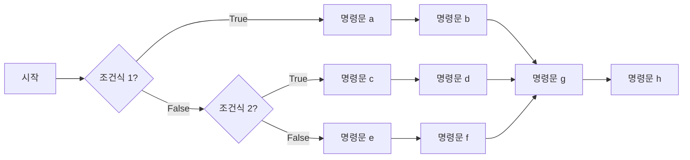

- [1. 목표:](#1-목표)
- [2. `if`, `elif`, `else` 조건문의 기본 구조 이해](#2-if-elif-else-조건문의-기본-구조-이해)
- [3. `for` 반복문](#3-for-반복문)
- [4. Built-in function인 `range`, `len`, `enumerate`를 `for`와 함께 조합!](#4-built-in-function인-range-len-enumerate를-for와-함께-조합)
- [5. 예제](#5-예제)
  - [5.1. 구구단 출력하기 (x단 입력하면 ... )](#51-구구단-출력하기-x단-입력하면--)
  - [5.2. 2의 제곱근 구하기.](#52-2의-제곱근-구하기)
  - [5.3. 3의 제곱근 구하기](#53-3의-제곱근-구하기)
  - [5.4. 4의 제곱근 구하기](#54-4의-제곱근-구하기)
  - [5.5. a의 제곱근 구하기](#55-a의-제곱근-구하기)
  - [5.6. 주양자수 $n$에 의해 결정되는 부 양자수 $l,m\_l$ 출력하기.](#56-주양자수-n에-의해-결정되는-부-양자수-lm_l-출력하기)
  - [5.7. 임의의 10진법 수를 이진법으로 바꾸는 파이썬 script를 작성해보자.](#57-임의의-10진법-수를-이진법으로-바꾸는-파이썬-script를-작성해보자)

# 1. 목표:

조건문과 (conditions), 반복문 (loop) 이해

# 2. `if`, `elif`, `else` 조건문의 기본 구조 이해

- 기본 구조 / 형식

```python
if 조건식1:
	<명령문a>
	<명령문b>
elif 조건식2:
	<명령문c>
	<명령문d>
else:
	<명령문e>
	<명령문f>
<명령문g>
<명령문h>
<.....>
```



- 주의

  - indent, dedent 에 주의!!
  - 콜론 기호 ':' 빼먹지 말 것!

- 예시

  ```python
  # 예: 순수 알루미늄의 녹는점
  melting_point = 660  #Celcius degree
  temperature = 700    #Celcius degree

  if temperature < melting_point:
  	print("Solid state")
  elif temperature == melting_point:
  	print("Solid and liquid co-exist")
  else:
  	print("Liquid state")
  ```

# 3. `for` 반복문

- 기초 설명

  - 파이썬의 for 반복문은 **순서가 있는 데이터(시퀀스)**나
    **반복 가능한 객체(iterable)**를 순차적으로 꺼내면서 코드를 실행하는 구문.

- 기본 구조

  ```python
  ## 주의! 실행할 명령문1, 2, ... 줄은 들여쓰기로 구분됨.
  for <변수> in <반복가능객체>:
  	<실행할 명령문1>
  	<실행할 명령문2>
  	<...>

  ```

  ```mermaid
  flowchart TD
  	A[시작] --> B[반복가능 객체, iterable ]
  	B --> C[반복가능객체 속의 다음번 element]
  	C --> D{아직 남은 element가 있나?}
  	D -- True --> E[명령문 1] --> E2[명령문 2]
  	E2 --> C
  	D -- False --> F[Exit loop]
  	F --> G[Continue program]
  ```

- Indent & dedent를 활용해서 시작과 끝을 구분

- **순서가 있는 데이터 시퀀스**로는 List, Tuple, Dictionary 타입의 변수가 있다.

  - 예1

  ```python
  a=[3,4,5] #list type
  for e in a:
     print(e)
  ```

  - 예1

  ```python
  a=[0,1,2,3,4,5,6] #list type
  for e in a[::2]: ## 0, 2, 4, 6
     print(e)
  ```

  - 예2

  ```python
  a=('3',[34343],5) # tuple type
  for e in a:
     print(e)
  ```

  - 예3

  ```python
  a=dict(a='b',b='1',d=3,z=[]) # (Python 3.7>)
  for e in a:
     print(e)
  ```

- 주의

  - indent, dedent 에 주의!!

  - 콜론 기호 ':' 빼먹지 말 것!

# 4. Built-in function인 `range`, `len`, `enumerate`를 `for`와 함께 조합!

- 개념
- `len()` -> 시퀀스 (List, 문자열, 튜플 등)의 **길이(요소 개수)**를 반환
- `range()` → 지정한 범위의 숫자 시퀀스를 생성 (반복문에서 자주 사용)
- `range` 와 `len` 함께 활용하여, 인덱스 기반 반복
- `enumerate()`로 인덱스와 요소 함께 활용 용이

- 예시1

```python
fruits = ["apple", "banana", "cherry"]

for i in range(len(fruits)):  # 0 ~ len(fruits)-1
   print(f"Index {i}: {fruits[i]}")
```

- 예시 2

```python
specimen_lengths = [10.0, 12.3, 9.8, 11.5]  # cm

for i in range(len(specimen_lengths)):
length = specimen_lengths[i]
   print(f"Specimen {i+1}: {length} cm")
```

- 예시 3

```python
word = "steel"

for i in range(len(word)):
   print(f"Index {i} → {word[i]}")
```

- 예시 4

```python
fruits = ["apple", "banana", "cherry"]

for i, fruit in enumerate(fruits):
   print(i, fruit)
```

# 5. 예제

## 5.1. 구구단 출력하기 (x단 입력하면 ... )

```python
## algorithm
# 1. x단 입력 필요
# 2. 1곱하기부터 9 곱하기까지 '반복'; 예를 들어, y를 1부터 9까지 바꾸며 반복
#    2-1 각 '반복' 마다, x 곱하기 9 출력
```

- 예제2: 1부터 100사이의 정수합 구하기 (loop)

- 예제3: x! 팩토리얼 구하기

- 예제4: 주어진 List에서 최대값과 최소값 찾기 (조건문과 loop 활용)
  가령,
  ```python
  a=[3,4,5,6,102,3,4,103,1,-10,3,-10]
  ```
  으로 주어진 리스트 `a`내에서 가장 큰 값과 가장 작은 값을
  `for` 구문을 활요해 찾아보기.

## 5.2. 2의 제곱근 구하기.

- Algorithm (점화식)

$$x_{n+1}=x_n-\frac{(x_n)^2-2}{2x_n}$$

- 파이썬으로 바꾸면

```python
x=11. ## initial guess
x=x-(x**2-2)/(2*x)
print(x)
x=x-(x**2-2)/(2*x)
print(x)
x=x-(x**2-2)/(2*x)
print(x)
x=x-(x**2-2)/(2*x)
print(x)
```

- `for` loop를 활용하면 더 근사하게 표현 가능하겠다.

```python
x=11. ## initial guess
for i in range(5):
	x=x-(x**2-2)/(2*x)
	print(x)
```

## 5.3. 3의 제곱근 구하기

```python
x=1. ## initial guess (0이어서는 안된다. 이유는?)
for i in range(7):
	x=x-(x**2-3)/(2*x)
	print(x)
```

## 5.4. 4의 제곱근 구하기

```python
x=1. ## initial guess (0이어서는 안된다. 이유는?)
for i in range(7):
	x=x-(x**2-4)/(2*x)
	print(x)
```

## 5.5. a의 제곱근 구하기

- Algorithm (점화식)

$$ x\_{n+1}=x_n-\frac{(x_n)^2-a}{2x_n} $$

```python
a=30 # a에 다른 숫자를 넣어서 반복해보자.
x=1. ## initial guess (0이어서는 안된다. 이유는?)
for i in range(7):
	x=x-(x**2-a)/(2*x)
	print(x,x**2-a)
```

- initial guess를 -1로 사용해서 되풀이 해보자.

## 5.6. 주양자수 $n$에 의해 결정되는 부 양자수 $l,m_l$ 출력하기.

```python
# Calister 책의 표 2.1
n=3 ## 주양자수,
print('n:',n)
no_electrons=0
for l_value in range(0, n): # 0, 1, .., (n-1) 까지
  print('\tl:',l_value) #주의 '\t' string은 키보드의 탭기호를 뜻한다.
  low=-l_value
  up=+l_value
  print('\t\tml:',)
  for i in range(low,up+1): # -l, -l+1, ... 1, 0, 1, ... l-1, l
	  print('\t\t\t',i)
	  no_electrons=no_electrons+2 # 각 state마다 up/down spin 전자, 따라서 2개씩.
print('total number of electrons:',no_electrons)
```

## 5.7. 임의의 10진법 수를 이진법으로 바꾸는 파이썬 script를 작성해보자.
