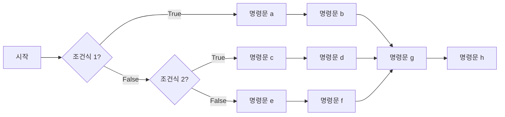

- [1. 목표:](#1-목표)
- [2. `if`, `elif`, `else` 조건문의 기본 구조 이해](#2-if-elif-else-조건문의-기본-구조-이해)
- [3. `for` 반복문](#3-for-반복문)
- [4. Built-in function인 `range`, `len`, `enumerate`를 `for`와 함께 조합!](#4-built-in-function인-range-len-enumerate를-for와-함께-조합)
  - [4.1. 논리 연산자를 활용한 조건식](#41-논리-연산자를-활용한-조건식)
  - [4.2. `while` 반복문](#42-while-반복문)
  - [4.3. `break`와 `continue`](#43-break와-continue)
  - [4.4. 누적 계산과 반복문 속 조건문](#44-누적-계산과-반복문-속-조건문)
- [5. 예제](#5-예제)
  - [5.1. 조건문과 반복문을 활용한 기본 예제](#51-조건문과-반복문을-활용한-기본-예제)
    - [5.1.1. 구구단 출력하기](#511-구구단-출력하기)
    - [5.1.2. 1부터 100까지의 정수 합 구하기](#512-1부터-100까지의-정수-합-구하기)
    - [5.1.3. 팩토리얼 구하기](#513-팩토리얼-구하기)
    - [5.1.4. 리스트에서 최댓값과 최솟값 찾기](#514-리스트에서-최댓값과-최솟값-찾기)
  - [5.2. 2의 제곱근 구하기.](#52-2의-제곱근-구하기)
  - [5.3. 3의 제곱근 구하기](#53-3의-제곱근-구하기)
  - [5.4. 4의 제곱근 구하기](#54-4의-제곱근-구하기)
  - [5.5. a의 제곱근 구하기](#55-a의-제곱근-구하기)
  - [5.6. 주양자수에 따른 부양자수와 자기양자수 출력하기](#56-주양자수에-따른-부양자수와-자기양자수-출력하기)
- [연습 문제](#연습-문제)
  - [문제 1](#문제-1)
  - [문제 2](#문제-2)
  - [문제 3](#문제-3)
  - [문제 4](#문제-4)
  - [문제 5](#문제-5)
  - [문제 6](#문제-6)
- [프로젝트형 연습문제](#프로젝트형-연습문제)
  - [프로젝트 1. 10진수 → 2진수 변환기](#프로젝트-1-10진수--2진수-변환기)
  - [프로젝트 2. 경도 측정값 검사와 결과 요약](#프로젝트-2-경도-측정값-검사와-결과-요약)

# 1. 목표:

조건문과 (conditions), 반복문 (loop) 이해

# 2. `if`, `elif`, `else` 조건문의 기본 구조 이해

- 기본 구조 / 형식

```text
if 조건식1:
	<명령문a>
	<명령문b>
elif 조건식2:
	<명령문c>
	<명령문d>
else:
	<명령문e>
	<명령문f>
<명령문g>
<명령문h>
<.....>
```



- 주의

  - indent, dedent 에 주의!!
  - 콜론 기호 ':' 빼먹지 말 것!

- 예시

  ```python
  # 예: 순수 알루미늄의 녹는점
  melting_point = 660  #Celcius degree
  temperature = 700    #Celcius degree

  if temperature < melting_point:
  	print("Solid state")
  elif temperature == melting_point:
  	print("Solid and liquid co-exist")
  else:
  	print("Liquid state")

  ## melting point와 temperature를 바꿔가며 실습해보기.
  ```

# 3. `for` 반복문

- 기초 설명

  - 파이썬의 for 반복문은 **순서가 있는 데이터(시퀀스)**나
    **반복 가능한 객체(iterable)**를 순차적으로 꺼내면서 코드를 실행하는 구문.

- 기본 구조

  ```text
  ## 주의! 실행할 명령문1, 2, ... 줄은 들여쓰기로 구분됨.
  for <변수> in <반복가능객체>:
  	<실행할 명령문1>
  	<실행할 명령문2>
  	<...>

  ```

  ```mermaid
  flowchart TD
  	A[시작] --> B[반복가능 객체, iterable ]
  	B --> C[반복가능객체 속의 다음번 element]
  	C --> D{아직 남은 element가 있나?}
  	D -- True --> E[명령문 1] --> E2[명령문 2]
  	E2 --> C
  	D -- False --> F[Exit loop]
  	F --> G[Continue program]
  ```

- Indent & dedent를 활용해서 시작과 끝을 구분

- **순서가 있는 데이터 시퀀스**로는 List, Tuple, Dictionary 타입의 변수가 있다.

  - 예1

  ```python
  a=[3,4,5] #list type
  for e in a:
     print(e)
  ```

  - 예1

  ```python
  a=[0,1,2,3,4,5,6] #list type
  for e in a[::2]: ## 0, 2, 4, 6
     print(e)
  ```

  - 예2

  ```python
  a=('3',[34343],5) # tuple type
  for e in a:
     print(e)
  ```

  - 예3

  ```python
  a=dict(a='b',b='1',d=3,z=[]) # (Python 3.7>)
  for e in a:
     print(e)
  ```

- 주의

  - indent, dedent 에 주의!!

  - 콜론 기호 ':' 빼먹지 말 것!

# 4. Built-in function인 `range`, `len`, `enumerate`를 `for`와 함께 조합!

- 개념
- `len()` -> 시퀀스 (List, 문자열, 튜플 등)의 **길이(요소 개수)**를 반환
- `range()` → 지정한 범위의 숫자 시퀀스를 생성 (반복문에서 자주 사용)
- `range` 와 `len` 함께 활용하여, 인덱스 기반 반복
- `enumerate()`로 인덱스와 요소 함께 활용 용이

- 예시1

```python
fruits = ["apple", "banana", "cherry"]

for i in range(len(fruits)):  # 0 ~ len(fruits)-1
   print("Index:",i,"fruit:",fruits[i])
```

- 예시 2

```python
specimen_lengths = [10.0, 12.3, 9.8, 11.5]  # cm

for i in range(len(specimen_lengths)):
    length = specimen_lengths[i]
    print("Specimen", i, "length:", length, "cm")
```

- 예시 3

```python
word = "steel"

for i in range(len(word)):
   print("Index ->", i, "character:", word[i])
```

- 예시 4

```python
fruits = ["apple", "banana", "cherry"]

for i, fruit in enumerate(fruits):
   print(i, fruit)
```

- Take home
  `zip ` 기능 찾아보기

## 4.1. 논리 연산자를 활용한 조건식

여러 조건을 함께 판단할 때는 논리 연산자를 사용한다.

- `and`: 두 조건이 모두 참일 때 참
- `or`: 조건 중 하나 이상이 참일 때 참
- `not`: 조건의 참과 거짓을 반대로 바꿈
- `in`: 어떤 값이 자료구조에 포함되어 있는지 확인

```python
temperature = 750
melting_point = 660

if temperature >= melting_point and temperature < 1000:
  print("liquid state")
```

문자열이나 리스트에 특정 값이 포함되어 있는지도 확인할 수 있다.

```python
element = "Fe"
metals = ["Fe", "Al", "Cu"]

if element in metals:
  print("metal")
```

## 4.2. `while` 반복문

`while`은 조건이 참(True)인 동안 명령문을 반복한다. 반복문 안에서 조건이 거짓이 되도록 값을 변경해야 무한 반복을 피할 수 있다.

```python
n = 1

while n <= 5:
  print(n)
  n += 1
```

`for`는 반복 횟수나 순회할 자료가 정해져 있을 때, `while`은 종료 조건이 중심일 때 사용하면 편리하다.

## 4.3. `break`와 `continue`

- `break`: 반복문을 즉시 종료
- `continue`: 현재 반복만 건너뛰고 다음 반복으로 이동

```python
for number in range(1, 10):
  if number == 5:
    break
  print(number)
```

```python
for number in range(1, 6):
  if number == 3:
    continue
  print(number)
```

## 4.4. 누적 계산과 반복문 속 조건문

반복문에서 계산 결과를 변수에 계속 더하는 방식을 누적 계산이라고 한다.

```python
total = 0

for number in range(1, 6):
  total += number # total= total + number

print(total)  # 15
```

반복문 안에 조건문을 넣으면 특정 조건을 만족하는 값만 처리할 수 있다.

```python
numbers = [3, 8, 11, 20, 25]

for number in numbers:
  if number % 2 == 0:
    print(number, "짝수")
  else:
    print(number, "홀수")
```

# 5. 예제

<span id="51-구구단-출력하기-x단-입력하면--"></span>

## 5.1. 조건문과 반복문을 활용한 기본 예제

### 5.1.1. 구구단 출력하기

정수 `x`를 입력받아 `x`단을 출력하시오. 입력은 2부터 9까지의 정수라고 가정한다.
`for`와 `range`를 사용하여 `x × 1`부터 `x × 9`까지 출력한다.
예를 들어 `x = 3`이면 첫 줄은 `3 × 1 = 3`, 마지막 줄은 `3 × 9 = 27`이다.

알고리즘: `x`를 입력받고, 곱하는 수 `y`를 1부터 9까지 바꾸면서 `x * y`를 출력한다.

<!--
풀이 예시:
x = int(input('출력할 단을 입력하세요 (2~9): '))
for y in range(1, 10):
    print(f'{x} × {y} = {x * y}')

range(1, 10)은 1부터 9까지의 정수를 생성한다. 끝값 10은 포함하지 않는다.
-->

### 5.1.2. 1부터 100까지의 정수 합 구하기

반복문으로 1부터 100까지의 정수를 더하여 합을 출력하시오.
`sum()`은 사용하지 않고, 합을 저장할 변수를 0으로 초기화한 뒤 값을 누적한다.

<!--
풀이 예시:
total = 0
for number in range(1, 101):
    total += number
print(total)

정답: 5050.
100도 합에 포함해야 하므로 range의 끝값은 101로 지정한다.
-->

### 5.1.3. 팩토리얼 구하기

변수 `x`에 저장된 정수의 팩토리얼 `x!`을 반복문으로 구하시오.
입력은 0 이상의 정수라고 가정한다. `x!`은 1부터 `x`까지의 정수를 곱한 값이며, `0! = 1`로 정의한다.
예를 들어 `x = 5`이면 결과는 `120`이다.

<!--
풀이 예시:
x = 5
factorial = 1
for number in range(1, x + 1):
    factorial *= number
print(factorial)

정답: x가 5이면 120, 1이면 1, 0이면 1.
x가 0이면 반복문을 실행하지 않아 초기값 1이 그대로 유지된다.
곱을 누적할 변수는 0이 아니라 1로 초기화해야 한다.
-->

### 5.1.4. 리스트에서 최댓값과 최솟값 찾기

다음 리스트에서 가장 큰 값과 가장 작은 값을 `for`와 조건문으로 구하시오.
`max()`와 `min()`은 사용하지 않는다. 리스트는 비어 있지 않다고 가정한다.

```python
a = [3, 4, 5, 6, 102, 3, 4, 103, 1, -10, 3, -10]
```

첫 번째 원소를 최댓값과 최솟값의 초기값으로 삼고, 각 원소와 비교하며 갱신한다.

<!--
풀이 예시:
a = [3, 4, 5, 6, 102, 3, 4, 103, 1, -10, 3, -10]
maximum = a[0]
minimum = a[0]
for value in a:
    if value > maximum:
        maximum = value
    if value < minimum:
        minimum = value
print('최댓값:', maximum)
print('최솟값:', minimum)

정답: 최댓값 103, 최솟값 -10.
초기값으로 0 대신 첫 번째 원소를 사용하면 음수만 있는 리스트나 양수만 있는 리스트에서도 올바르게 계산된다.
-->

## 5.2. 2의 제곱근 구하기.

- 알고리듬 (algorithm)

$$x_{n+1}=x_n-\frac{(x_n)^2-2}{2x_n}$$

- 파이썬으로 바꾸면

```python
x=11. ## initial guess
x=x-(x**2-2)/(2*x)
print(x)
x=x-(x**2-2)/(2*x)
print(x)
x=x-(x**2-2)/(2*x)
print(x)
x=x-(x**2-2)/(2*x)
print(x)
```

- `for` loop를 활용하면 더 근사하게 표현 가능하겠다.

```python
x=11. ## initial guess
for i in range(5):
	x=x-(x**2-2)/(2*x)
	print(x)
```

## 5.3. 3의 제곱근 구하기

```python
x=1. ## initial guess (0이어서는 안된다. 이유는?)
for n in range(7):
	x=x-(x**2-3)/(2*x)
	print(x)
```

## 5.4. 4의 제곱근 구하기

```python
x=1. ## initial guess (0이어서는 안된다. 이유는?)
for n in range(7):
	x=x-(x**2-4)/(2*x)
	print(x)
```

## 5.5. a의 제곱근 구하기

- 알고리듬 (algorithm)

$$ x_{n+1}=x_n-\frac{(x_n)^2-a}{2x_n} $$

```python
a=30 # a에 다른 숫자를 넣어서 반복해보자.
x=1. ## initial guess (0이어서는 안된다. 이유는?)
for i in range(7):
	x=x-(x**2-a)/(2*x)
	print(x,x**2-a)
```

- initial guess를 -1로 사용해서 되풀이 해보자.

<span id="56-주양자수-n에-의해-결정되는-부-양자수-lm_l-출력하기"></span>

## 5.6. 주양자수에 따른 부양자수와 자기양자수 출력하기

이 예제는 원자의 전자 상태를 나타내는 양자수의 허용 범위를 **중첩 반복문**으로 출력한다.
각 양자수의 의미와 가능한 값은 다음과 같다.

| 양자수 | 의미 | 가능한 값 |
| --- | --- | --- |
| 주양자수 $n$ | 전자껍질(shell)을 구분한다. 오비탈의 크기와 에너지에 관련된다. | 양의 정수: $1,2,3,\ldots$ |
| 부양자수 $l$ | 부껍질(subshell)과 오비탈의 모양을 구분한다. $l=0,1,2,3$은 각각 s, p, d, f에 해당한다. | $0$부터 $n-1$까지의 정수 |
| 자기양자수 | 주어진 부껍질 안에서 오비탈의 공간적 방향을 구분한다. | 아래 식의 정수 값 |

자기양자수는 부양자수와 다른 양자수이며, 다음 범위를 갖는다.

$$
m_l=-l,-l+1,\ldots,0,\ldots,l-1,l.
$$

따라서 $n$을 정하면 가능한 $l$의 범위가 정해지고, 각 $l$을 선택하면 가능한 자기양자수의 범위가 정해진다.
예를 들어 $n=3$인 전자껍질에서는 다음 상태가 가능하다.

| $l$ | 부껍질 | 자기양자수의 값 | 오비탈 수 | 최대 전자 수 |
| --- | --- | --- | --- | --- |
| 0 | 3s | 0 | 1 | 2 |
| 1 | 3p | −1, 0, 1 | 3 | 6 |
| 2 | 3d | −2, −1, 0, 1, 2 | 5 | 10 |

각 오비탈은 서로 다른 스핀양자수 $+1/2$, $-1/2$를 갖는 전자를 최대 두 개 수용한다.
따라서 아래 코드는 **실제로 들어 있는 전자 수가 아니라, 해당 껍질이 수용할 수 있는 최대 전자 수**를 센다.

```python
n = 3  # 주양자수: 양의 정수
print('n:', n)
max_electrons = 0

for l_value in range(n):  # l = 0, 1, ..., n-1
    print('\tl:', l_value)  # \t는 출력에 탭 간격을 넣는다.
    print('\t\tml:')
    for ml_value in range(-l_value, l_value + 1):  # ml = -l, ..., +l
        print('\t\t\t', ml_value)
        max_electrons += 2  # 오비탈 하나당 최대 전자 두 개

print('maximum number of electrons:', max_electrons)
```

바깥 반복문은 부껍질을 하나씩 선택하고, 안쪽 반복문은 그 부껍질의 오비탈을 하나씩 선택한다.
Python의 `range`는 끝값을 포함하지 않으므로, 자기양자수의 마지막 값까지 출력하려면 끝값에 **1을 더해야 한다.**
안쪽 반복문은 각 부껍질에서 $2l+1$회 실행된다.
$n=3$이면 총 오비탈 수는 $1+3+5=9$이고, 마지막 출력의 최대 전자 수는 $18$이다. 일반적으로는

$$
\text{오비탈 수}=\sum_{l=0}^{n-1}(2l+1)=n^2,
\qquad
\text{최대 전자 수}=2n^2
$$

가 된다. `n`을 1, 2, 4로 바꾸어 각각 최대 전자 수가 2, 8, 32인지 확인해 보자.


# 연습 문제

## 문제 1

변수 <code>x</code>가 0보다 큰지 검사하는 조건식을 쓰시오.

<!--
풀이와 해답:
x > 0
-->

## 문제 2

<code>for i in range(3)</code>에서 i가 차례로 갖는 값을 쓰시오.

<!--
풀이와 해답:
0, 1, 2
-->

## 문제 3

1부터 3까지의 정수를 출력하는 반복문의 첫 줄을 쓰시오.

<!--
풀이와 해답:
for i in range(1, 4):
-->

## 문제 4

변수 `temperature`가 0보다 크고 100보다 작은지 검사하는 조건식을 쓰시오.

<!--
풀이와 해답:
0 < temperature and temperature < 100
또는 0 < temperature < 100
-->

## 문제 5

`while` 반복문을 사용하여 1부터 5까지의 정수를 출력하시오.

<!--
풀이와 해답:
n = 1
while n <= 5:
  print(n)
  n += 1
-->

## 문제 6

다음 리스트에서 짝수만 출력하도록 반복문 속에 조건문을 작성하시오.

```python
numbers = [1, 2, 3, 4, 5, 6]
```

<!--
풀이와 해답:
for number in numbers:
  if number % 2 == 0:
    print(number)
-->

# 프로젝트형 연습문제

앞에서 배운 변수, 산술 연산, 문자열, 리스트, 조건문과 반복문을 조합하여 다음 두 프로그램을 작성하시오.
각 프로젝트의 제출물은 **코드, 실행 결과, 확인 사례별 결과, 프로그램 흐름을 설명하는 짧은 글**이다.

## 프로젝트 1. 10진수 → 2진수 변환기

앞에서 배운 조건문과 반복문을 활용하여, 변수 `number`에 저장된 정수를 2진수 문자열로 변환하는 프로그램을 작성하시오.
예를 들어 `number = 13`이면 `1101`을 출력해야 한다.

**구현 요구사항**

1. 입력은 정수라고 가정한다. 음수이면 지원하지 않는 입력이라는 안내를 출력한다.
2. 0이면 `0`을 출력한다.
3. 양수이면 `while` 반복문과 `//`, `%`를 사용해 변환한다. `bin()`이나 이진수 형식 지정 기능은 사용하지 않는다.[^binary-conversion]
4. 원래 입력값을 유지하고, 최종 결과에 10진수 입력과 2진수 문자열을 함께 출력한다.


[^binary-conversion]: 10진수 `n`을 2로 나누면 항상 `n = 2q + r`로 나타낼 수 있다. 여기서 `q`는 몫이고 `r`은 나머지(`0` 또는 `1`)이다. 따라서 `n % 2`로 가장 오른쪽 이진수 자리를 얻고, `n // 2`로 다음 자리를 구할 수 있는 더 작은 수를 만든다. 몫이 `0`이 될 때까지 이 과정을 반복하면 나머지는 낮은 자리부터 얻어진다. 예를 들어 `13`은 `(q, r) = (6, 1) → (3, 0) → (1, 1) → (0, 1)`이므로 나머지를 역순으로 읽어 `1101`이 된다. 코드에서는 나머지를 문자열의 앞에 붙여 역순으로 읽는 효과를 낸다.
2로 나눈 나머지는 0 또는 1이며, 가장 낮은 자리부터 얻어진다.
나머지를 문자열의 **앞쪽**에 차례로 붙이고, 몫을 다음 반복의 대상으로 사용하면 된다.
13에서는 몫이 `6 → 3 → 1 → 0`, 나머지가 `1 → 0 → 1 → 1`이므로 결과는 `1101`이다.

**확인 사례**

| 입력 | 기대하는 결과 |
| --- | --- |
| 0 | `0` |
| 1 | `1` |
| 2 | `10` |
| 13 | `1101` |
| 32 | `100000` |
| −3 | 음수를 지원하지 않는다는 안내 |

<!--
풀이 예시:
```python
number = 13
if number < 0:
    print('음수는 지원하지 않습니다.')
elif number == 0:
    print(number, '->', '0')
else:
    remaining = number
    binary = ''
    while remaining > 0:
        remainder = remaining % 2
        binary = str(remainder) + binary
        remaining = remaining // 2
    print(number, '->', binary)
```

확인: 0, 1, 2, 13, 32는 각각 0, 1, 10, 1101, 100000이다.
나머지를 문자열 끝에 붙이면 자리 순서가 뒤집히므로 주의한다.
-->

## 프로젝트 2. 경도 측정값 검사와 결과 요약

여러 시편의 경도 측정값을 저장한 리스트를 검사하고, 각 시편의 판정과 전체 결과를 출력하는 프로그램을 작성하시오.
측정값은 모두 동일한 경도 척도와 시험 조건에서 얻은 수치라고 가정한다.

```python
hardness = [110, 125, -1, 138, 142, 119, 166, 130]
```

다음 기준은 **프로그래밍 연습을 위해 정한 가상의 기준**이며, 실제 재료의 합격 규격을 뜻하지 않는다.

| 측정값 | 처리 |
| --- | --- |
| 0 이하 | 잘못된 측정값으로 제외 |
| 0 초과, 120 미만 | 기준 미달 |
| 120 이상, 150 이하 | 합격 |
| 150 초과 | 기준 초과 |

**구현 요구사항**

1. `for` 반복문으로 측정값을 하나씩 읽고, 시편 번호와 판정을 출력한다. 시편 번호는 1부터 시작한다.
2. `if`, `elif`, `else`로 판정하고, 잘못된 값은 평균 계산에서 제외한다.
3. 유효한 값의 합과 개수, 잘못된 값의 개수, 기준 미달·합격·기준 초과의 개수를 누적한다.
4. 반복이 끝나면 각 개수와 유효한 값의 평균을 출력한다.
5. 유효한 값이 없으면 평균 대신 안내를 출력한다. 빈 리스트에서도 오류가 나지 않아야 한다.

평균은 유효한 측정값의 합을 **유효한 값의 개수**로 나누어 계산한다.
위 데이터의 결과는 유효값 7개, 잘못된 값 1개, 기준 미달 2개, 합격 4개, 기준 초과 1개이며, 평균은 약 132.86이다.

**확인 사례**

| 데이터 | 확인할 동작 |
| --- | --- |
| 위의 예시 리스트 | 판정별 개수와 평균이 예시 결과와 일치하는가? |
| `[120, 150]` | 두 값 모두 합격이고 평균이 135인가? |
| `[0, -1]` | 잘못된 값 2개로 집계하고, 평균을 계산하지 않는가? |
| `[]` | 모든 개수가 0이고, 유효한 값이 없다는 안내를 출력하는가? |

선택 과제: 판정별 개수를 딕셔너리에 저장하고, 합격률을 유효한 값의 개수를 기준으로 계산하시오.

<!--
풀이 예시:
```python
hardness = [110, 125, -1, 138, 142, 119, 166, 130]
total = 0
valid_count = 0
invalid_count = 0
below_count = 0
pass_count = 0
above_count = 0

for index, value in enumerate(hardness):
    if value <= 0:
        status = '잘못된 측정값'
        invalid_count += 1
    else:
        total += value
        valid_count += 1
        if value < 120:
            status = '기준 미달'
            below_count += 1
        elif value <= 150:
            status = '합격'
            pass_count += 1
        else:
            status = '기준 초과'
            above_count += 1
    print('시편', index + 1, ':', value, status)

print('유효값:', valid_count, '잘못된 값:', invalid_count)
print('기준 미달:', below_count, '합격:', pass_count, '기준 초과:', above_count)
if valid_count > 0:
    print('평균:', total / valid_count)
else:
    print('평균을 계산할 유효한 측정값이 없습니다.')
```
예시 데이터: total=930, valid_count=7, invalid_count=1,
below_count=2, pass_count=4, above_count=1, 평균=930/7.
합격률은 유효값이 있을 때 pass_count / valid_count * 100으로 계산한다。
-->