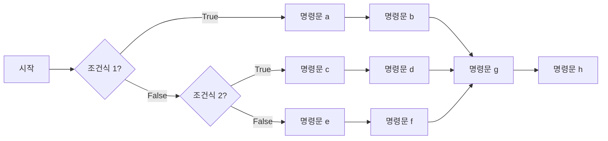

- [1. 목표:](#1-목표)
- [2. `if`, `elif`, `else` 조건문의 기본 구조 이해](#2-if-elif-else-조건문의-기본-구조-이해)
- [3. `for` 반복문](#3-for-반복문)
- [4. Built-in function인 `range`, `len`, `enumerate`를 `for`와 함께 조합!](#4-built-in-function인-range-len-enumerate를-for와-함께-조합)
  - [4.1. 논리 연산자를 활용한 조건식](#41-논리-연산자를-활용한-조건식)
  - [4.2. `while` 반복문](#42-while-반복문)
  - [4.3. `break`와 `continue`](#43-break와-continue)
  - [4.4. 누적 계산과 반복문 속 조건문](#44-누적-계산과-반복문-속-조건문)
- [5. 예제](#5-예제)
  - [5.1. 구구단 출력하기 (x단 입력하면 ... )](#51-구구단-출력하기-x단-입력하면--)
  - [5.2. 2의 제곱근 구하기.](#52-2의-제곱근-구하기)
  - [5.3. 3의 제곱근 구하기](#53-3의-제곱근-구하기)
  - [5.4. 4의 제곱근 구하기](#54-4의-제곱근-구하기)
  - [5.5. a의 제곱근 구하기](#55-a의-제곱근-구하기)
  - [5.6. 주양자수에 따른 부양자수와 자기양자수 출력하기](#56-주양자수-n에-의해-결정되는-부-양자수-lm_l-출력하기)
  - [5.7. 임의의 10진법 수를 이진법으로 바꾸는 파이썬 script를 작성해보자.](#57-임의의-10진법-수를-이진법으로-바꾸는-파이썬-script를-작성해보자)
- [연습 문제](#연습-문제)
  - [문제 1](#문제-1)
  - [문제 2](#문제-2)
  - [문제 3](#문제-3)
  - [문제 4](#문제-4)
  - [문제 5](#문제-5)
  - [문제 6](#문제-6)

# 1. 목표:

조건문과 (conditions), 반복문 (loop) 이해

# 2. `if`, `elif`, `else` 조건문의 기본 구조 이해

- 기본 구조 / 형식

```text
if 조건식1:
	<명령문a>
	<명령문b>
elif 조건식2:
	<명령문c>
	<명령문d>
else:
	<명령문e>
	<명령문f>
<명령문g>
<명령문h>
<.....>
```



- 주의

  - indent, dedent 에 주의!!
  - 콜론 기호 ':' 빼먹지 말 것!

- 예시

  ```python
  # 예: 순수 알루미늄의 녹는점
  melting_point = 660  #Celcius degree
  temperature = 700    #Celcius degree

  if temperature < melting_point:
  	print("Solid state")
  elif temperature == melting_point:
  	print("Solid and liquid co-exist")
  else:
  	print("Liquid state")

  ## melting point와 temperature를 바꿔가며 실습해보기.
  ```

# 3. `for` 반복문

- 기초 설명

  - 파이썬의 for 반복문은 **순서가 있는 데이터(시퀀스)**나
    **반복 가능한 객체(iterable)**를 순차적으로 꺼내면서 코드를 실행하는 구문.

- 기본 구조

  ```text
  ## 주의! 실행할 명령문1, 2, ... 줄은 들여쓰기로 구분됨.
  for <변수> in <반복가능객체>:
  	<실행할 명령문1>
  	<실행할 명령문2>
  	<...>

  ```

  ```mermaid
  flowchart TD
  	A[시작] --> B[반복가능 객체, iterable ]
  	B --> C[반복가능객체 속의 다음번 element]
  	C --> D{아직 남은 element가 있나?}
  	D -- True --> E[명령문 1] --> E2[명령문 2]
  	E2 --> C
  	D -- False --> F[Exit loop]
  	F --> G[Continue program]
  ```

- Indent & dedent를 활용해서 시작과 끝을 구분

- **순서가 있는 데이터 시퀀스**로는 List, Tuple, Dictionary 타입의 변수가 있다.

  - 예1

  ```python
  a=[3,4,5] #list type
  for e in a:
     print(e)
  ```

  - 예1

  ```python
  a=[0,1,2,3,4,5,6] #list type
  for e in a[::2]: ## 0, 2, 4, 6
     print(e)
  ```

  - 예2

  ```python
  a=('3',[34343],5) # tuple type
  for e in a:
     print(e)
  ```

  - 예3

  ```python
  a=dict(a='b',b='1',d=3,z=[]) # (Python 3.7>)
  for e in a:
     print(e)
  ```

- 주의

  - indent, dedent 에 주의!!

  - 콜론 기호 ':' 빼먹지 말 것!

# 4. Built-in function인 `range`, `len`, `enumerate`를 `for`와 함께 조합!

- 개념
- `len()` -> 시퀀스 (List, 문자열, 튜플 등)의 **길이(요소 개수)**를 반환
- `range()` → 지정한 범위의 숫자 시퀀스를 생성 (반복문에서 자주 사용)
- `range` 와 `len` 함께 활용하여, 인덱스 기반 반복
- `enumerate()`로 인덱스와 요소 함께 활용 용이

- 예시1

```python
fruits = ["apple", "banana", "cherry"]

for i in range(len(fruits)):  # 0 ~ len(fruits)-1
   print("Index:",fruits[i])
```

- 예시 2

```python
specimen_lengths = [10.0, 12.3, 9.8, 11.5]  # cm

for i in range(len(specimen_lengths)):
    length = specimen_lengths[i]
    print("Specimen", length, "cm")
```

- 예시 3

```python
word = "steel"

for i in range(len(word)):
   print("Index ->", word[i])
```

- 예시 4

```python
fruits = ["apple", "banana", "cherry"]

for i, fruit in enumerate(fruits):
   print(i, fruit)
```

- Take home
  `zip ` 기능 찾아보기

## 4.1. 논리 연산자를 활용한 조건식

여러 조건을 함께 판단할 때는 논리 연산자를 사용한다.

- `and`: 두 조건이 모두 참일 때 참
- `or`: 조건 중 하나 이상이 참일 때 참
- `not`: 조건의 참과 거짓을 반대로 바꿈
- `in`: 어떤 값이 자료구조에 포함되어 있는지 확인

```python
temperature = 750
melting_point = 660

if temperature >= melting_point and temperature < 1000:
  print("liquid state")
```

문자열이나 리스트에 특정 값이 포함되어 있는지도 확인할 수 있다.

```python
element = "Fe"
metals = ["Fe", "Al", "Cu"]

if element in metals:
  print("metal")
```

## 4.2. `while` 반복문

`while`은 조건이 참(True)인 동안 명령문을 반복한다. 반복문 안에서 조건이 거짓이 되도록 값을 변경해야 무한 반복을 피할 수 있다.

```python
n = 1

while n <= 5:
  print(n)
  n += 1
```

`for`는 반복 횟수나 순회할 자료가 정해져 있을 때, `while`은 종료 조건이 중심일 때 사용하면 편리하다.

## 4.3. `break`와 `continue`

- `break`: 반복문을 즉시 종료
- `continue`: 현재 반복만 건너뛰고 다음 반복으로 이동

```python
for number in range(1, 10):
  if number == 5:
    break
  print(number)
```

```python
for number in range(1, 6):
  if number == 3:
    continue
  print(number)
```

## 4.4. 누적 계산과 반복문 속 조건문

반복문에서 계산 결과를 변수에 계속 더하는 방식을 누적 계산이라고 한다.

```python
total = 0

for number in range(1, 6):
  total += number # total= total + number

print(total)  # 15
```

반복문 안에 조건문을 넣으면 특정 조건을 만족하는 값만 처리할 수 있다.

```python
numbers = [3, 8, 11, 20, 25]

for number in numbers:
  if number % 2 == 0:
    print(number, "짝수")
  else:
    print(number, "홀수")
```

# 5. 예제

## 5.1. 구구단 출력하기 (x단 입력하면 ... )

```python
## algorithm
# 1. x단 입력 필요
# 2. 1곱하기부터 9 곱하기까지 '반복'; 예를 들어, y를 1부터 9까지 바꾸며 반복
#    2-1 각 '반복' 마다, x 곱하기 9 출력
```

- 예제2: 1부터 100사이의 정수합 구하기 (loop)

- 예제3: x! 팩토리얼 구하기

- 예제4: 주어진 List에서 최대값과 최소값 찾기 (조건문과 loop 활용)
  가령,
  ```python
  a=[3,4,5,6,102,3,4,103,1,-10,3,-10]
  ```
  으로 주어진 리스트 `a`내에서 가장 큰 값과 가장 작은 값을
  `for` 구문을 활용해 찾아보기.

## 5.2. 2의 제곱근 구하기.

- 알고리듬 (algorithm)

$$x_{n+1}=x_n-\frac{(x_n)^2-2}{2x_n}$$

- 파이썬으로 바꾸면

```python
x=11. ## initial guess
x=x-(x**2-2)/(2*x)
print(x)
x=x-(x**2-2)/(2*x)
print(x)
x=x-(x**2-2)/(2*x)
print(x)
x=x-(x**2-2)/(2*x)
print(x)
```

- `for` loop를 활용하면 더 근사하게 표현 가능하겠다.

```python
x=11. ## initial guess
for i in range(5):
	x=x-(x**2-2)/(2*x)
	print(x)
```

## 5.3. 3의 제곱근 구하기

```python
x=1. ## initial guess (0이어서는 안된다. 이유는?)
for n in range(7):
	x=x-(x**2-3)/(2*x)
	print(x)
```

## 5.4. 4의 제곱근 구하기

```python
x=1. ## initial guess (0이어서는 안된다. 이유는?)
for n in range(7):
	x=x-(x**2-4)/(2*x)
	print(x)
```

## 5.5. a의 제곱근 구하기

- 알고리듬 (algorithm)

$$ x_{n+1}=x_n-\frac{(x_n)^2-a}{2x_n} $$

```python
a=30 # a에 다른 숫자를 넣어서 반복해보자.
x=1. ## initial guess (0이어서는 안된다. 이유는?)
for i in range(7):
	x=x-(x**2-a)/(2*x)
	print(x,x**2-a)
```

- initial guess를 -1로 사용해서 되풀이 해보자.

<span id="56-주양자수-n에-의해-결정되는-부-양자수-lm_l-출력하기"></span>

## 5.6. 주양자수에 따른 부양자수와 자기양자수 출력하기

이 예제는 원자의 전자 상태를 나타내는 양자수의 허용 범위를 **중첩 반복문**으로 출력한다.
각 양자수의 의미와 가능한 값은 다음과 같다.

| 양자수 | 의미 | 가능한 값 |
| --- | --- | --- |
| 주양자수 $n$ | 전자껍질(shell)을 구분한다. 오비탈의 크기와 에너지에 관련된다. | 양의 정수: $1,2,3,\ldots$ |
| 부양자수 $l$ | 부껍질(subshell)과 오비탈의 모양을 구분한다. $l=0,1,2,3$은 각각 s, p, d, f에 해당한다. | $0$부터 $n-1$까지의 정수 |
| 자기양자수 | 주어진 부껍질 안에서 오비탈의 공간적 방향을 구분한다. | 아래 식의 정수 값 |

자기양자수는 부양자수와 다른 양자수이며, 다음 범위를 갖는다.

$$
m_l=-l,-l+1,\ldots,0,\ldots,l-1,l.
$$

따라서 $n$을 정하면 가능한 $l$의 범위가 정해지고, 각 $l$을 선택하면 가능한 자기양자수의 범위가 정해진다.
예를 들어 $n=3$인 전자껍질에서는 다음 상태가 가능하다.

| $l$ | 부껍질 | 자기양자수의 값 | 오비탈 수 | 최대 전자 수 |
| --- | --- | --- | --- | --- |
| 0 | 3s | 0 | 1 | 2 |
| 1 | 3p | −1, 0, 1 | 3 | 6 |
| 2 | 3d | −2, −1, 0, 1, 2 | 5 | 10 |

각 오비탈은 서로 다른 스핀양자수 $+1/2$, $-1/2$를 갖는 전자를 최대 두 개 수용한다.
따라서 아래 코드는 **실제로 들어 있는 전자 수가 아니라, 해당 껍질이 수용할 수 있는 최대 전자 수**를 센다.

```python
n = 3  # 주양자수: 양의 정수
print('n:', n)
max_electrons = 0

for l_value in range(n):  # l = 0, 1, ..., n-1
    print('\tl:', l_value)  # \t는 출력에 탭 간격을 넣는다.
    print('\t\tml:')
    for ml_value in range(-l_value, l_value + 1):  # ml = -l, ..., +l
        print('\t\t\t', ml_value)
        max_electrons += 2  # 오비탈 하나당 최대 전자 두 개

print('maximum number of electrons:', max_electrons)
```

바깥 반복문은 부껍질을 하나씩 선택하고, 안쪽 반복문은 그 부껍질의 오비탈을 하나씩 선택한다.
Python의 `range`는 끝값을 포함하지 않으므로, 자기양자수의 마지막 값까지 출력하려면 끝값에 **1을 더해야 한다.**
안쪽 반복문은 각 부껍질에서 $2l+1$회 실행된다.
$n=3$이면 총 오비탈 수는 $1+3+5=9$이고, 마지막 출력의 최대 전자 수는 $18$이다. 일반적으로는

$$
\text{오비탈 수}=\sum_{l=0}^{n-1}(2l+1)=n^2,
\qquad
\text{최대 전자 수}=2n^2
$$

가 된다. `n`을 1, 2, 4로 바꾸어 각각 최대 전자 수가 2, 8, 32인지 확인해 보자.

## 5.7. 임의의 10진법 수를 이진법으로 바꾸는 파이썬 script를 작성해보자.
 -  연산 부호 ```//``` 와 ```%``` 활용하길 바란다.

# 연습 문제

## 문제 1

변수 <code>x</code>가 0보다 큰지 검사하는 조건식을 쓰시오.

<!--
풀이와 해답:
x > 0
-->

## 문제 2

<code>for i in range(3)</code>에서 i가 차례로 갖는 값을 쓰시오.

<!--
풀이와 해답:
0, 1, 2
-->

## 문제 3

1부터 3까지의 정수를 출력하는 반복문의 첫 줄을 쓰시오.

<!--
풀이와 해답:
for i in range(1, 4):
-->

## 문제 4

변수 `temperature`가 0보다 크고 100보다 작은지 검사하는 조건식을 쓰시오.

<!--
풀이와 해답:
0 < temperature and temperature < 100
또는 0 < temperature < 100
-->

## 문제 5

`while` 반복문을 사용하여 1부터 5까지의 정수를 출력하시오.

<!--
풀이와 해답:
n = 1
while n <= 5:
  print(n)
  n += 1
-->

## 문제 6

다음 리스트에서 짝수만 출력하도록 반복문 속에 조건문을 작성하시오.

```python
numbers = [1, 2, 3, 4, 5, 6]
```

<!--
풀이와 해답:
for number in numbers:
  if number % 2 == 0:
    print(number)
-->
