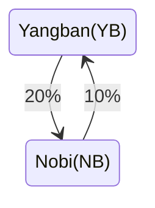

# 8. Week6

- NumPy 03, Eigenvalue, ANN

## 8.1. 수업 06-1 (Eigenvalue)

### 8.1.1. 개념

- 고유값(eigen value): 행렬(특히 선형변환)을 적용했을 때, 크기만 변하고 방향은 변하지 않는 벡터의 크기 변화 비율.

- 고유벡터(eigen vector): 그 “변하지 않는 방향”을 가지는 벡터.

- 수식:

  $$
  \boldsymbol A\cdot \boldsymbol v = \lambda \boldsymbol v
  $$

  를 만족시키는 스칼라 $$\lambda$$ 값을 고유값이라 한다.
  위 관계를 만족시키는 고유값 세개가 각각 $$\lambda_1,\lambda_2,\lambda_3$$라면
  $$\lambda_1\boldsymbol{v},\lambda_2\boldsymbol{v},\lambda_3\boldsymbol{v}$$
  를 고유 벡터라 한다.

### 8.1.2. 선형 변환(linear transformation; linear map)

#### 8.1.2.1. 선형변환 조건

- 행렬과 벡터의 곱을, 벡터 맵핑으로 해석할 수 있다.

<p align="center">
  
</p>

- 아래와 같은 두 조건을 만족시키는 행렬 $$\boldsymbol A$$를 선형변환 행렬이라 한다.

  $$
  \boldsymbol A\cdot (\boldsymbol a+\boldsymbol b)
  = \boldsymbol A\cdot \boldsymbol a+ \boldsymbol A\cdot \boldsymbol b
  $$

  $$
  \boldsymbol A\cdot (\lambda\boldsymbol a)=\lambda A\cdot\boldsymbol a
  $$

<p align="center">
  
</p>

<p align="center">
  
</p>

\*\* [Wikipedia 발췌 이미지](https://en.wikipedia.org/wiki/Linear_map)

#### 8.1.2.2. 선형변환 특성

- 선형변환의 특성을 잘 반영하는 방향을 찾을 수 있다.
- 아래의 행렬은 선형변환을 하며, 그 특성을 대표하는 두 방향을 빨간색으로 나타내었다.

### 8.1.3. 고유값의 기하하적 의미

고유값의 기하학적 의미를 파악해보자. 다음과 같은 행렬의 경우를 살펴보자. 다음의 여러 행렬들에 의한 벡터(점)의 변환을 살펴보자. 그리고 빨간 선과 (표기되어 있다면) 파란 선 위의 점들이 다른 점들과 어떠한 차이가 있는지 눈여겨 살펴보자.


위 세 경우와 달리, 아래 경우는 조금 특별하다. 특성값이 복소수
$$\lambda_1=0.71+0.71i,$$
그리고
$$\lambda_2=0.71-0.71i$$
임을 눈여겨 보자.


### 8.1.4. 고유값 (Eigenvalue), 고유벡터 (Eigenvector) 구하기.

- 2차원 예시01

  $$
  \begin{bmatrix}
  A_{11}&A_{12}\\
  A_{21}&A_{22}
  \end{bmatrix}
  \begin{bmatrix}
  v_1\\
  v_2
  8. \end{bmatrix}
  =
  \lambda
  \begin{bmatrix}
  v_1\\
  v_2
  \end{bmatrix}
  $$

  $$
  A_{11}v_1+A_{12}v_2=\lambda v_1\ \ \ \ (1)
  $$

  $$
  A_{21}v_1+A_{22}v_2=\lambda v_2\ \ \ \ (2)
  $$

  (1)식을 고치면,

  $$
  (A_{11}-\lambda)v_1=-A_{12}v_2
  $$

  따라서

  $$
  v_1=\frac{-A_{12}}{A_{11}-\lambda}v_2
  $$

  (2)에 대입하면

  $$
  \frac{-A_{21}A_{12}}{A_{11}-\lambda}v_2+A_{22}v_2=\lambda v_2\ \ \ \ (3)
  $$

  (3)의 $$v_2=0$$인 해는 trivial. 이걸 제외하면,

  $$
  \frac{-A_{21}A_{12}}{A_{11}-\lambda}+A_{22}=\lambda
  $$

  정리하면

  $$
  -A_{21}A_{12}+A_{22}(A_{11}-\lambda)=\lambda(A_{11}-\lambda)
  $$

  위는 $\lambda$에 대한 2차 방정식이며

  $$
  \lambda^2-(A_{11}-A_{22})\lambda-A_{21}A_{12}+A_{22}A_{11}=0
  $$

- 2차원 예시02

  $$
  \boldsymbol A\cdot \boldsymbol v = \lambda \boldsymbol v
  \ \ \
  \rightarrow
  \ \ \
  (\boldsymbol A-\lambda\boldsymbol I)\cdot v=0
  $$

  $$
  \boldsymbol A =
  \begin{bmatrix}
  A_{11}& A_{12}\\
  A_{21}& A_{22}
  \end{bmatrix}
  $$

  그리고

  $$
  \boldsymbol I =
  \begin{bmatrix}
  1& 0\\
  0& 1
  \end{bmatrix}
  $$

  고유값 $\lambda$는 아래와 같이 구해진다.

  $$
  \det(\boldsymbol A-\lambda\boldsymbol I)=0
  $$

  ```python
  import numpy as np
  def eig2x2(A):
    a=A[0,0]
    b=A[0,1]
    c=A[1,0]
    d=A[1,1]
    tr = a + d
    det = a*d - b*c
    disc = tr*tr - 4*det
    lam1 = (tr + np.sqrt(disc)) / 2
    lam2 = (tr - np.sqrt(disc)) / 2
    return lam1, lam2

  A = np.array([[3,2],[2,1]], dtype=float)
  lam1, lam2 = eig2x2(A)
  print("manual:", lam1, lam2)
  print("numpy :", np.linalg.eigvals(A))
  ```

- 예시
  주어진 [파일](/assets/dat_files/lectures/1_2_data_mse/matrix_03.txt)의 매트릭스의 값들을 활용해서 각 파일에서 고유값들을 구해서
  출력하시오.

  ```python
  import numpy as np
  def eig2x2(A):
    a=A[0,0]
    b=A[0,1]
    c=A[1,0]
    d=A[1,1]
    tr = a + d
    det = a*d - b*c
    disc = tr*tr - 4*det
    lam1 = (tr + np.sqrt(disc)) / 2
    lam2 = (tr - np.sqrt(disc)) / 2
    return lam1, lam2
  d=np.loadtxt('../data/matrix_03.txt',skiprows=1)
  for i, mat2x2 in enumerate(d):
    mat=mat2x2.reshape(2,2)
    print(eig2x2(mat)) ## nan 은 어던 경우인가?
  ```

- `np.ling.eigen`활용 소개

- 변형률

역학에서 변위구배텐서(displacement gradient tensor) $\boldsymbol u$라는 물리량을 활용해, 변형 전 후의 위치변화를 다음과 같이 위치를 나타내는 벡터 변환으로 나타낸다.

$$
\boldsymbol v^{new}=\boldsymbol u \cdot \boldsymbol v^{old}
$$

이때, 변위구배텐서의 eigen value를 활용해 변형의 `량`을 가늠해볼 수 있다. 2차원 변위구배텐서의 특성값을 각각 $\lambda_1, \lambda_2$라 한다면, 경우에 따라 (회전이 거의 없다면) $\lambda_1-1$과 $\lambda_2-1$은 꽤 괜찮은 변형의 정도를 나타내는 지표가 될 수 있다. 여기서 1을 빼는 이유는 무엇일까?

- 예시 Human vs. Zombie [ref](https://www.youtube.com/watch?v=i8FukKfMKCI)

신분제가 공고하던 조선 시대에서도 [양반](https://en.wikipedia.org/wiki/Yangban)과 [노비](https://en.wikipedia.org/wiki/Nobi) 계층간의 변화가 일어나곤 했다 ([참고](https://product.kyobobook.co.kr/detail/S000001197638)). 매우 불안정했던 가상의 조선시대에 매년 역적으로 몰린 양반의 20%가 노비가 되고, 노비 중 10%가 큰 부를 쌓아 양반으로 신분상승을 했다고 가정하자.



해가 거듭 될 수록 달라지는 양반(YB)과 노비(NB)의 상관 관계를 수식으로 표현하자면 아래와 같다.

$$
YB_{(n+1)} = 0.80 YB_{(n)} + 0.10 NB_{(n)}
$$

$$
NB_{(n+1)} = 0.20 YB_{(n)} + 0.90 NB_{(n)}
$$

여기서 첨자 $_{n}$과 $_{n+1}$은 각각 직전 해, 그리고 다음해에 해당하는 노비와 양반을 가리킨다. 위 연립 방정식을 아래와 같이 행렬식으로 나타낼 수 있겠다.

$$
\begin{bmatrix}
YB_{(n+1)} \\
NB_{(n+1)}
9. \end{bmatrix}
=
\begin{bmatrix}
  0.90& 0.01 \\
  0.02& 0.95
 \end{bmatrix}

\begin{bmatrix}
YB_{(n)} \\
NB_{(n)}
\end{bmatrix}
$$

예들 들어, 양반과 노비의 인구수가 첫해($n=0$)에 8명 vs 2명 이었다고 가정하자. 그 다음해에는

$$
\begin{bmatrix}
YB_{(1)} \\
NB_{(1)}
10. \end{bmatrix}
=
\begin{bmatrix}
  0.8& 0.1 \\
  0.2& 0.90
 \end{bmatrix}

\begin{bmatrix}
8 \\
2
11. \end{bmatrix}
=
\begin{bmatrix}
6.60 \\
3.40
\end{bmatrix}
$$

그리고 그 다음에는

$$
\begin{bmatrix}
YB_{(2)} \\
NB_{(2)}
12. \end{bmatrix}
=
\begin{bmatrix}
  0.8& 0.1 \\
  0.2& 0.90
 \end{bmatrix}

\begin{bmatrix}
6.60 \\
3.40
13. \end{bmatrix}
=
\begin{bmatrix}
5.62 \\
4.38
\end{bmatrix}
$$

이렇게 차례로 시간이 더욱 지나고 나면 3.34, 6.66으로 수렴된다. 하지만 초기 세팅이 8대2가 아니라 8대 4였다면 4대 8로 바뀌게 된다. 위 경우를 포함해 양반대 노비의 비율이 각기 다를경우에도 시간이 충분히 지나면, 규칙성 있게 바뀌게 된다.


다음 몇몇 선형변환 매트리스와 그에 해당하는 Eigenvector와 Eigenvalue가 보여주는 변화를 살펴보자


- 구글(Google)의 Page ranking system: [ref](https://pi.math.cornell.edu/~mec/Winter2009/RalucaRemus/Lecture3/lecture3.html)

<!--

```typograms
                                                        ----0.3--+
                                                        |        |
                                                        V        |
+-----------------+                    +---------------------+   |
| www.daum.net    | ------ 0.2 ---   | www.naver.com       |---+
|                 | <----- 0.3 -----   |                     |
+-----------------+                    +---------------------+
     ^     |        \                     ^           |
     |     |         \                    |           |
    0.2    0.3        \                   0.15        0.3
     |     |           \                  |           |
     |     v            0.2               |           v
+-----------------+       \           +-------------------+
|                 |        \          |                   |
| www.youtube.com |         +------ |    google.com     |
|                 |<-------0.7--------|                   |
|                 |--------0.05-----|                   |
+-----------------+                   +-------------------+
```

$$
\begin{bmatrix}
daum \\
naver \\
youtube \\
google  \\
\end{bmatrix}
=
\begin{bmatrix}
0 & 0.3  & 0.2 & 0 \\
0.2 & 0.3 & 0 & 0.15\\
0.3 & 0 & 0 & 0.7 \\
0.2 & 0.3 & 0 & 0.05
\end{bmatrix}
\begin{bmatrix}
daum \\
naver \\
youtube \\
google  \\
\end{bmatrix}
$$

-->

---

## 8.2. 수업 06-2 (ANN, Activation)

- 인공 신경망 (Artificial Neural Network)

  - [인공 신경망](https://ko.wikipedia.org/wiki/신경망)
    ([neutral network](<https://en.wikipedia.org/wiki/Neural_network_(machine_learning)>))에 쓰이는
    일반적인 [인공뉴런](https://ko.wikipedia.org/wiki/인공_뉴런)
    ([artificial neuron](https://en.wikipedia.org/wiki/Artificial_neuron))은 다음 형태를 가지는 경우가 많다.
  - 신경망

- Basic structure of Artificial Neural Network

  - 행렬곱과 더하기 조합. 아래 수식은 실제로 Artifical Neutral Network(ANN)에서 널리 활용되는 형태의 연산이다.

    $$
    \boldsymbol y=\boldsymbol W\cdot \boldsymbol x + \boldsymbol b
    $$

    $$
    y_i=\bigg(\sum_j^mW_{ij}x_j\bigg)+b_i=W_{ij}x_j+b_i \text{ with } i=1,2, ..., n
    $$

    ```python
    W=np.array([[1,2,3,4],[5,6,7,8]]) ## 2x4 행렬 (with n and m beging 2 and 4, respectively)
    x=np.array([5.5,0.1,0.3,1.0])     ## 4 (nested 가 아님. 1차원 임에 유의)
    b=np.array([-0.5,+0.5])

    n=2
    m=4
    y=np.zeros(n) # 주의 정수 n은 2이다.

    for i in range(n): ## i=1,2,...,n
    for j in range(m):
      y[i]+=W[i,j]*x[j]+b[i]
    print(y)
    ## 위 표현은 틀렸다.
    ## 올바른 표현의 예는 아래와 같다. 무엇이 고쳐졌는가?
    n=2
    m=4
    y=np.zeros(n)
    for i in range(n): ## i=1,2,...,n
    y[i]+=b[i]
    for j in range(m):
      y[i]+=W[i,j]*x[j]
    ## summation_j^m가 어디까지의 term에 적용되는지 정확히 알아야 함.
    print(y)
    ```

  - 예시

  `W[n,m]`행렬과 `x[m]`벡터, 그리고 `b[n]`벡터로 구성된
  배열을 활용해 위 수식

  $$\boldsymbol v=\boldsymbol W\cdot \boldsymbol x + \boldsymbol b$$

  을 계산하여 리턴하는 함수를 만드시오.

  ```python
  def neuron(w,x,b):
  	  """
  	  Arguments
  	  ---------
  	  W: ndarray
  	   [m x n] matrix (weight)
  	  b: ndarray
  	   [n] vector (bias)

  	  Returns
  	  -------
  	  W.x + b
  	  """
  	  n,m=w.shape() # tuple
  	  y=np.zeros(n)
  	  for i in range(n):
  		y[i]+=b[i]
  		for j in range(m):
  		  y[i]+=w[i,j]*x[j]
  	  return y
  ```

- Activation

  - [인공 신경망](https://ko.wikipedia.org/wiki/신경망)
    ([neutral network](<https://en.wikipedia.org/wiki/Neural_network_(machine_learning)>))에 쓰이는
    일반적인 [인공뉴런](https://ko.wikipedia.org/wiki/인공_뉴런)
    ([artificial neuron](https://en.wikipedia.org/wiki/Artificial_neuron))은 다음 형태를 가지는 경우가 많다.

    $$
    y_k=\phi\bigg(\sum_{j}^mw_{kj}x_j+b_k\bigg)
    $$

    이 때 $$\phi$$는 activation function이라 불리며 다양한 형태가 사용되고 있다.
    우리는 이를 element-wise로 적용되는 함수라 보자.

  - Activation function

    - Binary step

    $$
    \phi(x_i)=0 \text{ if } x_i<0
    \newline
    \phi(x_i)=1 \text{ if } x_i\geq0
    $$

    ```python
    def act_func_binary(x):
      """
      Binary function as the activation function for neuron
      """
      flg=x>=0
      y=np.zeros(x.shape)
      y[flg]=1.
      return y
    ```

    - 예시 (Logistic function)

    $$
    \phi(x_i)=\frac{1}{1+e^{-x_i}}
    $$
    - 예시: Rectified linear unit (ReLU)

    $$
    \phi(x_i)=\frac{x+|x|}{2}
    $$

# 9. Week7

- 중간고사

## 9.1. 수업 07-1

- 목표
  - 복습, 출제 방향 설명

## 9.2. 수업 07-2

## 10.2. Crystal symmetry

## 10.3. 수업 08-2 (~~np.meshgrid~~, np.mgrid, grid, contouring)

# 12. Week10 (Matplotlib + Hall-petch equations, Creep data)

## 12.1. 수업 10-1 (Creep data)

- SN curve 데이터 파일 [SN_curve.txt](/assets/dat_files/lectures/1_2_data_mse/SN_curve.txt)을 다운받아서
  아래 예측 모형에 걸맞는 값들을 구해보자.

  $$
  N=B/\sigma^m
  $$

  위에서 각 기호는 아래와 같이 설명된다.

  $$
  N: \text{ number of cycles at failure }
  \newline
  \sigma: \text{Stress amplitude}
  $$

  $$
  B, m : \text{material parameters}
  $$

- Creep 데이터 파일 [creep.txt](/assets/dat_files/lectures/1_2_data_mse/creep.txt)을 다운받아서
  아래 예측 모형에 걸맞는 값들을 구해보자.

  $$
  \dot\varepsilon=K\sigma^n
  $$

  $$
  \dot\varepsilon : \text{ creep rate}
  $$

  $$
  \sigma : \text{ 응력}
  $$

  $$
  K, n : \text{material parameters}
  $$

- [SciPy](https://scipy.org)의 curve_fit 함수 활용하기

  ```python
  import numpy as np
  import matplotlib.pyplot as plt
  from scipy.optimize import curve_fit

  def power(edot,K,n):
  	return (edot/K)**(1/n)

  dat=np.loadtxt('creep.txt',skiprows=1).T
  x_data,y_data=dat

  popt, pcov=curve_fit(power,x_data,y_data,p0=[1,1])
  args=popt
  power(x_data,*args)
  plt.plot(x_data,y_data,'x')
  plt.plot(x_data,power(x_data,*args))
  plt.xscale('log')
  plt.yscale('log')
  ```

- 실습: 데이터를 활용해
  $$
  \dot\varepsilon<10^{-2}
  $$
  영역과
  $$
  \dot\varepsilon\geq 10^{-2}
  $$
  에 따로 `curve_fit`을 적용시켜서
  $$
  K
  $$
  와
  $$
  n
  $$
  값을 구해보자.

## 12.2. 수업 10-2 (Contouring)

- 등고선 (contour) plot
- 예시

  ```python
  %matplotlib widget
  import numpy as np
  import matplotlib.pyplot as plt
  ## number of grid lines
  xn=20 #along horizontal
  yn=20 #along vertical

  ## x,y range
  xlim=np.array([-2,2])
  ylim=np.array([-6,6])
  ## actual grids
  xs=np.linspace(*xlim,xn) ## 4
  ys=np.linspace(*ylim,yn) ## 11
  yy,xx=np.meshgrid(ys,xs) ##  11 x 4
  #xx,yy=np.meshgrid(xs,ys) ##  11 x 4

  ## canvas (two 2D axes, one 3D axis)
  fig=plt.figure(figsize=(13,3))
  ax1=fig.add_subplot(131)
  ax2=fig.add_subplot(132)
  ax3=fig.add_subplot(133,projection='3d')

  ## grid points
  ax1.scatter(xx,yy,c='k')
  mappable=ax2.contourf(xx,yy,z,cmap='jet')
  plt.colorbar(mappable,ax=ax2)
  if True:
  	#z=np.sqrt(xx**2+yy**2)
  	z=np.cos(xx)*yy+10
  	#z=np.log(np.abs(xx))*np.abs(yy)

  	## 3D surface
  	ax3.plot_surface(xx,yy,z,cmap='jet',alpha=0.5)
  	## colored 2D contour
  	ax3.contour(xx,yy,z,offset=0,cmap='jet')

  	for i in range(xn): ## x
  		for j in range(yn): ## y
  			ax1.text(xx[i,j],yy[i,j],f"z{i,j}={z[i,j]:.1f}",size=7,va='bottom',ha='center')

  fig.tight_layout()
  for i, ax in enumerate([ax1,ax2,ax3]):
  	ax.set_xlabel('X'); ax.set_ylabel('Y')
  	ax.set_xlim(xlim*1.3)
  	ax.set_ylim(ylim*1.3)
  ax3.set_zlabel('Z')
  ax3.set_zlim(0,)
  ```

- 예시: Schmid law

  $$
  \tau=\sigma\cos\phi\cos\lambda
  $$

  이 때

  $$
  \cos\phi\cos\lambda
  $$

  를 Schmid factor라 부른다.

  ```python
  %matplotlib inline
  import numpy as np
  import matplotlib.pyplot as plt
  nphi=200
  nlam=100
  phi=np.linspace(0,2*np.pi,nphi) ## x
  lamb=np.linspace(0,2*np.pi,nlam) ## y

  P,L=np.meshgrid(phi,lamb)
  print(L.shape)
  print(P.shape)

  fig=plt.figure(figsize=(8,2))
  ax1=fig.add_subplot(121)
  ax2=fig.add_subplot(122)
  sf=np.cos(L)*np.cos(P) # schmid factor calculation
  map=ax1.contourf(np.rad2deg(P),np.rad2deg(L),sf) ## radian -> degree로 바꿔서
  plt.colorbar(map,ax=ax1)
  ax1.set_xlabel(r'$\phi ^\circ{}$')
  ax1.set_ylabel(r'$\lambda ^\circ{}$')
  ```

- 예시, FCC 단결정의 슬립계 면방향 지수

  $$(h,k,l)$$

  그리고 슬립 방향

  $$[u,v,w]$$

  이 주어지고, 일축 인장 방향이 벡터

  $$
  (x_1,x_2,x_3)
  $$

  로 주어졌을 때,

  $$
  \phi,\lambda
  $$

  를 계산하고, 이를 활용해 인장 응력 방향에 따라서 달라지는 Schmid factor 값을 살펴보시오.

- 인장 응력 방향을 polar coordinate로 표현해서 살펴봅시다.

# 13. Week11

- 무게비 원자비

## 13.1. 수업 11-1 (무게비 원자비 변환)

- 무게비 (weight fraction)

  $$
  w_a=\frac{W_a}{W_a+W_b}\times 100 (wt.\%)
  $$

  $$
  W_a, W_b
  $$

  는 각각

  $$
  a
  $$

  원소와

  $$
  b
  $$

  원소의 질량 (혹은 무게).
  마찬가지로, 부피비는 다음과 같이 표현이 가능하겠다.

  $$
  f_a=\frac{V_a}{V_a+V_b}\times 100 (vol.\%)
  $$

  $$
  V_a, V_b
  $$

  는 각각

  $a$ 원소와 $b$ 원소의 부피

- 무게비 <-> 변환?

  - 원소 $a$의 무게는 밀도 $\rho_a$
    와 부피 $V_a$의 관계로 설명가능하다.

    $$
    \rho_a=\frac{W_a}{V_a}
    $$

    $$
    w_a=\frac{W_a}{W_a+W_b}\times 100 =\frac{\rho_aV_a}{\rho_aV_a+\rho_bV_b}\times 100
    $$

    $$
    \rightarrow w_a=\frac{1}{1+\frac{\rho_bV_b}{\rho_aV_a}}\times 100
    $$

    $$
    \rightarrow 1+\frac{\rho_bV_b}{\rho_aV_a}=\frac{100}{w_a}
    \rightarrow \frac{\rho_bV_b}{\rho_aV_a}=\frac{100}{w_a} -1
    $$

    $$
    \therefore
    \frac{V_b}{V_a}=(\frac{100}{w_a} -1)\frac{\rho_a}{\rho_b}
    $$

    마지막 관계식을 활용하여 부피비를 다시 표현하면

    $$
    f_a=\frac{V_a}{V_a+V_b}\times 100=\frac{1}{1+V_b/V_a}\times 100=\frac{1}{1+(\frac{100}{w_a} -1)\frac{\rho_a}{\rho_b}}\times 100
    $$

    따라서 각 원소의 밀도

    $$
    \rho_a,\rho_b
    $$

    그리고 무게비

    $$
    w_a [\%]
    $$

    를 알면 백분율 부피비를 구할 수 있다.

    $$
    a
    $$

    원소와

    $$
    b
    $$

    원소의 자리르 바꾸면

    $$
    f_b=\frac{1}{1+(\frac{100}{w_b} -1)\frac{\rho_b}{\rho_a}}\times 100
    $$

    ```python
    def convert_a(wa,rhoa,rhob): ## get f_a
    	return 1/(1+(100/w_a-1)*(rhoa/rhob))*100
    def convert_b(wb,rhoa,rhob): ## get f_a
    	return 1/(1+(100/w_b-1)*(rhob/rhoa))*100
    ```

- 유용한 패키지 [periodic table](https://pypi.org/project/periodictable/),
  [Github page](https://github.com/python-periodictable/periodictable)
  [Documentation](https://periodictable.readthedocs.io/en/latest/)

  ```bash
  c:\users\user> pip install periodictable
  ```

- 예제
  한 철강 제품의 무게비가 다음과 같았다.

  $$
  Fe:C = 0.99: 0.01
  $$

  철의 부피비,

  $$
  v_{Fe}
  $$

  는 얼마인가?

  ```python

  ```

## 13.2. 수업 11-2

## 14.2. 수업 12-2

- 수업 12-1 내용을 Argparse를 활용해 CLI 프로그램으로 작성해보자.
- EBSD data 분석

# 15. Week13

- 내삽과 외삽, 선형회귀

## 15.1. 수업 13-1

## 15.2. 수업 13-2

# 16. Week14

## 16.1. 수업 14-1

- 실습 예시
  - 금속 합금 조성 (Cu %) vs 전기 전도도

```python
import numpy as np
import matplotlib.pyplot as plt

# 예제: 금속 합금 조성(Cu %) vs 전기 전도도
x = np.array([0, 5, 10, 15, 20])
y = np.array([58, 55, 50, 45, 42])  # 전도도 W/mK

plt.scatter(x, y, color='b', label='Data')
plt.xlabel("Cu content [%]")
plt.ylabel("Electrical Conductivity [W/mK]")
plt.title("Conductivity vs Cu content")
plt.grid(True)
plt.legend()
plt.show()
```

## 16.2. 수업 14-2

# 17. Week15 (기말고사)

## 17.1. 수업 15-1

## 17.2. 수업 15-2
